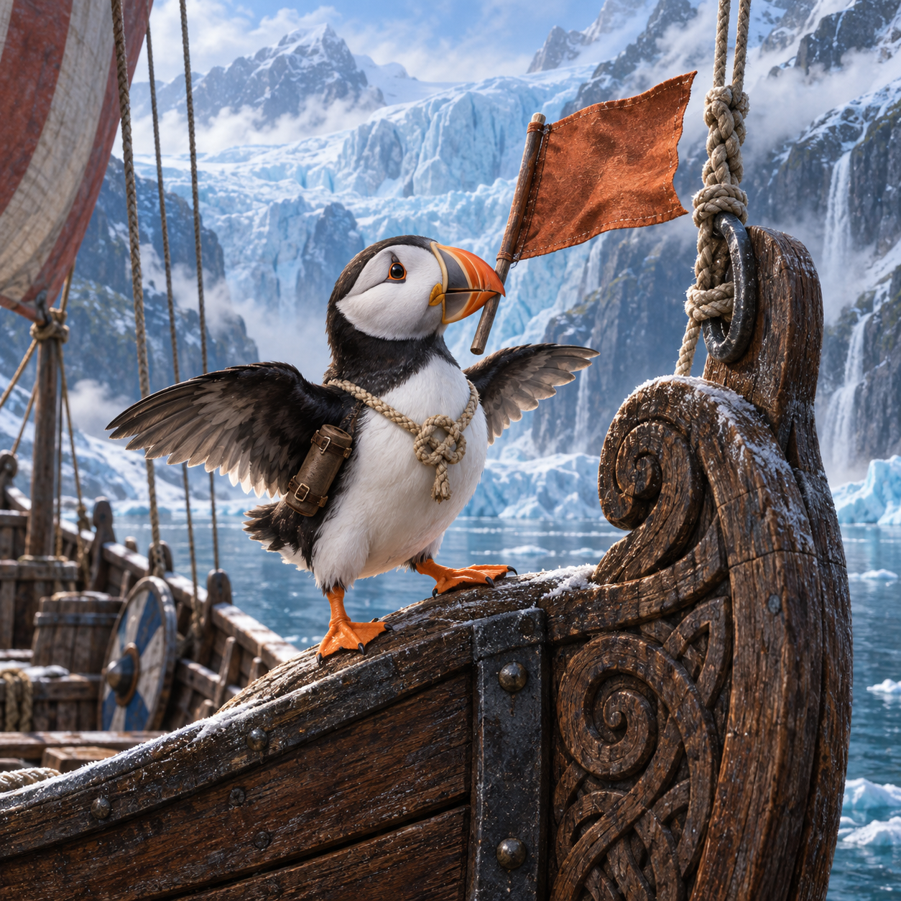
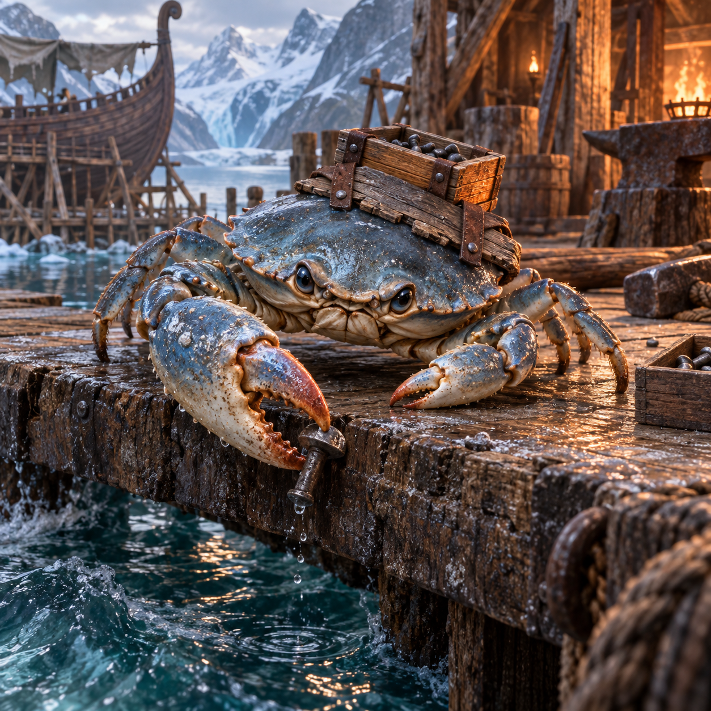
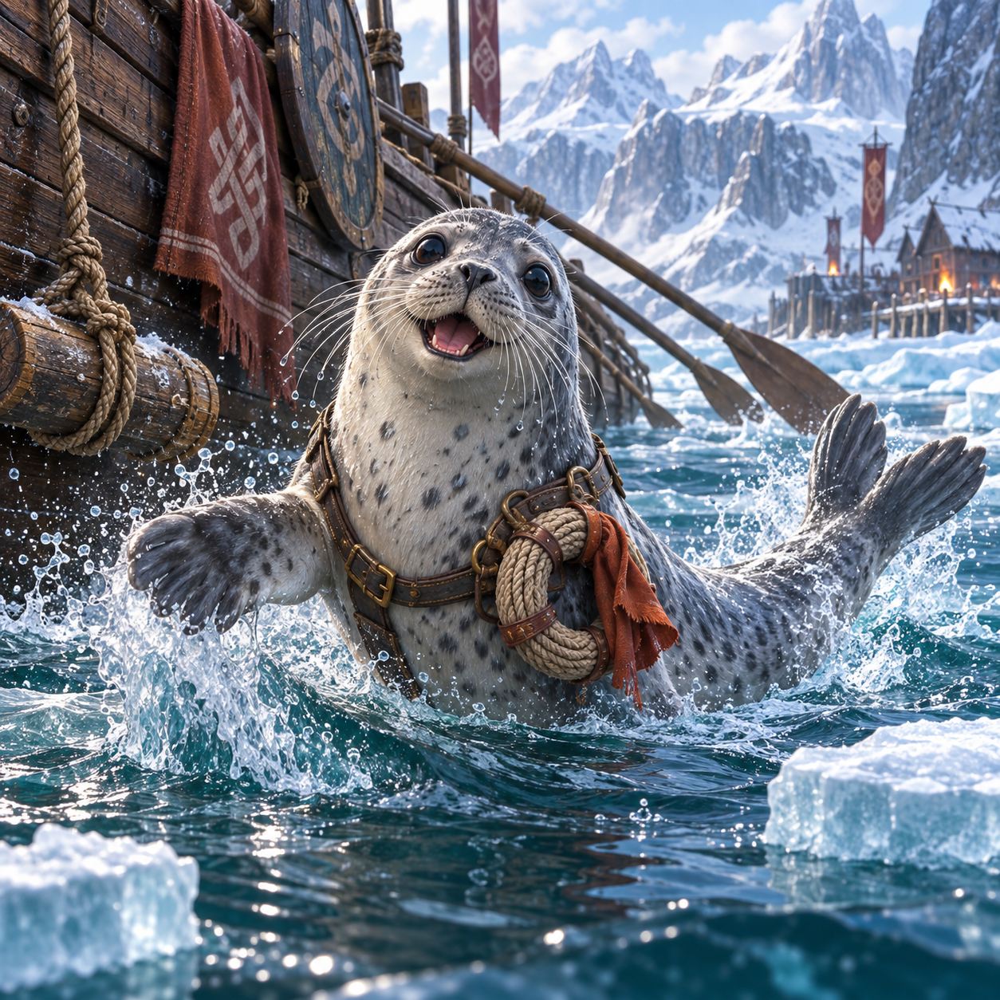
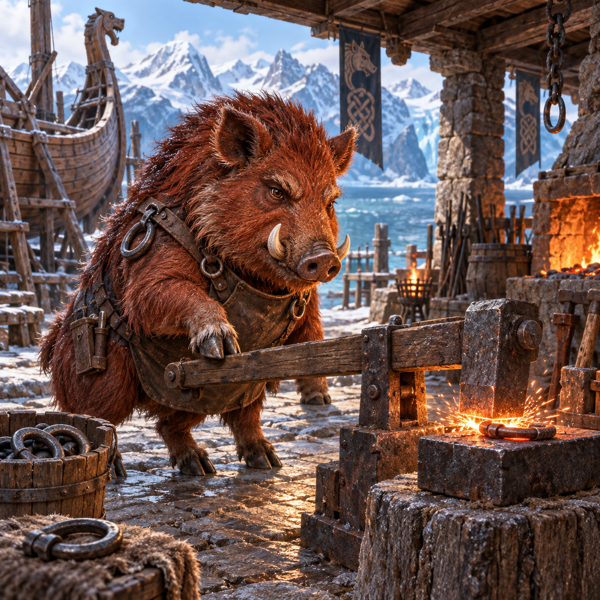
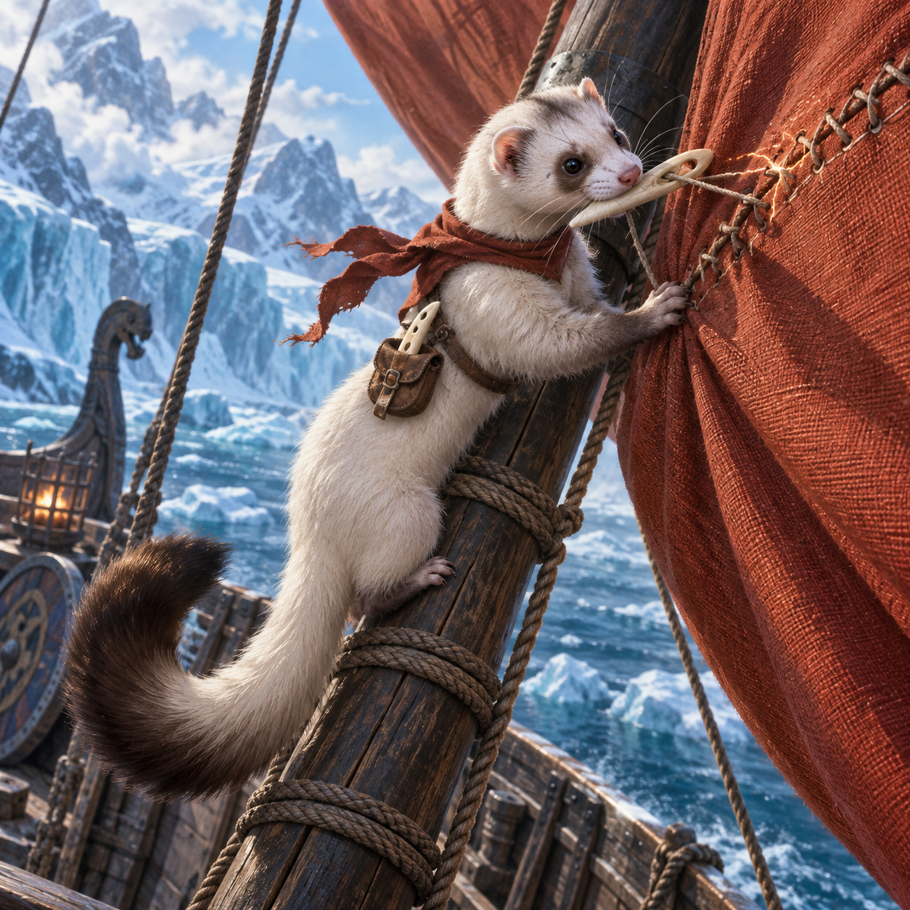
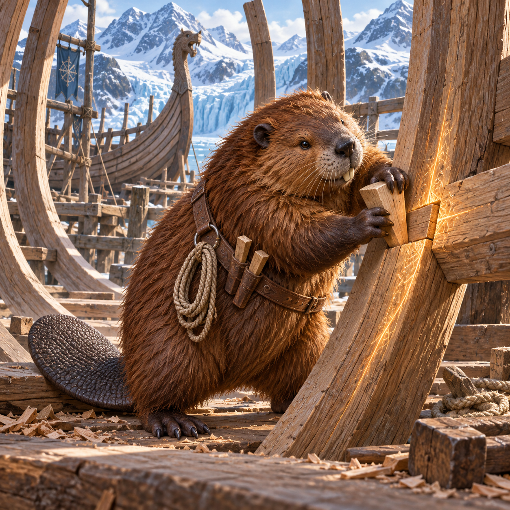
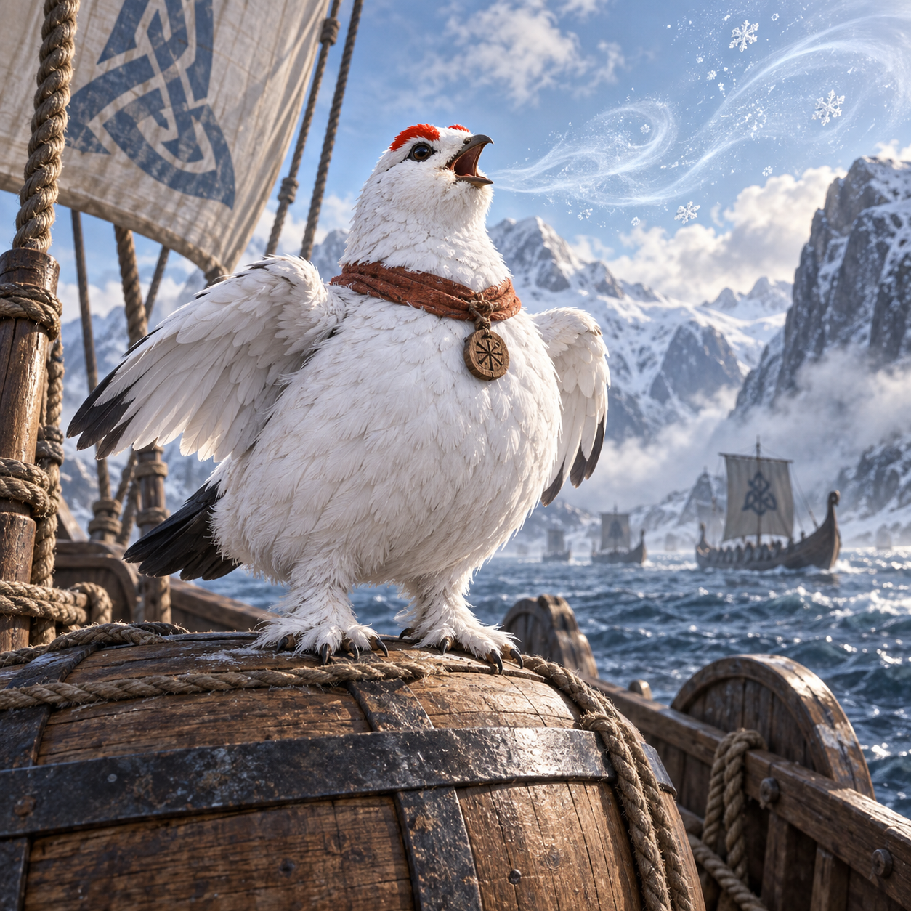
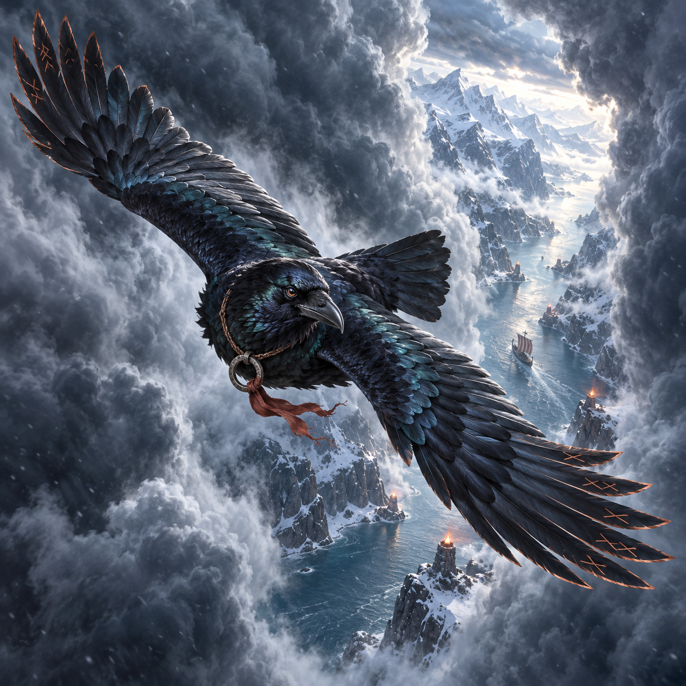
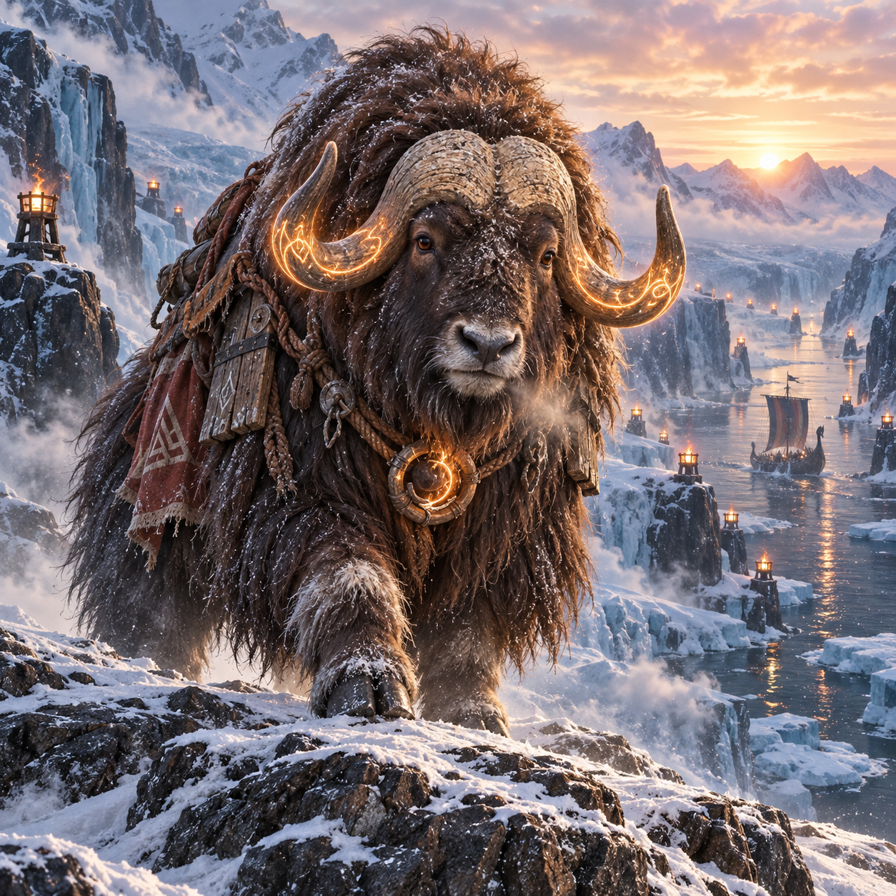

# 霜誓峽灣｜12 張原圖審閱

2026-09-23，Asia/Taipei。**brief、plan、content、prompts、images 皆已核准，staging 已完成並通過驗證。卡池尚未發布。** 使用者以「核准卡圖」批准下列 12 張選圖與已展示的原圖大小取捨；最新候選見 [Staging 審閱](./STAGING-REVIEW.md)。

使用者回覆「核准提示詞」後，已重新確認當前 hash，透過原生 Pipeline 封存 prompts。這次以內建 image_gen 執行 13 次：12 隻各一張，另為馴鹿重取一版。全部使用原樣的已核准 prompt + negativePrompt，未新增影像參考或更動文字。

## 先看卡圖

開啟 [互動卡圖審閱頁](./IMAGE-REVIEW.html) 可看全部原圖、按稀有度篩選、點圖放大，並比較 48／80 px 方圖與 96 px 圓形裁切。暫時的本機預覽為 [卡圖審閱](http://127.0.0.1:8129/IMAGE-REVIEW.html)；即使該服務停止，工作區 HTML 和 PNG 仍保留。

這是 content workspace 的卡圖審閱頁，沒有載入 QuestNote 正式 App、玩家資料或正式卡池。

## 本輪選圖與視覺檢查

全圖逐張檢查了物種、主要裝備、動作、材質、背景和文字／外框。冷色冰河、紅褐織物、磨損木鐵與局部暖光已貫穿 12 張；船員保持不同獸形與職能，主打麝牛、三種鳥及無背鰭領航鯨彼此可辨。

實際在本機瀏覽器檢視 48／80 px 方圖與 96 px 中心圓形裁切。80 px 與圓形中均可辨識角色，臉部保留；48 px 適合辨認物種與主要色塊，工具細節需看較大圖。圓形會截去部分翼尖／角尖或背景，完整構圖以方形原圖為準。這是美術素材預覽，不代替後續 staging／正式 App 的呈現驗收。

馴鹿第一版有角尖貼近頂邊的問題，因此以完全相同的已核准提示詞再生成；第二版完整保留角尖與蹄部，現選第二版。兩版均留在 `generation/variants/`，原始工具輸出也保留，沒有破壞舊稿。

### N｜燼囊旅鼠

陶罐暖光與躍過棧橋裂縫清楚；小圓耳、短腿與金褐毛保留。

原圖：1254×1254，2.38 MiB，採第 1 版。

### N｜纜結海鸚

橙喙叼旗、胸前繩結與訊旗筒可辨；雙翼自由，沒有文字旗號。

原圖：1254×1254，2.60 MiB，採第 1 版。

### N｜鉚殼岸蟹

大小螯、霧藍甲殼與木匣清楚；較大螯扣住平台邊鐵件。

原圖：1254×1254，2.60 MiB，採第 1 版。

### R｜槳歌斑海豹

銀灰斑點、繩環與拍水表情清楚；短鰭與連續身軀保留。

原圖：1254×1254，2.82 MiB，採第 1 版。

### R｜鍛火獠豬

四個獸蹄與短獠牙可辨，以前蹄操作槓桿；錘頭落點與爐火均可見。

原圖：1254×1254，2.78 MiB，採第 1 版。

### R｜織帆雪貂

細長身軀、深色尾尖及骨梭可辨；嘴銜梭具，前爪扶住帆縫。

原圖：1254×1254，2.70 MiB，採第 1 版。

### SR｜刻潮築舟狸

槳尾、門齒、量繩、木楔與船體骨架可辨；暖光集中於接點木紋。

原圖：1254×1254，2.78 MiB，採第 1 版。

### SR｜霜途馴鹿

採第二版，角尖與蹄部均在畫內；回首、航向石與近處三段落腳光點可見。

原圖：1254×1254，2.83 MiB，採第 2 版。

### SR｜峽歌雷鳥

白色圓胸、紅眼冠與覆羽足清楚；立於繫牢木桶，冰晶音浪呈現領唱。

原圖：1254×1254，2.51 MiB，採第 1 版。

### SSR｜風眼誓鴉

黑羽保留藍綠亮面；楔尾、鐵環與短旗帶清楚，完整展翼穿過雲隙。

原圖：1254×1254，2.39 MiB，採第 1 版。

### SSR｜深潮領航鯨

光滑深藍身體、淺下頷與無背鰭輪廓清楚；水線上下連續，尾鰭完整。

原圖：1254×1254，2.53 MiB，採第 1 版。

### UR｜破曉誓角麝牛

天然粗角、寬肩垂地毛與胸前誓環清楚；迎風踏岩，航標和長船交代旅程。

原圖：1254×1254，3.01 MiB，採第 1 版。

## 檔案與來源驗證

- 12 張均為可完整解碼的 1254×1254 PNG，不透明，低於每張 5 MB 的硬上限。
- 每張約 2.38–3.01 MiB，總計約 31.92 MiB。12 個 IMAGE_LARGE 為大於 2 MB 的審閱 warning；這些是保留品質的原圖，沒有壓縮或改繪原始 bytes。核准後 staging 會依現有流程產生 WebP，不在本輪提前製作。
- 全部選圖與工具原始檔 SHA-256 一致，實際請求逐字等於已核准 prompt、兩個換行、`Avoid: ` 和 negativePrompt。
- [generation/manifest.json](./generation/manifest.json) 記錄選圖、版本、hash、尺寸、大小及每次產圖記錄位置。
- `generation/<petId>-v<attempt>.json` 保存真正送出的請求、開始／完成時間、工具輸出路径提示。工具未提供模型版本與 seed，因此保留 null，不推測。
- `prompts.json` 保持已核准 bytes，其 provenance 是生成前的 authoring 紀錄；本輪實際執行資料另存於 generation/。

## Pipeline 結果與核准範圍

完整 `card-pool validate frost_oath_fjord` 為 **ok: true，0 errors**。Warnings 為 12 個 IMAGE_LARGE 與 12 個 PET_NO_STANDARD；後者符合獨立新池、不進標準召喚的原定設計。

標準池候選仍 56／56、永眠花海仍 12／16、新池 12／12；既有 pets／Lore／series／pool 沒有 changed 或 removed。正式 catalog、assets、legacy compatibility 未改。

已核准 images outputHash：`2dfdd2dbfe88da5fa42a0eefb8e422d5961dbbe0ab05964fa893b0a0ed740493`。原生 CLI receipt 已封存；stage dry-run、組裝與重建一致性驗證皆已完成。

依 [Card Pool Pipeline](../../../docs/card-pool-pipeline.md) 的 images gate，已封存上述 12 張選定原圖及 IMAGE_LARGE 的品質保存取捨。此版本不需重複核准；接續工作與候選識別見 [Staging 審閱](./STAGING-REVIEW.md)。

圖片核准不等於正式發布、正式 source promotion、merge 或部署。後續仍須依現有 release review 驗證。
