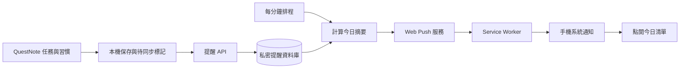

# 每日任務與習慣通知系統設計

日期：2026-09-30。狀態：已實作 V3.4.27，獨立 Cloudflare Worker／D1 已部署；網站發布與實機收件狀態見發布紀錄。
來源：fetch 後的 `origin/main`，`e34672242db6c9a79f199d59d3dbdd4cc6c64e13`。

2026-10-02 通知修復：正式環境已到期的訂閱沒有每日發送紀錄，近兩天日誌及 GraphQL Cron 事件查詢均未見 scheduled invocation。重新註冊等效 Cron 並等待超過文件中的 15 分鐘傳播期，仍未產生排程紀錄；Cloudflare 內部原因未確認。獨立診斷確認 Durable Object alarm 能連續自行執行，因此正式背景喚醒改用 SQLite-backed `ReminderScheduler` alarm，按分鐘持續排程；停用原 Cron，避免兩種驅動同時發送。單一小批次派送是協調邊界，App API 仍在一般 Worker 中處理，不經 Durable Object。

alarm 先持久保存下一個分鐘的喚醒，再處理最多四筆到期安裝，避免下游故障耗盡重試後永久停跑。授權的設定同步會確認 alarm 存在，既有喚醒不因頻繁同步而順延。部署時透過獨立 Worker secret 保護的 `POST /_internal/scheduler/start` 啟動既有訂閱；金鑰只在 Cloudflare secret 中，不放到前端或 Git。`worker-runtime.js` 是部署入口，匯出 Durable Object 與既有 API handler。

新增私密資料庫中的單列排程健康記錄，`GET /health` 與授權的 `/status` 提供最近啟動／完成時間及健康狀態。`ready` 僅代表推播金鑰就緒，`scheduler.healthy` 才代表最近五分鐘完成過背景排程，`driver` 指明背景驅動；讀取 API 不會啟動排程或刷新這份記錄。另修正漏掉前一天後直接跳過今天的恢復問題，並以實際執行時間判斷通知是否過期。當天若只被略過而沒有發送，明確改成當天較晚的時間會原子重設該筆未送出的紀錄；已接受的通知不能重送，前景同步也會保留最近的發送狀態。修改時間時正在處理但尚未發送的舊工作，會保留新時間的發送資格。

本機驗證：`npm run test:reminders` 與 `npm run test:reminders:runtime`。後者使用記憶體 D1、SQLite-backed 測試物件與攔截所有外部推播的 workerd，直接執行部署模組的 alarm handler；同時驗證 Apple 與 Android 供應商、無前景同步、下一次喚醒、漏日恢復與去重。正式部署驗證必須讀到連續兩次自行更新的背景健康記錄；實機收件仍須 iPhone 與 Android 個別確認。每分鐘約 1,440 次 alarm／日及保存下一次喚醒的 storage write，仍須依帳號額度觀察使用量。

## 使用者會得到什麼

前一天安排任務，隔天在自訂時間收到一則 QuestNote 系統通知，點開直接看到今日任務與習慣。App 不必保持開啟。使用者已確認 iPhone 與 Android 都必須支援，兩者均為第一版必要驗收平台。第一版預設每天 08:00、Asia/Taipei，可改時間；啟用前需使用者主動同意通知與提醒資料同步。

範例：2026-09-30 晚上將「繳電費」「整理報告」「買食材」安排到明天，並有「閱讀」「運動」兩項每日習慣。2026-10-01 08:00 的通知為：

> QuestNote · 10/1 今日計畫
>
> 今天有 3 項任務、2 項每日習慣等你完成。
> 繳電費、整理報告、買食材
>
> 點開查看今日清單

數量依實際尚未完成的項目計算。上述範例假設已開啟項目名稱預覽；預設只顯示數量。系統通知的外觀由手機作業系統決定。

## 操作流程與畫面

1. 任務新增與編輯新增「安排日期」：未安排／今天／明天／選擇日期。點「明天」會儲存實際日期，不依任務文字猜測日期。
2. 任務清單提供「明天」檢視，讓使用者睡前核對隔天計畫；開始日、截止日仍可各自設定。
3. 設定頁新增「每日提醒」。首次點啟用時先說明：會同步提醒所需的日期、完成狀態與習慣規則；開啟標題預覽時另同步任務／習慣短標題。
4. 支援的裝置在使用者點擊後要求系統通知權限；iPhone 先引導加到主畫面，再從主畫面 App 啟用。
5. 設定時間並儲存，建立推播訂閱，完成初次同步後才顯示「已啟用，下一次：10/1 08:00」。
6. 每天時間到，伺服器計算當地日期的摘要並發送。點通知開啟 App 的「今日清單」，含任務與每日習慣；每週習慣另標示「本週目標」。

設定頁內容：

| 設定 | 預設與行為 |
| --- | --- |
| 每日提醒 | 關閉；使用者主動啟用 |
| 提醒時間 | 08:00，可選其他時間，顯示提醒時區 |
| 包含任務／每日習慣 | 兩者皆開啟 |
| 包含每週習慣進度 | 開啟，但另外標示為本週目標 |
| 包含逾期任務 | 關閉；開啟後另列「逾期待處理」 |
| 顯示項目名稱 | 關閉，只顯示數量；開啟後最多預覽 3 個短標題 |
| 今天沒有待辦時 | 不發送 |
| 發送測試通知 | 使用獨立測試識別碼，不占用當天摘要 |
| 提醒狀態 | 系統權限、伺服器啟用狀態、最後同步、下一次發送時間 |

畫面狀態必須可辨識：尚未啟用、需加到主畫面、不支援、權限被拒絕、連線中、已啟用、同步待重試、已暫停。系統拒絕通知時提供開啟設定的文字指引，不反覆彈出權限要求。

## 現有專案與必要變更

- `src/taskService.js` 目前只能直接加入「今日計畫」，已有 `plannedDate`、`startDate`、`dueDate`。沿用 `plannedDate` 表示安排日期，新增通用 `setTaskPlanDate(id, date)`，既有今日操作呼叫它。
- `src/taskMigration.js` 已保留 `plannedDate`，但 `isPlannedToday` 依今天推導。未來日期不能因這個旗標為 false 就被清空；新增與更新都必須保留未來計畫。遷移預設值仍是未安排。
- `src/taskFilterService.js` 的今天篩選涵蓋計畫日、截止日或開始日等於今天。通知沿用這些條件，另外排除已完成任務。
- `src/habitService.js` 已有每日、每週目標與日期完成紀錄。第一版沿用既有規則，不要求使用者重建習慣。
- 任務、習慣在本機 IndexedDB；目前沒有雲端任務同步。通知後端須取得最小提醒投影，才能在 App 關閉時產生內容。
- `service-worker.js` 現有職責是離線快取，沒有 `push` 或 `notificationclick` 處理。新增這兩個事件，保留現有快取驗證及更新流程。
- 專案已有 `backend/feedback/` 的 Cloudflare Worker/D1 原始碼。建議新增獨立 `backend/reminders/` Worker 與私密資料庫，沿用技術、不共用意見回報資料。

以上是來源碼檢查結果，不代表正式站或後端已提供此功能。

## 今日摘要規則

所有判斷接受明確的 `date` 與 `timeZone`，前端今日清單、預覽與後端摘要使用同一份規則，不能各寫一套。

| 項目 | 納入條件 |
| --- | --- |
| 今日任務 | 未完成，且 `plannedDate`、`dueDate`、`startDate` 任一等於當地今天；依任務 ID 去重 |
| 無日期任務 | 未主動安排就不加入摘要 |
| 逾期任務 | 設定開啟、未完成且截止日早於今天；與今日任務去重，另列數量 |
| 每日習慣 | 活躍、未封存、今天尚未完成 |
| 每週習慣 | 活躍、未封存、今天未完成、本週尚未達標；文字為「本週還差 N 次」，不宣稱今天必須完成 |
| 完成／刪除／封存 | 最新已同步狀態不再納入 |
| 空摘要 | 記錄已檢查，當天不發送 |

任務排序沿用現有重要程度及日期排序，預覽限制長度，超過 3 項顯示「另有 N 項」。習慣不算成一次性任務；子任務不單獨增加任務數。已完成的任務若重新打開，當天摘要尚未發送時可重新納入；發送後不再補送第二則。

第一版每天一則；晚間催辦、個別任務鬧鐘、稍後提醒、通知直接勾選完成均留到後續版。通知點擊只導航，完成與獎勵仍由原有 App 服務處理。

## 技術架構

選用標準 Web Push，搭配 Cloudflare Workers、D1、Cron Triggers。GitHub Pages 繼續提供前端；新增 Worker 接收提醒投影與推播訂閱，排程不依賴前端定時器。

Push API 能在網頁未載入時接收推送；Service Worker 會被事件喚醒，但不能當作永久運行的時鐘。參考 [Push API](https://developer.mozilla.org/en-US/docs/Web/API/Push_API) 與 [PWA 背景運作](https://developer.mozilla.org/en-US/docs/Web/Progressive_web_apps/Guides/Offline_and_background_operation)。

iOS/iPadOS 16.4 起，主畫面 Web App 支援 Web Push；要求通知權限須由使用者直接操作觸發。支援通知中心、鎖定畫面與專注模式。實作需能力偵測與真機驗收，不能只憑裝置名稱顯示成功。參考 [WebKit 官方說明](https://webkit.org/blog/13878/web-push-for-web-apps-on-ios-and-ipados/)。

Android 使用支援 Push API、Service Worker 與 Notifications 的瀏覽器／PWA，首要驗收 Chrome。可引導安裝到主畫面以方便日常使用；實際支援以能力偵測、HTTPS、通知權限與真機收件為準。iPhone 與 Android 使用相同提醒規則與 API，由各平台推播服務負責交付，不需維護兩套任務排程。

## 提醒資料與身分

第一版採單一安裝的匿名提醒身分，不要求登入。每個安裝只提醒自己在該安裝保存的任務與習慣；跨裝置共用清單、換機還原與帳號登入是獨立後續功能。

| 記錄 | 必要欄位 |
| --- | --- |
| 安裝身分 | `installationId`、雜湊後的管理 token、環境、最後活動時間、停用狀態 |
| 提醒設定 | enabled、當地時間、IANA 時區、各項內容開關、顯示標題開關、設定版本、`nextSendAt` UTC |
| 推播訂閱 | endpoint、p256dh、auth、訂閱版本與有效狀態；每個安裝一個有效訂閱 |
| 任務投影 | ID、安排／開始／截止日期、重要程度、完成狀態；允許預覽時才傳短標題 |
| 習慣投影 | ID、daily/weekly、每週目標、啟用／封存狀態、近期 28 天完成日期；允許預覽時才傳短名稱 |
| 同步版本 | 單調遞增 revision、伺服器確認時間、schemaVersion |
| 發送紀錄 | 安裝 ID、當地日期、摘要種類、待發／處理中／服務接受／略過／失敗、重試次數、租約與過期時間 |

提醒同步是投影，不是完整存檔備份。長篇任務內文、子任務內容、習慣描述、幻獸、星塵、獎勵與收藏均不上傳。關閉標題預覽時，新的投影必須移除先前同步的標題，不只隱藏通知文字。

匿名 token 由後端建立，至少 256 bit 隨機值，僅第一次返回；前端存放於獨立 IndexedDB 記錄，伺服器存雜湊。它只能管理自己的提醒安裝，不能查詢其他使用者。VAPID 私鑰只存在 Worker secret，前端只取得公鑰。

訂閱 endpoint 是外部網路輸入：限制 HTTPS、已驗證的推播供應商主機、禁止任意 redirect 與私人位址，限制訂閱大小與頻率。API 驗證 token、環境與來源，來源白名單不取代身分驗證。日誌不記錄 token、endpoint、內容與完整 payload。

## 同步與離線

1. 任務／習慣修改仍先本機保存；同一 IndexedDB transaction 增加 reminder revision 並寫入待同步標記，防止保存成功但漏掉同步。
2. 客戶端以包含任務、習慣、設定的版本化完整投影同步；同一安裝多分頁必須序列化發送，伺服器原子接受更高 revision，同版相同內容可重試，舊版不能覆蓋新版。同版不同內容拒絕。
3. 首次啟用只有在訂閱與投影均被伺服器確認後才成功。新增、完成、取消完成、刪除、封存、修改計畫日與提醒設定皆觸發同步。
4. 離線保存顯示「已儲存在此裝置，提醒資料待同步」。回到前景或恢復連線時重試；不依賴所有平台都有 Background Sync。
5. 後端只能使用最後已同步資料。若前一天離線新增任務後直接關閉 App，新增項目可能不出現在隔天通知；離線完成的項目也可能仍被提醒。此狀態顯示於設定頁。
6. 發送前再讀最新已確認版本及啟用狀態，不提早保存一份固定的「明天內容」。網路發送前後仍有小幅競態；通知點開後以本機最新清單為準。

每日習慣由規則與當天日期計算，不能只同步明天一次性的清單，否則 App 連續幾天沒開就失去提醒。每週完成紀錄依目標週查詢，跨週自然重置。

## 排程、時區與避免重複

- 以一個每分鐘的 Cron 查詢索引化 `nextSendAt <= now` 的安裝，不為每個使用者建立一個 Cron，也不每分鐘掃全部任務。
- Cron 使用 UTC；用儲存的 IANA 時區將使用者當地時間轉成下一次 UTC 發送時間。Asia/Taipei 的 2026-10-01 08:00 對應 2026-10-01 00:00 UTC。參考 [Cron Triggers](https://developers.cloudflare.com/workers/configuration/cron-triggers/)。
- 初次時區以裝置偵測值為建議，明確顯示。更換裝置時區時，App 在下次開啟提供更新提醒時區；App 今日清單及完成日期計算需與選定提醒時區一致。舊完成日期紀錄不重新解讀。
- 下一次提醒依當地日曆計算，不直接加 24 小時。夏令時間跳過的時間移至下一有效時刻；重複的時間只用第一次。午夜、跨月、跨年與跨週需測試。
- 當天提醒時間已過後才啟用，從明天開始。當日已發送後修改時間不補發；當日尚未發送且改到未來時間，可重新排程。
- 唯一發送鍵為 `(installationId, localDate, dailyDigest)`，另以條件式寫入取得短租約，避免排程重疊同時處理。訂閱或設定版本更新可讓舊工作失效，但不能讓當天再發一次。
- 暫時失敗有限次退避重試；發送截止時間為原預定時刻後 60 分鐘或當地午夜，取較早者。超過窗口不補發昨日摘要，重新排下一天。
- HTTP 404/410 移除無效訂閱；429 遵守 Retry-After；5xx 退避；401/403 視為推播設定問題並記錄失敗。初始發送加最多兩次重試，所有重試仍受發送窗口限制。
- 每則 push 設定 TTL 為剩餘發送窗口秒數，通知 tag 使用日期鍵。這能減少重複，但網路逾時或發送後程序崩潰仍有「服務已收、紀錄未寫」的不確定性，不能宣稱端到端恰好一次。
- 收到 push 後用 `event.waitUntil(showNotification(...))` 顯示可見通知，不用靜默推播觸發同步。若系統仍交付過期 payload，顯示「開啟 QuestNote 查看最新計畫」，不把昨天稱為今天，也不靠吞掉 push 達成去重。

發送目標是在設定分鐘開始處理；「推播服務接受」不等於「手機已顯示」。網路、系統省電、通知摘要與專注模式可能延後呈現，不能當作保證準點的鬧鐘。TTL 語意參考 [HTTP Web Push 規範](https://datatracker.ietf.org/doc/html/rfc8030)。

## API 與前端接點

| API | 行為 |
| --- | --- |
| `GET /v1/push/public-key` | 取得該環境 VAPID 公鑰 |
| `POST /v1/reminder-installations` | 限流的匿名安裝初始化，返回本安裝管理憑證 |
| `PUT /v1/reminder-installation/state` | token 授權；版本化投影、設定、訂閱一併驗證與保存 |
| `GET /v1/reminder-installation/status` | token 授權；返回最後同步、啟用狀態、下一次發送、最近服務接受／失敗時間 |
| `POST /v1/reminder-installation/test` | token 授權且限流；傳一則測試通知 |
| `DELETE /v1/reminder-installation` | token 授權；停用排程、撤銷憑證、清除投影與訂閱 |

私密 API responses 使用 `Cache-Control: no-store`，service worker 不快取提醒 API。測試與啟用 endpoint 不對未授權 installation 發送。

新增模組建議：`src/reminderRules.js`（純摘要規則）、`src/reminderService.js`（設定／訂閱）、`src/reminderSyncService.js`（版本／同步）、`src/reminderController.js`（畫面與能力狀態）、`backend/reminders/worker.js`（API／排程）及專用 migration。

`src/ui.js`／`index.html`／styles 只串接畫面，由同一整合者修改；`src/app.js` 初始化與接收通知導航；`service-worker.js` 處理 push、點擊、更新既有視窗或開啟新視窗。通知導航 URL 由本地 scope 推導，限定同 origin 及 scope；不相信 payload 指定的任意網址。冷啟動或已有視窗時都能選到今日清單；過期通知點入以目前當地今天為準。

## 關閉、還原與資料生命週期

關閉提醒先更新本機設定，再向後端確認停用並取消本機訂閱。無網路時顯示「本機已關閉，雲端停用待確認」；不可宣稱後端已刪除。即使後端停用成功，已交給推播服務的訊息仍可能到達，剩餘窗口 TTL 限制其生命週期。

備份匯出不包含 token、推播訂閱、發送紀錄或同步 revision。匯入不得啟用其他裝置的訂閱；保留本裝置有效身分時，還原後以更高 revision 重新同步投影。清除全部資料前先撤銷雲端提醒，失敗時保留撤銷所需資訊並提示尚未確認。使用者自行清除瀏覽器資料可能遺失憑證，既有提醒不能立刻被本機撤銷。

建議雲端投影與訂閱在安裝連續 30 天未同步／未開啟 App 後自動停用並清除，限制遺失憑證的殘留提醒。設定頁顯示有效期限；開啟 App 更新活動時間。停用後下次進 App 需重新啟用。發送紀錄只保留 30 天且不保存內容，D1 備份保留期依環境設定另行確認，不能承諾刪除後立刻從備份消失。

production／preview 使用不同 API、D1、VAPID、安裝身分與訂閱。前端身分鍵包含 release profile 與 scope。預覽不得讀寫正式提醒資料；沒有選定環境時開發環境預設只用本機 mock。

## 容量與成本

第一版以小規模驗證為目標。每分鐘排程每日約 1,440 次，加上同步與測試 API；每日實際推播數約為有待辦的啟用安裝數，不是任務總數。

每批數量與並行數須依實際方案的 D1 查詢、HTTP subrequest 與 CPU 限制設定，不能在一個 Cron 中無上限遍歷使用者。小批次加索引、工作租約與截止時間即可起步；當同一分鐘待發量無法在目標延遲內清空，再引入 Queues 分批消費。先用負載測試決定批量，不保證免費額度足夠。參考 [Workers 限制](https://developers.cloudflare.com/workers/platform/limits/)、[D1 限制](https://developers.cloudflare.com/d1/platform/limits/) 與 [Workers 定價](https://developers.cloudflare.com/workers/platform/pricing/)，正式部署前再核對實際帳號方案。

## 實作順序與驗收

1. **日期與規則**：今天／明天／選日期、明日檢視、共用摘要規則。測試未來 `plannedDate` 遷移、日期切換、任務去重、完成排除、每日與每週習慣、逾期開關及空摘要。
2. **本機啟用與同步**：設定畫面、權限／主畫面引導、推播訂閱、匿名身分、原子待同步標記、投影 API。驗收多分頁亂序、網路中斷、刪除／封存、還原、標題預覽移除及停用。
3. **後端發送**：獨立 Worker/D1、Cron、Web Push 加密與 VAPID、短租約、TTL、重試與訂閱清理。先用 fake push endpoint 測 404/410/429/5xx、逾時、發送後崩潰、跨午夜、設定競態與容量。
4. **通知點擊與裝置驗收**：閉 App、鎖屏、冷啟動與已有視窗；點通知抵達今日清單；裝置收件不能只靠 API 回傳成功推論。
5. **發布**：執行 `npm test`、變更 JS 語法檢查與隔離瀏覽器驗收；同步 App 版本、SW cache 與 precache。記錄 source、preview／production artifact 與 backend 版本，各自驗證。

核心驗收情境：9/30 將三項任務安排到 10/1，設定 08:00，確認同步後關閉 App；10/1 在允許通知且連線的真機上收到摘要；已同步完成的任務不在通知內；點開顯示 10/1 最新清單。另測手機離線至窗口過期，不在中午補發過期早安通知。

第一版發布門檻必須同時通過 iPhone 主畫面 App 與 Android Chrome／PWA 的真機驗收，桌面支援瀏覽器為補充平台。每項都測權限拒絕、取消訂閱、系統勿擾、離線與不支援能力。所有測試使用隔離的 DB/API／測試訂閱，不對使用者正式存檔或正式訂閱發送測試訊息。文件與模擬測試通過不能取代上述兩種手機的實際驗收。

## 本次交付界線

實作採預設 08:00 與單安裝匿名身分；通知啟用時可選時間。開啟 App 時會跟隨裝置時區並重新同步。後端每分鐘最多處理 4 個到期安裝，適用目前小規模使用；設定修改、任務完成與還原備份均會更新同步版本。已通過隔離瀏覽器與 Workers 加密發送測試；iPhone／Android 鎖屏實機收件須由裝置端確認，不能以推播服務接受回應取代。
