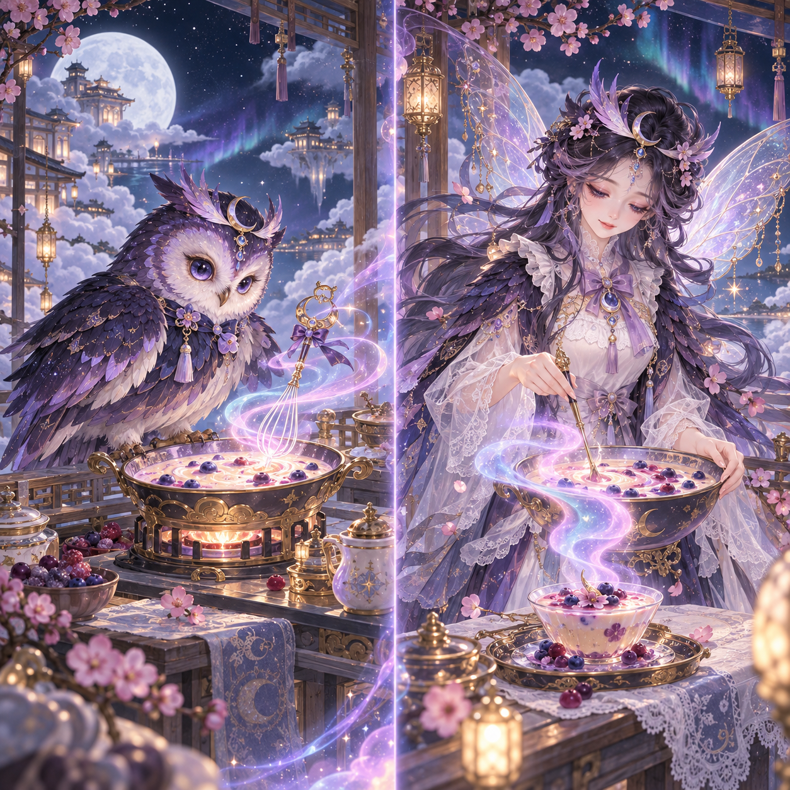
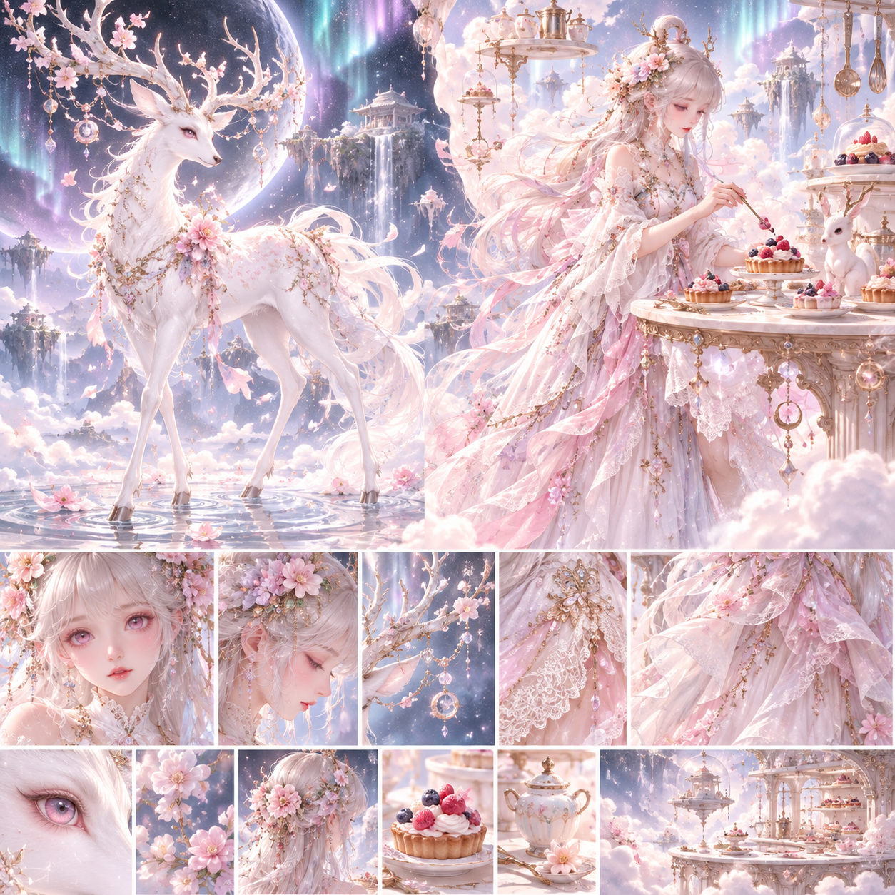
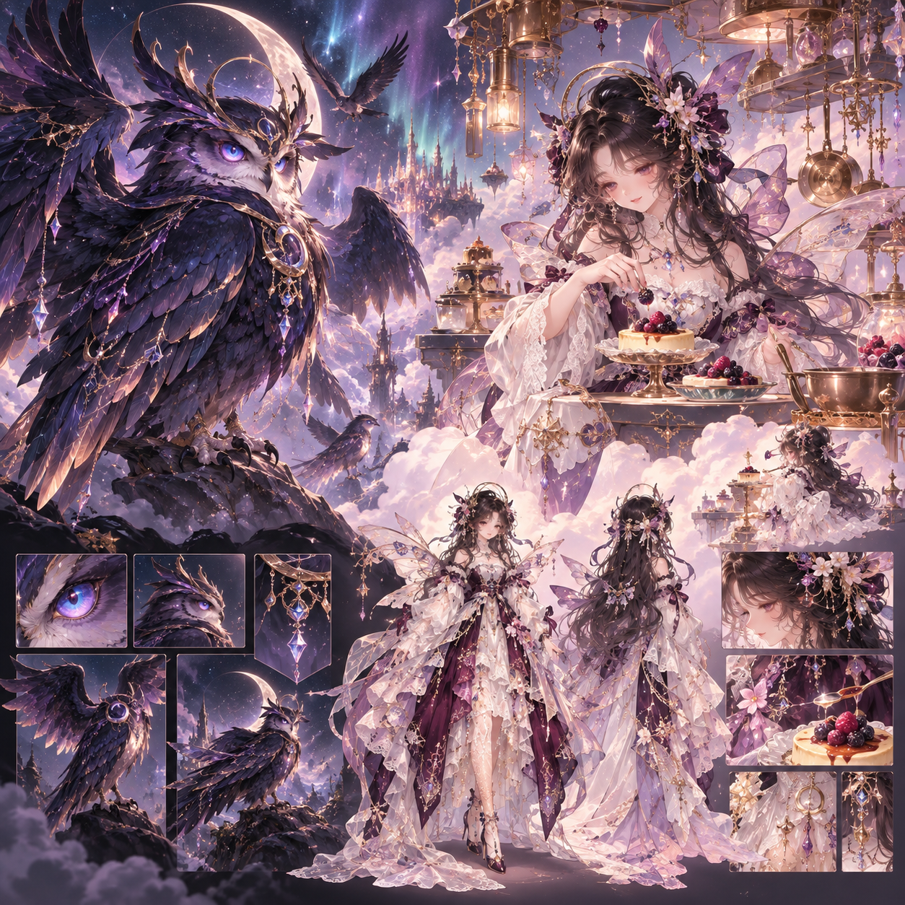

# 霓霞仙膳：新卡池企劃與首批美術審閱

2026-10-09。階段：企劃／中途人工審圖。池名為 AI 暫定提案；沒有正式 images receipt、candidate 或發布授權。

已帶入使用者訪談，不重新問工程細節：仙女喜歡下凡做美食，抽到時都是靈獸；**只有 SSR／UR 可以覺醒成仙女**，N／R／SR 保持靈獸。12 隻、2 UR、整池深淺各六；新地區、特殊解鎖、贈寵、專屬演出全部納入。採 `human` 中途審圖。

## 一個故事，晨昏兩席

霓霞膳庭的宴席正在失去光與香。仙女們化為靈獸下凡，最初以為只要帶回珍貴食材就能補好；她們在陪伴玩家、採集與烹調後，才懂得真正留下滋味的是等待與分享。

月露雪鹿管理晨露與花點，曜夜玄鸮照看夜灶與返航路。牠們不互相敵對；粉白晨席與藍紫夜席最後合成一場為同行者留座的宴會。其餘角色各自負責採香、運籃、護火、辨香或奉茶。稀有角色的仙女真身透過羈絆儀式揭露，普通角色繼續以靈獸身分陪伴。

畫風：粉白、桃粉、奶油、淡藍、柔紫的馬卡龍色與極光光影；深色使用暮藍、莓紫與柔銀，保留柔和膚光和通透紗質。蕾絲、蝴蝶結、紗與珠鏈必須幫助辨識角色，而不是把全部角色都變成相同衣裙。仙女採成年女性、優雅溫柔造型。

## 12 隻名單

| 稀有度 | 淺色 | 深色 | 初遇與特殊設定 |
| --- | --- | --- | --- |
| UR | 月露雪鹿 | 曜夜玄鸮 | 初始可抽；分別覺醒為月露司膳仙姬／曜夜守灶仙姬 |
| SSR | 櫻紗靈狐 | 霧靛羽鵠 | 初始可抽；分別覺醒為櫻紗點心仙子／霧靛調香仙子 |
| SR | 奶霜綺兔 | 藍糖霧貂 | 初始可抽；運籃與探路，保持靈獸 |
| SR | 桃露茶栗 | 紫盞雲狸 | 累積 20 抽後加入；採香與奉茶，保持靈獸 |
| R | 花綃糖雀 | 夜莓綺蝟 | 花瓣裝飾與護灶，保持靈獸 |
| N | 糖霧粉蝶 | 紫露星螢 | 糖粉描花與露光帶路，保持靈獸 |

共 2 N／2 R／4 SR／2 SSR／2 UR；每稀有度的深淺配對平衡。詳細逐隻「辨識特徵＋故事動作＋可見結果」、偏好與專長保存在 [proposal.json](../content/pool-proposals/aurora_fairy_feast/proposal.json)。這是前期企劃資料，尚未分配正式 pet ID；進入正式 pipeline 時將 design 寫入 `plan.json`，不以本文件取代 hash gates。

## 特殊體驗

- **晨昏共席解鎖**：初始 10 隻（深淺各 5），本池累積 20 抽後加入桃露茶栗與紫盞雲狸，合計 12 隻。兩隻 UR、兩隻 SSR 從第一抽可出現。沿用既有 `unlockExpansion`；候選增加會改變 SR 內各角色占比，稀有度機率與保底保持原規則。
- **贈寵**：解鎖時固定贈送一隻 SR 桃露茶栗，已包含在 12 隻內，不增加第 13 隻。重複持有依真實碎片規則處理；重播、重開、跨分頁不再發。贈寵不增加抽數，也不重設保底。
- **四位羈絆覺醒**：親密度 Lv.5 並領取對應故事後，接下試煉；完成三筆新的任務／習慣及一次接下後出發、角色參隊的霓霞膳庭派遣並領獎。取得信物後，原子交易消耗信物與一份霓霞花露塔。沿用現有進度與形態切換；不新增資料庫 store、不增加戰力或收益。
- **一種工坊食物**：霓霞花露塔，森林之葉 ×2＋霓霞花露 ×3；普通 +75、偏好符合時總共 +150。用既有 `nature`／`astral` tags，不從名稱自動推斷偏好。11 位角色符合新食物；夜莓綺蝟偏好暖火與田園料理，保留個性差異。森林之葉可在迷霧森林或雲棧古道取得，花露由新地區供應。
- **專屬演出**：雲階顯現→晨昏食籃入席→香氣在中央膳鼎會合→正式名稱與情境文字。入場 3400ms、等候繼續、淡出 550ms；抽卡前奏固定 650／750／900／700ms；SSR 2500ms、UR 4500ms。提供略過、鍵盤、減少動態；抽卡畫面保持靈獸，仙女屬覺醒演出。

沿用單抽 100／十連 1000 星塵、N 55%／R 30%／SR 10%／SSR 3%／UR 2%、SSR＋30／UR100 保底與十連 SR＋保障。以上全部是尚未接入 runtime 的提案。

## 新探險地區：霓霞膳庭

擁有本池任一靈獸即可解鎖，透過既有 trait unlock 的精確 pool tag 與提示判斷，不用廣泛的名字關鍵字誤開地區。派遣 60 分鐘、能量 5；星塵 30–60、花露 1–2、親密度 10，與現有同級地區尺度一致。

| 探索進度 | 里程碑 | 故事結果 | 星塵獎勵提案 |
| --- | --- | --- | --- |
| 10 | 沿香入庭 | 露光標出膳亭石階 | 30 |
| 25 | 晨露採香 | 採集隊學會留下未熟的花露 | 50 |
| 50 | 夜灶留火 | 晨香與夜香開始靠近 | 80 |
| 75 | 雲橋共渡 | 兩席互換食物，食籃接力渡霧 | 100 |
| 100 | 霓霞共席 | 香氣回到膳鼎，每個同行者都有座位 | 150 |

地區發現：舊食譜只畫了兩副碗筷，提示留住香氣的是等待與共食。新花露必須有可領取來源、材料 label 與配方用途；這三者及完整故事／里程碑 runtime 支援完成後，才鎖定 authoring baseline。

## 五張原圖：實際審閱結果

使用者 2026-10-09 提供。五張均已完整解碼；原 bytes 保存到 `content/pool-proposals/aurora_fairy_feast/references/`，來源與 SHA-256 見 `references.json`。原始生成工具、模型、seed、提示詞與費用未核實，不補造。不是 Library 項目，沒有 `library_file_id`。

**月露雪鹿・料理對照**（原檔尾碼 58_53）：

優點：花角、月滴、粉白材質與料理動作一致；靈獸與仙女有連續辨識點。待修：插畫被分成左右兩半，小卡中主角只占半幅；頭角、花、珠與高亮背景競爭。可借用「花露引向果塔」的動作，正式成圖應獨立畫完整鹿身。

**曜夜玄鸮・料理對照**（58_49）：

優點：暮藍紫、月冠、羽披與暖灶形成良好對照。待修：圓眼、收翼的可愛姿態讓 UR 分量弱於設定板；不能只讓一支漂浮打蛋器代替牠的故事動作。建議採展翼護火、香霧聚成返航極光。

**霓霞膳庭・地區候選**（58_44）：

優點：中央膳鼎、採集者、田地、花露與雲橋清楚支持故事；可作地區方向候選。待驗：大量暖金粉色與蜜光糖庭可能接近，正式卡池背景應增加柔暮藍紫的晨昏分區；縮成 320px 地區卡時採集者非常小，不能用人物數量作唯一辨識點。原圖 1672×941，接近 16:9，後續需製作合規 WebP 並實測雙畫面裁切。

**月露雪鹿・造型設定板**（58_39）：

完整鹿身與鹿角、長裙薄紗、蕾絲及極光氣氛比料理對照更適合建立 UR 主視覺。建議以此為造型主參考，再帶入料理對照的故事動作；底部臉、髮、服飾等小格僅作製作參考，正式卡圖不保留設定板拼貼。

**曜夜玄鸮・造型設定板**（58_22）：

巨翼、精準目光、月冠與金紫羽緣更符合 UR 地位，仙女形態保留羽紗與月飾。建議以此為造型主參考，用料理對照的暖光讓她仍然溫柔；避免過度銳利、純黑紅配色或惡魔造型。正式靈獸與仙女各自一張，保持身份連續。

**AI 建議**：設定板定造型，料理對照定故事動作，地區圖定世界；先做月露雪鹿的「獨立靈獸卡＋獨立仙女卡」代表切片，審閱方向成立後才擴展剩餘角色。五張附件和本次要求不等於正式卡圖核准。此處已做原圖及約 320px 呈現判讀，尚未做 App 真正焦點卡、地圖／派遣視窗或正式 artifact 驗收。

## 流程狀態與下一步

已完成：重新核對正式 V3.9.2 基準；從 origin/main 建立乾淨隔離分支；保存五張原圖與雜湊；完整 12 隻前期企劃、偏好／專長、食物、地區、解鎖／贈寵及演出方案；AI 初步故事／美術審閱。

目前人工節點只需要針對這批圖片的造型、配色與氣氛提出意見。名稱、Lore、提示詞與工程細節由 AI 接續，不新增逐份企劃人工核准。尚未生成新圖，也沒有把拼貼轉成正式素材。

下一步依序：中途美術回饋→代表 UR 雙形態獨立成圖→受控 theme／解鎖／地區／覺醒支援與必要驗證、獨立 commit→在 reviewed source 初始化 SOP2 authoring→AI brief／plan／content／prompts exact-hash gates→完成卡圖及四位覺醒圖、中途人工 images gate→staging／固定 artifact／動畫檢視與整包驗證→最終人工驗收及同 packageHash 的「可以發布」。本池具有覺醒變更，必須納入適用覺醒回歸。

尚未完成：正式 pet IDs、受控 runtime 註冊、正式 authoring／receipts、12 張獨立初遇卡、4 張仙女卡、正式地區 WebP、實際動畫、flow／離線／artifact 驗證、人工圖片核准及最終驗收。不 merge、不 push、不部署。

## 核對基準

正式 HTTPS：V3.9.2；部署 `48be5954b60dcd1c27d5d192922f6753b1e5597b`；source `bc216baa9bfbf8aabaf1f7347b3ca98baf0702bf`；main `7b7fb0b093c052338811e1ca4c64f3a2dc4a8601`。2026-10-09 23:04（台灣時間）讀回 manifest，SHA-256 `1fa1a59af449f5824ff13b4f872d9b14983295cdc3381cc78c1f36f9eafb7268` 與正式收據一致；version bytes 符合 manifest，Git descriptor artifact identity 一致。Main 多出的兩次提交都是發布收據文件，沒有未發布 runtime 差異。另一工作分支的 V3.9.7 不作本池基準。

`artifact-manifest.json` URL 回應 404，正式 manifest 實際是 `release-artifact.json`；已改用正確資源核對。不把歷史全量發布測試稱為本次重跑。開始後續實作前需再次確認遠端與正式基準未漂移。
