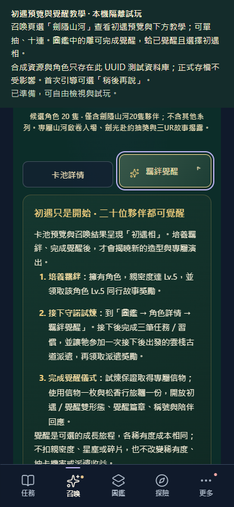

# V3.5.6 候選：覺醒教學與初遇呈現

此為 V3.5.5 發布後的獨立修改，尚未合併、發布。不沿用上一整包的人工作答。

- 「羈絆覺醒」放在「卡池詳情」旁；預設收合，點擊展開／收合，切池重置。星芒、山河青金色與箭頭呈現展開狀態，44px 觸控區與鍵盤焦點支援手機操作。
- 「更多 → 使用教學」加入完整流程；卡池說明可直達教學並聚焦，教學提供圖鑑與工坊入口。
- 二十隻卡池预覽、單抽／十連演出及結果、未覺醒圖鑑／詳情／陪伴呈現初遇圖。完成覺醒才揭曉造型，已覺醒的形態選擇保留。重複抽到同角色仍呈現初遇圖。
- canonical catalog、抽卡機率、成本、保底、稀有度、覺醒交易與存檔格式不變；圖片沿用已保存原圖，不重寫历史核准。

## 驗證

`npm test`、`pools:validate`、`images:check`、JS 語法與 diff 檢查通過。新增二十隻圖片／展示副本／教學純邏輯檢查。既有隔離覺醒瀏覽器驗收 11 項通過，紀錄保存在本資料夾的 regression 子目錄，未覆寫 V3.5.5 發布驗收。

[新 UI 瀏覽器驗收](browser-checks.json) 實測教學跳轉／焦點、二十位初遇、覺醒前後造型、重載形態、保底 UR 單抽與十連（略過且僅扣款一次）、其他卡池隱藏、320／393／1280px 無溢出。使用 UUID 合成資料庫，未操作正式玩家存檔。

## 檢視

[本機隔離試玩](http://127.0.0.1:56985/devtools/awakening-guide-review.html) 已主動開啟。進入召喚，選劍隱山河，在卡池詳情旁點「羈絆覺醒」。合成雕角色可直接進行儀式，蛤已覺醒但保留初遇相。

正式發布前仍須對固定 preview／production 整包完成驗收並取得明確「可以發布」，見現行卡池 SOP 與專案 AGENTS.md；本頁不代表發布授權。
