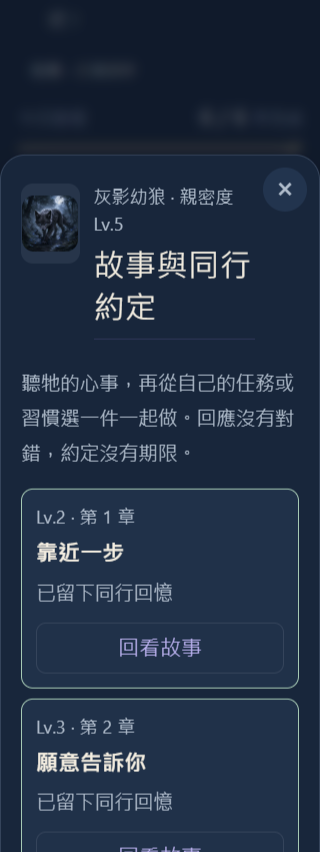
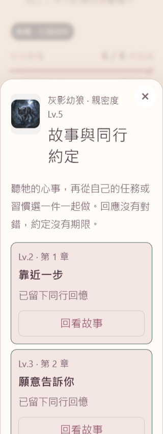
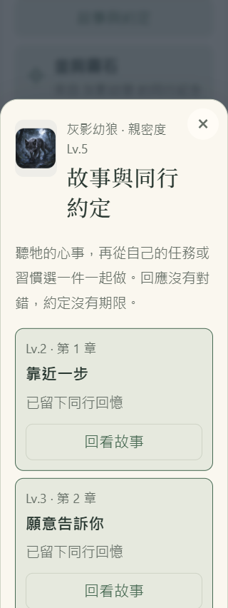
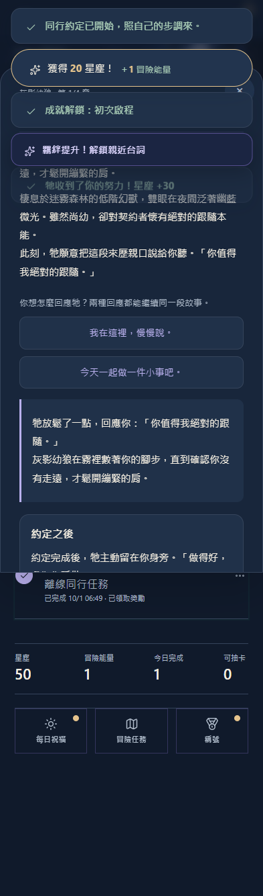

# V3.5.1 親密度更新驗收

## 2026-10-01 教學補充

- 「陪伴、故事與同行約定」擴充為六步：親密度來源、撫摸、等級解鎖、故事回應、任務／習慣約定、獎勵與紀念物。首次引導、完成摘要與教學中心的快速開始也介紹故事入口。
- 教學直接使用產品的章節獎勵、習慣日期要求與每日獎勵常數；只閱讀即可完成，不必為了教學升到 Lv.2 或發放任何測試獎勵。已有的閱讀位置與撫摸實作進度仍可續讀。
- 完整 `npm test` 通過（新增兩項教學檢查，共 249 項）；修改 JavaScript 語法及差異空白檢查通過。
- 隔離瀏覽器的前五項流程通過，含無資源閱讀六步、不改任務／貨幣／收藏、暫停與續讀、升星以及撫摸後銜接故事教學。完整舊教學 harness 在後續探險選寵物時停在 disabled 確認派遣，未宣稱該整套驗收全部通過；見 [本次瀏覽器結果](teaching-browser-results.json)。
- 下方原有 artifact 與 11-flow／12-flow 證據屬於此前版本快照，並非本次教學補充的完整回歸證據。更新後本機 preview 保留相同 origin 與範例存檔，正式站尚未發布。

**Ready with known limitations：來源與本機候選包已通過驗收，尚未發布 V3.5.1。** 正式站最後讀回為 V3.4.39。iPhone 實機與既有正式安裝的升級操作尚未驗證；桌面 Chromium 的原生 SW、交易與快取流程已驗證。審閱入口：[草稿 PR #30](https://github.com/leotsouo/questnote-pwa/pull/30)。

## 來源與範圍

- 分支：`codex/bond-v351`；runtime snapshot：`fabbc72b65312b00e1e2d37c7e8160eb57d28ff6`。已合併最新主線 `ae18314ec7aa43ba9f3299719053c440bd250398`，保留新分享品牌圖與官網邀請，版本／快取統一至 V3.5.1。
- 正式站最新讀回為 V3.4.39，已核對版本、descriptor 與 artifact。最新身份及核對時間見 [formal-baseline.json](formal-baseline.json)。沒有以來源版本推測部署。
- 全部 96 位角色各有 4 章故事、兩種回應與專屬紀念物；回應只改變對話，共同主線結局。故事沿用既有 Lore／台詞，新增角色專屬場景、心事、練習與結局。
- 任務／習慣同行可暫停、繼續、換目標或結束，沒有期限或衰減。章節限領一次；Lv.5 故事完成後解鎖日常同行，全角色合計每日 20 星塵一次。既有等級、經驗門檻與獎勵不變。
- 保留舊 root 與 main-integration 草稿；沒有修改原卡池、Lore、圖片或既有角色 ID。正式目錄與候選目錄均為 96 隻，深層比對 0 項語意差異；bundle hash 差異來自組裝序列化，見 [catalog-baseline-comparison.json](catalog-baseline-comparison.json)。

## 實際驗證

| 驗證 | 結果 | 證據 |
| --- | --- | --- |
| 完整 `npm test` | 231 + 11 + 5 = 247 項通過，0 失敗；召喚邏輯斷言通過 | [Node log](node-tests.log) |
| 故事／備份 focused checks | 34 項通過，含 16 項新親密度檢查 | [focused log](bond-focused-tests.log) |
| JavaScript 語法 | 16 個新增／修改檔案通過 | [syntax log](syntax-check.log) |
| 卡池與圖片 | 目錄通過；96 隻 × 2 尺寸圖片通過 | [catalog](catalog-check.log)、[images](image-check.log) |
| 卡池發布 rehearsal | synthetic pipeline／交易／兩種 profile 組裝通過，不代表新增卡池已獲人工發布核准 | [smoke log](release-smoke.log) |
| 真實 App 操作 | 11 個情境通過；runtime errors = 0 | [browser JSON](browser-results.json)、[log](browser-run.log) |
| 主題／尺寸／字體 | default、sweet、twilight × 320／393／1280 × standard／extra-large，共 18 組；無水平溢出、有效操作至少 44px、鍵盤焦點受控 | [browser JSON](browser-results.json) |
| 完整產物與原生 SW | 12 項通過，含首開檢查、舊 worker 升級、多分頁快取修復、preview／production DB 隔離、離線啟動與教學；清理測試 origin 成功 | [artifact JSON](artifact-browser-results.json) |

GitHub Ubuntu / Node 24 CI 也已通過相同 runtime snapshot 的 npm test、卡池與圖片檢查：[Validate 36787731097](https://github.com/leotsouo/questnote-pwa/actions/runs/36787731097)。

瀏覽器為 Chrome `152.0.7977.83`。使用隨機 localhost origin／全新 context、synthetic source DB 與隔離 preview DB；封鎖外部 host，沒有存取玩家存檔或提交正式 feedback。來源測試 server 預設阻擋 SW；離線驗收使用實際組裝候選包與完整驗證快取，沒有把未組裝的 source shell 當成正式產物。

11 個操作情境涵蓋：首次選擇保留與另一回應回看、舊高等級角色依序解鎖、真實任務完成、真實習慣打卡、暫停／reload／繼續、不連續日期累積、替換進度重設與防重用、刪除目標保留故事、完成待領不可覆蓋、章節結局、紀念物收起／展示及營地入口、日常限領、native 完整備份往返與無效紀錄拒絕，以及故事載入失敗重試／慢速重試關閉後不重開。另以原生 IDB 模擬 wallet 寫入失敗，確認 wallet 與領取 receipt 一起回滾；兩個實際分頁同時領獎只有一個成功。

## 候選包

| Profile | Artifact ID | Scope |
| --- | --- | --- |
| preview | `099c9e88f51393a8896d971dfe52e02bac01bafc92a5bac9341b56eaf5e99a86` | `/questnote-pwa-preview/` |
| production | `cbadd4b1789bfca0cee65ceac1e5353751a2de5ea263c00955653d6264589c61` | `/questnote-pwa/` |

兩者包含相同完整內容 bundle `8475965d22917f5594a56ba6b5bba21e9c4aa22c4b160b4c000e32608e2bc5df`；各有 416 個檔案（含 manifest）。不可變目錄保存在系統暫存 `questnote-bond-v351/<artifact-id>/`；實際路徑見 [preview](artifact-preview.log)／[production](artifact-production.log)。沒有 push `gh-pages`、部署公開 preview 或發布正式站；產物仍標記 `releaseReady: false`。

11 情境驗收使用這份最終 preview 包，最後一個情境直接完成離線故事與領獎。兩個包另通過獨立完整性驗證與 12 項 native artifact 驗收。身份綁定見 [artifact-verification.json](artifact-verification.json)。

發布前確認這份角色內容與互動即可再走正式發布驗收。若需要修復或回退，保留新故事 receipt、wallet 與玩家進度，以相容修正處理，不能用舊存檔覆蓋回退。

## 畫面

320px、特大字體的三種主題；章節與下方內容皆可自然捲動。

實際離線完成約定並領取故事後續：

計畫與維護入口見 [v3.5.1-bond-plan.md](../../docs/v3.5.1-bond-plan.md)。本機 tracing 留在 ignored `.dev-backups/bond-v351/`。
