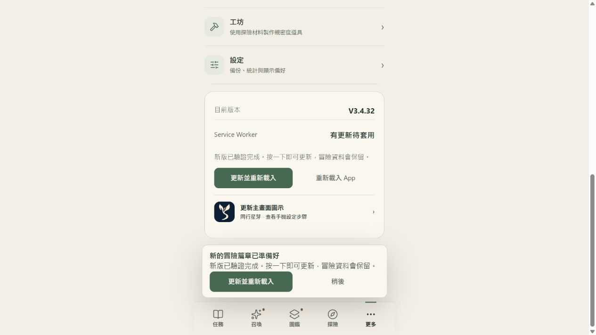

# V3.5.1 正式發布收據

2026-10-01。使用者明確核准「推上正式版」。正式網址：https://leotsouo.github.io/questnote-pwa/。

- 來源 PR：[#30](https://github.com/leotsouo/questnote-pwa/pull/30)，已合併至 main，提交 a73bab776a8b1e69243bb41311f687760f2272e9。
- 驗收 runtime source：a15406b，與合併來源全部 runtime 檔案位元組一致。
- 正式 artifact：fe265960962cc11859afed1ca7e0e5558bee31dc135eb7f9ac80fca92ec688c5。
- Manifest SHA-256：6710f51d784ced23ca1de43d64f6b05c8a2c47bcdac32b8574852f117f047d9e。
- 正式 Pages commit：09f1b66cd1db8096925fdfa117b51b5f5c7367ce，從 f86c5b2 正常 fast-forward。
- Pages 部署：[run 36881650163](https://github.com/leotsouo/questnote-pwa/actions/runs/36881650163)，success。

本次包含親密度四章故事、同行約定、紀念物與日常同行，以及精簡教學與固定上緣／自然高度的教學卡片。已整合最新 V3.4.42 的探險推薦、任務表單捲動與瀏覽器啟動恢復修正。正式 96 位角色／四個卡池的 content bundle 8475965d22917f5594a56ba6b5bba21e9c4aa22c4b160b4c000e32608e2bc5df 與公開信箱位元組原樣保留；DB/scope 維持 QuestNoteDB、/questnote-pwa/；沒有部署後端或清除玩家資料。

## 驗證

254 項 Node 測試與召喚邏輯斷言、GitHub CI、12 項原生產物驗收、11 個親密度完整瀏覽器情境通過。親密度瀏覽器驗收涵蓋三種主題、三種視窗、兩種字體、備份還原、雙視窗防重複領獎及原生 SW 下離線故事／約定／領獎。正式 417 個 staged Git blobs 全數符合產物雜湊；24 個正式 HTTPS 檔案（含全部變更檔案）符合 pinned artifact。[HTTPS 記錄](live-hashes.json)、[產物驗證](verified-artifacts.json)、[原生瀏覽器結果](artifact-browser.json)、[回歸測試](tests.log)、[親密度驗收](../production-acceptance/browser-results.json)。

完整親密度套件第一次在建立原生 artifact 情境時，因相同 artifact ID 的不同輸入模式留下不同 manifest metadata 而被不可變目錄檢查拒絕；未改寫或刪除產物。第二次使用獨立驗收輸出目錄，11 情境全部通過。驗收產物全部 sourceFiles 與正式 pinned artifact 相同；正式 artifact 另直接通過 12 項原生驗收。

## 現有瀏覽器更新狀態

正式站 HTTPS 已為 V3.5.1；既有 in-app browser 的正式 origin 仍由 V3.4.32 快取控制，已偵測 verified waiting 更新。按更新時，正常保護機制提示另一個 QuestNote 視窗仍開啟；未強制啟用 SW、未清除 IndexedDB、未關閉使用者分頁。請關閉其他正式 QuestNote 視窗，再到「更多 → 更新並重新載入」。裝置已安裝 App 的實際套用狀態仍由各裝置決定。

