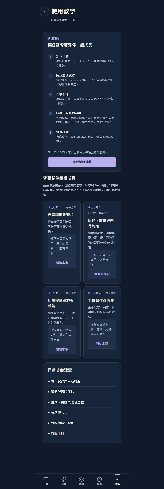
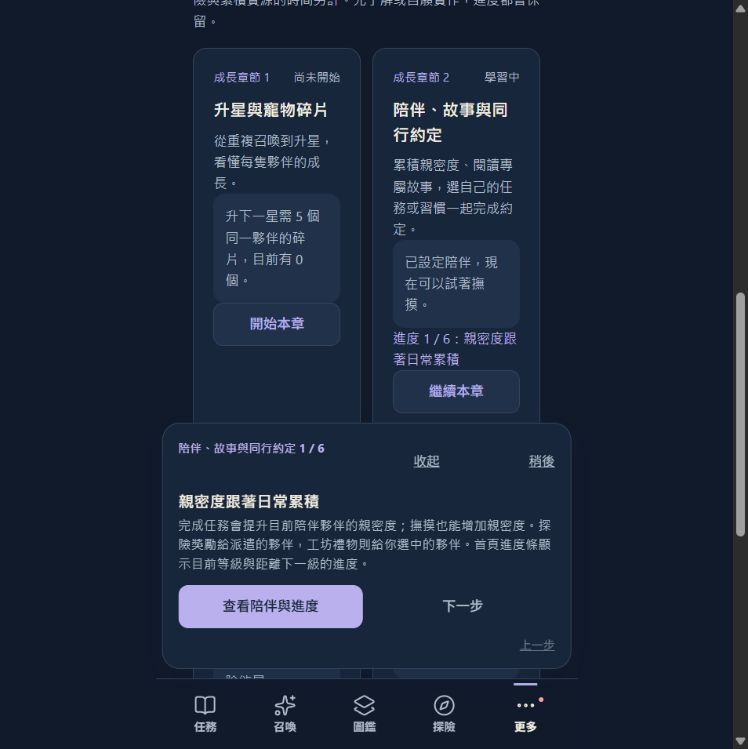
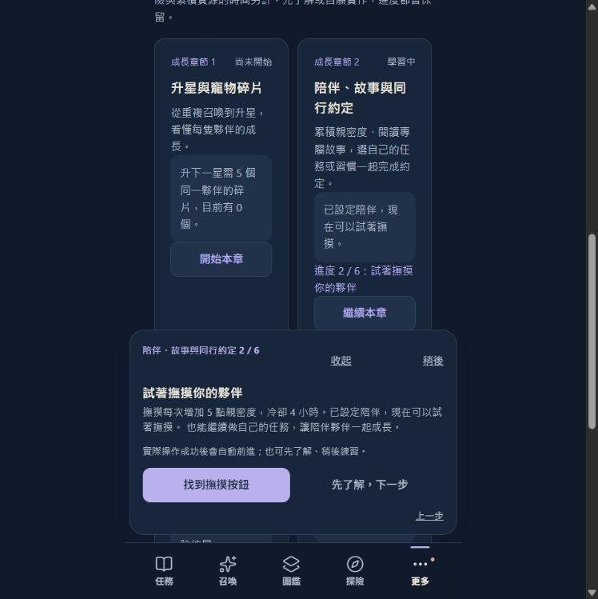
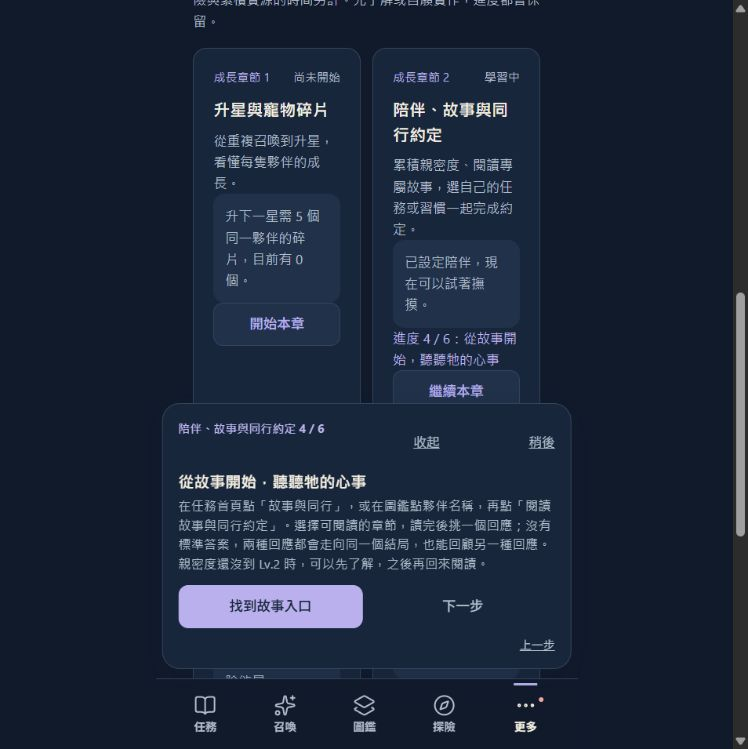
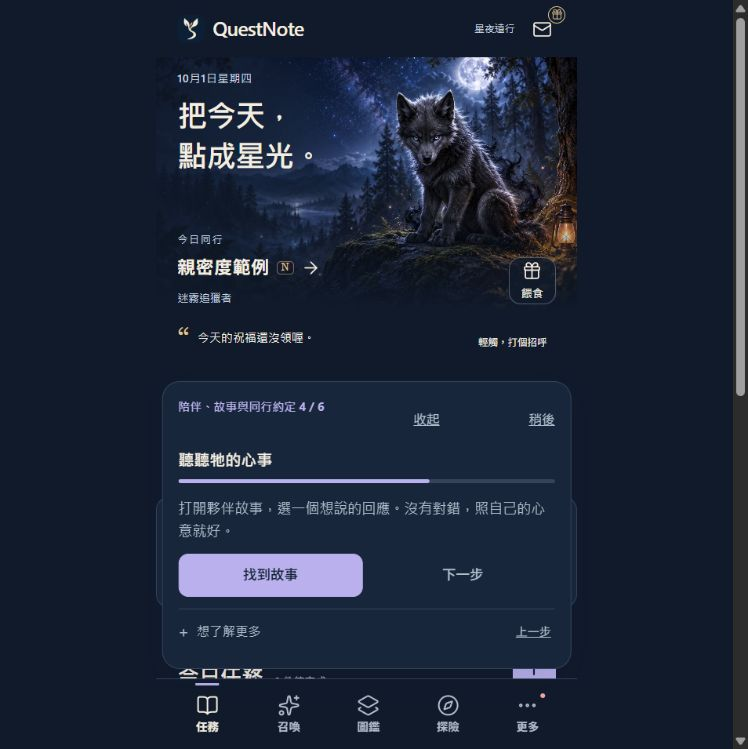

# V3.5.1 新手教學設計審查與優化

2026-10-01。以清楚的下一步、閱讀負擔、情感語氣、可中斷性與操作可達性審查。這是本機實際流程的設計審查，不是獎項評審結果。

## 結論

原版功能完整，但把規則手冊搬進每一步，尤其約定與獎勵會在預設狀態產生內部捲動。新版每一步只先呈現一句核心說明與主要動作，完整規則透過「想了解更多」展開。沿用既有夥伴畫面、色彩與語氣，讓陪伴成為操作的情境。親密度六步預設說明由約 806 字降至約 157–162 字，減少約 80%；計算不含標題、按鈕與展開規則，實際字數隨夥伴狀態改變。

加入可讀取的 progress、統一 44px 操作高度、較短動作名稱與可暫停／續看的入口。四個成長章節與快速開始一併採用簡短說明；未改動親密度、獎勵或存檔規則。

## 逐步審查

### 1. 教學入口 — 已改善

原版問題：五步介紹直接展開、雙欄卡片在窄 App 欄位中反覆換行，第一個操作被大量說明推遠。

新版優點：五步介紹折疊；章節改成單欄，每章一句目的、可見進度與開始／繼續按鈕。

操作與可及性：單欄保留較完整的閱讀寬度；展開內容仍需自然捲動。本步截圖可確認層級與文字密度；不代表螢幕閱讀器或所有字級均已通過。

原版：

新版：

### 2. 日常累積 — 已改善

原版問題：來源、限制與行為解釋一起出現，使用者很難先記住日常陪伴的主旨。

新版優點：先說日常會累積親密度；來源與每日上限留在補充說明。

操作與可及性：主要動作置於補充規則之前；可略過實作先了解，也可回上一步或暫停。本步截圖可確認層級與文字密度；不代表螢幕閱讀器或所有字級均已通過。

原版：

新版：

### 3. 撫摸夥伴 — 已改善

原版問題：練習提示和規則文字同時顯示，讓簡單的撫摸操作顯得複雜。

新版優點：一句提示 +5，主按鈕直接找到撫摸；沒有夥伴時提供設定入口。

操作與可及性：主要動作置於補充規則之前；可略過實作先了解，也可回上一步或暫停。本步截圖可確認層級與文字密度；不代表螢幕閱讀器或所有字級均已通過。

原版：

新版：

### 4. 解鎖故事 — 已改善

原版問題：四個等級門檻與敘事擠在長段落中，記憶負擔過大。

新版優點：先解釋 Lv.2 起每級有故事，以及完成前章約定並領獎才能往下；精確門檻可展開。

操作與可及性：主要動作置於補充規則之前；可略過實作先了解，也可回上一步或暫停。本步截圖可確認層級與文字密度；不代表螢幕閱讀器或所有字級均已通過。

原版：

新版：

### 5. 故事回應 — 已改善

原版問題：入口、選項與重播規則混在長段落，情感體驗被操作說明打斷。

新版優點：先邀請照心意回應；補充入口、同一結局與可重看的完整規則。

操作與可及性：主要動作置於補充規則之前；可略過實作先了解，也可回上一步或暫停。本步截圖可確認層級與文字密度；不代表螢幕閱讀器或所有字級均已通過。

原版：

新版：

### 6. 同行約定 — 已改善

原版問題：任務、習慣日期與暫停規則同時出現，預設教學已有內部捲動。

新版優點：先選一件小事；說明沒有期限。不同日期、接受前不補算、暫停與更換目標規則可展開。

操作與可及性：主要動作置於補充規則之前；可略過實作先了解，也可回上一步或暫停。本步截圖可確認層級與文字密度；不代表螢幕閱讀器或所有字級均已通過。

原版：

新版：

### 7. 同行紀念 — 已改善

原版問題：四章獎勵、最終紀念物和每日上限放在同段，預設教學需要內部捲動。

新版優點：先說完成後領獎、最後留下紀念物；數值與一次性限制留在補充說明。

操作與可及性：主要動作置於補充規則之前；可略過實作先了解，也可回上一步或暫停。本步截圖可確認層級與文字密度；不代表螢幕閱讀器或所有字級均已通過。

原版：

新版：

## 行為與驗證

- 本次逐步操作六個親密度步驟，確認標題、文字、進度與前後導航；不重設使用者的預覽資料。
- 實際以 Enter 展開、收合原生 details；同行約定完整規則可見。
- 預設獎勵步驟在 320×640、390×844、1280×900：沒有橫向溢出、內部捲動或遮住底部選單；六個操作目標高度均為 44px。量測見 [layout-checks.json](layout-checks.json)。展開完整規則時允許內部捲動。
- npm test：234 + 11 + 5，共 250 項通過、0 失敗，另有 summon 邏輯斷言通過；其中 15 項教學測試驗證短文與完整規則相容性。[完整記錄](tests.log)。
- 修改 JS 語法檢查及 git diff --check 通過。完整 npm test 執行於 cd236eb；其後 743d8c6 僅修正章節卡片單欄 CSS，已在本機預覽目視確認。

## 證據範圍與待驗證

截圖皆於本次審查實際擷取、保存並檢視。六步新版截圖使用 ea290 預覽（最終教學浮層布局）；最終入口與規則截圖使用 a681 預覽，差異僅為章節卡片單欄修正。最終 runtime source 為 743d8c6，preview artifact ID 為 a681a372820d282aebbe758165b49e5f5fd3c9dfda2b22718925a771d8faedda，416 個檔案，releaseReady=false。報告提交不另修改 runtime。

本次檢查以星夜遠行主題、標準字體與範例夥伴為主；尚未完成真實新手可用性研究、VoiceOver、iPhone 裝置與所有主題／大字體組合的完整教學驗收，不能宣稱完整 WCAG 合規或得獎。這次沒有重跑完整瀏覽器回歸套件；先前瀏覽器驗收不能當成本次優化的完整回歸證據。下一次發布前仍須完成相應驗收。

本次完成來源與本機預覽更新；未合併 main、未正式發布。
