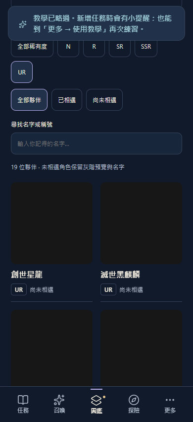

# V3.8.2 圖鑑分類正式發布 — 2026-10-07

依使用者要求移除「精簡卡片／展開卡片」，保留預設卡片排版，並發布已驗收的 N～UR 分類篩選。分類可搭配收藏狀態、系列與名字搜尋，手機自動換行顯示，沿用目前主題與美術。

- Source PR #79 CI 成功並合併：`56827677682cf089a19698c6af2131b61c841b07`。修復提交 `4eda0b1`、移除切換提交 `64757c9`。
- Production artifact：`a15c113eaf7cc4ab42e9225ea059da1271227ee4991f26b266e85238880f89fb`，manifest SHA256 `fec8638ed22f53a4d8ad35519afa11df6a7e4d8ed5a3d1480a6efaa2e898bdd6`，production profile／scope `/questnote-pwa/`。
- Pages：`cc1fd1e7672288dd5a222bcd0fc99fa9395c75fd`，正常快轉推送。[Pages run 37590060044](https://github.com/leotsouo/questnote-pwa/actions/runs/37590060044) build／deploy 全部成功；[PR #79](https://github.com/leotsouo/questnote-pwa/pull/79) 與 main CI 都成功。
- 619 個 Git blobs 逐檔核對固定產物一致；正式 HTTPS 全部 618 個檔案（含 manifest，排除僅供 hosting 的 .nojekyll）雜湊一致，見 https.json。
- 正式新隔離 Edge 瀏覽器成功取得本次 artifact，UR 顯示 19 張卡，密度切換按鈕數為 0；未操作使用者既有瀏覽器或存檔。見 live-browser.json 與下方截圖。

驗證：完整 npm test、JS 語法與 diff checks 通過；來源手機 320／390／768px × 三個主題 × normal／senior CSS 版面通過。固定 production／preview 嚴格驗證通過，18 項原生產物測試通過（離線、更新防護、資料恢复、profile 隔離與交易等）；固定 production 圖鑑另驗 UR 操作及按鈕移除。

與實際正式 baseline 比對，卡池資料／角色／Lore／系列完整保留；公告精確 bytes 保留。沒有變更 DB/schema 或部署後端。易讀模式的原生切換／iPhone／VoiceOver 不屬於此次實測範圍。原有 font-scaling 未追蹤報告保留。

本機發布材料與工具位於 `.dev-backups/collection-production-20261007`、`.dev-backups/release-collection.mjs`；固定產物留在 TEMP/questnote-collection-releases-20261007，來源與組裝器仍可重建。瀏覽器 screenshot / diagnostics 已由 producer 登記為 hold，不清理失敗診斷。初次 18 項產物驗收成功，追加畫面檢查受到測試最後留下的 all503 故障注入影響；改用全新無注入 server 補驗通過，未改產品。Git 大批 blob 驗證超出 128MiB buffer，改為分批核對；最後 HTTPS 驗證另遇短暫 DNS/TLS 中斷，恢復後重試。

