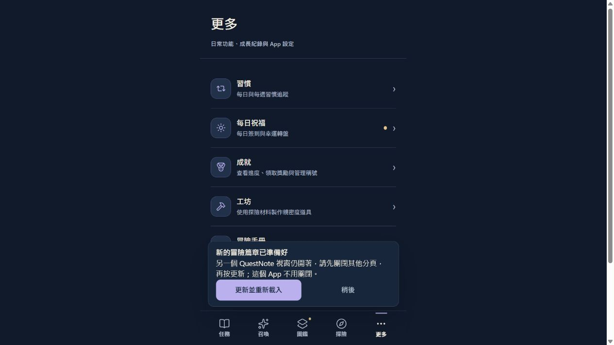

# V3.8.1 正式部署收據

2026-10-05：使用者在完整實作審查之後明確要求「部屬」。本次發布 I01、I03、I06、I07 已驗證的 SAFE 改善；沒有新增產品改善、修正 I02 或部署後端。

- Source：[PR #78](https://github.com/leotsouo/questnote-pwa/pull/78) 的 Validate CI 成功，來源合併提交 `c4c31171df1c98e9bf9a763efa368b8f707366d9`。實作來源 `7b5192c`，完整測試／Mapping 提交 `b8e8f3a` 的 runtime bytes 均保留。
- 固定 production artifact：`f6b0b5a7fa5731725d71094d33af3fd0a1d8b677810d672f131682d9bd3bbfa8`；manifest SHA256：`f977f61617a586debe17e30825a850ad66748bc8cf29a95383cf04f21222b71d`；profile production、scope `/questnote-pwa/`、`QuestNoteDB`。
- Pages 提交：`6bb8931a581ca4b53cce8dd5318b771f5c81f906`，正常快轉自 `fc8a1779df1a798bc3f143aaa8a1ea3c78a6d4a2`，沒有 force push。[Pages run 37297068513](https://github.com/leotsouo/questnote-pwa/actions/runs/37297068513) completed / success。
- [正式 QuestNote](https://leotsouo.github.io/questnote-pwa/) 全部 618 個 HTTPS 檔案（617 個 runtime / content 檔案加 manifest）雜湊符合固定產物。`.nojekyll` 另以 Git blob 核對；共 619 個 Git blobs 全部符合，見 [HTTPS 記錄](https.json)、[準備紀錄](prepared.json)。
- 發布前核對實際正式 baseline、catalog 與公告：128 隻角色、六池、所有既有 data / assets 保持一致，包含目前公告的精確 bytes 與 reward identity。未改 DB/schema、後端、既有資料或正式 preview repo。隔離 preview artifact 只用於 loopback 驗證。

## 驗證與限制

本輪沒有變更產品 runtime，因此沿用上一階段完整 npm test：12 項 focused、362 次既有 Node 測試執行、35 項 reveal 斷言全部通過；六情境操作與 JS 語法日誌見 [Final Implementation Review](../flow-implementation-2026-10-05/final-review.md)。合併前遠端 CI 再次通過，詳 [source-integration.json](source-integration.json)。

固定 production / preview 產物嚴格驗證通過；18/18 原生瀏覽器產物驗收通過，包含首次啟動、legacy worker 更新防護、cache recovery、profile 隔離、離線、核心交易、資料恢復與教學 checkpoint，完整結果見 [artifact-browser.json](artifact-browser.json)。這些是隔離瀏覽器結果，不宣稱實體 iPhone / VoiceOver 驗收或實測 UX completion rate。

正式瀏覽器能啟動，但已存在的 controller 仍提供舊 generation（觀察 index marker `b0b22f41b2ff4407b3c21e77a72eaa53ad3936b6ff2fd28da97b19c757191868`）。實際按正常「更新並重新載入」後，仍受到另一個 QuestNote 視窗的既有保護限制；沒有清 site data、強制 activation、關閉不屬於本輪的使用者視窗，亦沒有建立測試任務或貨幣。因此正式 browser 中的 V3.8.1 啟用驗證尚未完成；正式 CDN 的 V3.8.1 bytes 已全數獨立驗證。代理建立的測試分頁與 localhost server 已關閉。

使用者請關閉其他 QuestNote 分頁／視窗，再按「更新並重新載入」；不要清除網站資料。

## 已知風險與部署決定

I02 工坊跨 stores 的分次寫入仍是條件式 P0：扣料完成後道具保存失敗可能造成不一致，尚未有正式事故或發生率證據。上一輪已完整告知，使用者隨後明確要求部署；依此次指示發布四項 SAFE，將 I02 延後風險保留於收據，不把部署授權解讀成修正 I02 的授權，也不宣稱所有 Flow 問題已消失。

## 工具診斷

初次 Node fetch 無法驗證本機代理憑證；改用 Node 24 `--use-system-ca`，保留 HTTPS 憑證驗證。初次 Git 大型 image blob 讀回超過預設緩衝；將發布工具 maxBuffer 提高至 64 MiB 後全數通過。兩次原始失敗與最後成功 log 均保留。正式 browser 支援按鈕曾因 role 與舊 generation 不符而 selector timeout；重新讀取 DOM 後改驗證當前可見更新提示，未修改產品迎合測試。

部署工具及證據是本輪新增的檔案；來源 runtime、Function Mapping 與所有 KEEP 流程未再變更。原本未追蹤的 font-scaling 報告與根目錄草稿保留。
