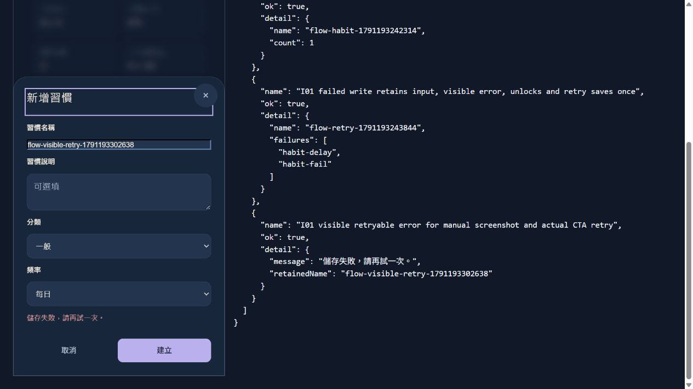
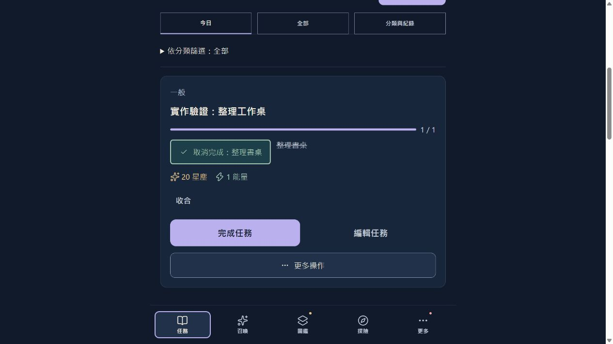
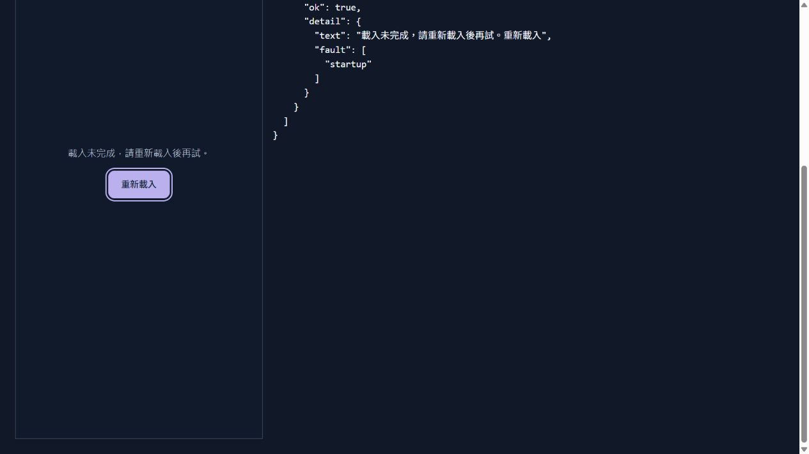

# Final Implementation Review

日期：2026-10-05。維護 checkout：`.worktrees/main-integration`；產品版本 V3.8.1，最終產品 source commit `7b5192c`，相對核准審查基準 `872d144`。本機實作／驗證，未 push、merge、發布或查驗正式部署。

只執行 SAFE 的 I01、I06、I03、縮小後 I07。各項依 Problem → Implement → Local Test → Scenario Test → Regression Test → Compare Before/After 驗證並本機 commit；最後再做全套 regression 與六情境交叉檢查。

## 1. Implemented Changes

| ID | 實作結果 | Scope | 本機 commit |
| --- | --- | --- | --- |
| I01 | 習慣表單 pending 防重、儲存中、保存失敗保留输入並解鎖；提交後刷新失敗明確說已存，不讓原表單再建立 | SMALL | `483b917` |
| I06 | 子任務 label 含目標與完成／取消完成，aria-pressed 使用既有 completed；易讀文字也同步準確 | SMALL | `9b72537` |
| I03 | initApp catch 將既有 loader 接回 document，顯示中性載入錯誤與取得焦點的整頁 reload CTA | SMALL | `5ef0c44` |
| I07 | restore 共用 catch 的 inline/toast 使用同一句中性回饋，不斷言資料未寫入或備份檔錯誤 | SMALL | `7b5192c` |

另同步 V3.8.1／BUILD_TIME／SW cache；既有 runtime 模組已在 precache 中，未加入新 runtime 模組。新聚焦檢查納入 npm test，沒有新增 dependency 或 schema。

## 2. Changes Not Implemented

- **I02：REQUIRES REVIEW，未明確核准，不實作。** 工坊 wallet → inventory → stats 仍為分次寫入。既有頁內鎖保留，不宣稱具有跨 stores 原子性。
- **I04、I05：已撤回，不實作。** 保留一般模式取消語意及提醒保存／待同步／重試。
- 不實作 I03 頁內重新初始化、恢復 wizard／錯誤分類；不實作 I07 restored flag／階段分支。
- 沒有 MAJOR PRODUCT DECISION、核心導航／onboarding／data model 改版。

## 3. Final Scenario Verification

使用 Codex In-app Browser、真實 App DOM／native IndexedDB；兩個 server 指定 UUID 隔離 origin。檔案、測試 hooks 只屬 devtools，不加入 App。沒有碰使用者真實存檔或正式收件／推播。

| Step / Scenario | 操作與結果 | Health / 限制 |
| --- | --- | --- |
| 1 / First-time | 全新 DB 跑真實歡迎 → 預填新增 → 完成 → 獎勵；在預填 editor reload 後续接 | PASS。首次實際完成記於 six-scenarios-first-run.json 的 A；其後 test selector 失敗另留檔。沒有真人理解率數據。 |
| 2 / Returning | 回訪保留完成教學、任務／習慣；直接新增、切換子任務；More→Habits→Tasks 返回 | PASS。未新增成功路徑點擊，不宣稱量測速度提升。 |
| 3 / Interrupted | 教學 checkpoint、已存 task/subtask、易讀偏好 reload 保留；切換 browser tab 再返回 | PASS。未測 OS kill、真實手機背景 suspension 或裝置離線恢復。一般未存草稿仍不承諾跨重啟保存。 |
| 4 / Error / Failure | required 空值不保存；pending 重送一筆；注入 native transaction 建立例外，保留習慣輸入、顯示錯誤並重試一筆；啟動失敗 reload；restore 前／後故障中性訊息 | PASS。delay 是 real transaction 完成 callback 的延遲；throw 是 transaction 建立邊界，不能當原生 quota/abort/斷電實測。 |
| 5 / Change Mind | 一般 Cancel 不建立任務；導航返回正常；易讀 dirty Close → Continue 保留原文字 → Discard 返回焦點 | PASS。保存中習慣退出暫停；正常 Cancel 無新確認。 |
| 6 / Low Digital Familiarity | 易讀可見子任務名稱及取消完成；正常／易讀 Space 切換；習慣失敗時 Enter 使用原建立 CTA 重試；啟動 Enter reload | 控制語意／鍵盤／路徑 PASS。未招募低數位熟悉度使用者，不能稱真人 UX 通過或完整 accessibility 合規。 |

證據：[首次與工具失敗紀錄](six-scenarios-first-run.json)、[修正後 5/5 情境檢查](six-scenarios-final.json)、[I01 3/3](I01-browser.json)、[I03 2/2](I03-browser-final.json)、[I07 2/2](I07-browser.json)、[人工觀察](manual-scenario-notes.md)。初次完整教學 A 的 PASS 和後續 B–F PASS 合併評估，不把第二次既有存檔當成重新測過 first-time。

已保存並檢視的代表畫面：





其他 accepted 截圖 01–11 與逐步描述见 manual-scenario-notes.md。

## 4. Regression Results

**npm test：PASS（exit 0）。** 12 個新聚焦 checks、362 個既有 Node test 執行、35 個 reveal 邏輯 assertions 全通過；362 含既有命令重複執行的 suites，不宣稱 362 個唯一 UX scenario。

逐項局部：I01 6 checks + 9 regression；I06 1 check + 8 regression；I03 2 checks + 18 regression；I07 3 checks + 22 regression。全套後沒有再為湊數重跑相同 suites。JavaScript 語法、cache 同步、mapping／ASCII 名稱與來源位置另外檢查。

| Regression concern | 驗證 |
| --- | --- |
| 主要新增／完成／成長、教學與召喚等 | 全套服務／交易／演出測試；實際真實教學、任務／子任務／習慣路徑 |
| 保存／既有資料／state restore | native 合成記錄 reload、restore 前後原 task IDs；22 backup safety tests 覆蓋歷史版本與合法存檔。未讀取真實使用者資料。 |
| Navigation / Back / Cancel | More 與子頁返回、取消不寫入、易讀继续／放棄與焦點；瀏覽器歷史 Back 及真實裝置返回鍵未單獨測量，不宣稱涵蓋。 |
| Loading / Empty / Error / Retry | 初次空存檔、required、明確 pending、習慣重試、可見初始化 reload；既有 empty/load distinction 測試 |
| Duplicate prevention | 同一次 pending submit 一筆；成功後 detached callback 不再寫入；不保證跨頁或成功回應遺失的全域去重 |
| Offline / Update / Reminders | 既有 app-update、preview-cache-recovery、release-safety、reminders 測試通過；本次隔離 origin 禁 SW，不作裝置推播／發佈驗收聲稱 |

完整日誌：full-regression.log、focused-tests.log、各項 local/regression.log。工具失敗已留檔並修正：constructor precedence、modal 隱藏未刪除、legacy CTA 隱藏、mock 缺少 focus。沒有用工具失敗推導新的產品改善。

## 5. Final ASCII Flow

下面是最终 source-backed **全產品功能級**流程，不是逐行 call graph；1411 個具名宣告的精確位置見 function-index.md。匿名事件 callback 明示為 callback。[SEQ]＝分次寫入，[TX]＝同一交易；不能將所有服務誤標成原子。

```text
[S] index.html / 開啟 QuestNote
 -> [F] bootApplication()
 +-- release 驗證未過 -> [ERR] renderBootstrapRecovery() [KEEP]
 `-- source 或 verified release -> [F] initApp()
      -> [API] openDB() / catalog / preferences / migrations
      +-- failure -> [C] 可見 loader / 載入未完成 [I03]
      |              -> [UX] 重新載入 -> [NAV] 整頁 reload
      `-- success -> [F] initUI() / refreshState()
           -> [STATE] tasks / wallet / habits / collection / preferences
           +-- 新存檔 -> [S] 真實任務教學 [KEEP]
           |    -> [F] prepareGuidedOnboarding() / advanceGuidedOnboarding()
           |    -> [C] 預填任務 -> [F] commitTutorialTask() -> [API] [TX]
           |    -> [C] 完成 -> [F] claimTutorialReward() -> [API] [TX]
           |    -> [STATE] receipt / checkpoint / completed
           |    [UX] 續接、略過、重播；[F] recoverGuidedOnboarding()
           `-- 回訪 -> [NAV] switchView() / 中文主選單
                |
                +-- [S] 任務 / 今日 / 全部 / 智慧
                |    -> [F] renderTasksView() / renderTaskCard()
                |    +-- [C] 新增/編輯 -> [F] openTaskForm()
                |    |    -> [STATE] 原有 saving guard
                |    |    -> [F] createTask()/updateTask() -> [API] 保存
                |    +-- [C] 子任務「完成/取消完成：名稱」+ pressed [I06]
                |    |    -> [F] toggleSubtaskComplete() -> [API] 保存
                |    +-- [C] 今日安排 -> [F] addToTodayPlan()/removeFromTodayPlan()
                |    +-- [C] 主任務完成 -> [F] toggleTaskComplete()/claimTaskReward()
                |    |    -> [API] 正式任務既有 [SEQ]；教學 [TX]
                |    `-- [C] 刪除 -> [UX] 確認 -> [F] deleteTask()
                |
                +-- [S] 召喚
                |    -> [F] renderGachaView()/renderEncounterView()
                |    -> [UX] 切池 / 單抽 / 十連 / 指定邀請
                |    +-- [F] pullOnce()/performTenPull()/executeDraw()
                |    |    -> [API] wallet+stats+collection+fragments [TX]
                |    |    -> [F] presentCommittedEncounters() -> [C] 演出/結果
                |    `-- [F] inviteCompanion() -> [API] fragments+collection [TX]
                |         -> [C] 到來 / 可設陪伴
                |
                +-- [S] 圖鑑 / 角色詳情
                |    -> [F] renderCollectionView()/openPetDetailModal()
                |    -> [C] 篩選 / 暱稱 / 陪伴 / 收藏里程碑
                |    -> [F] setPetNickname()/setCompanion()/claimCollectionMilestone()
                |    -> [API] 收藏與領取紀錄
                |    +-- [S] 故事與同行約定
                |    |    -> [F] createBondJourneyController()/startBondAgreement()
                |    |    -> [STATE] active/paused/ready
                |    |    -> [F] syncBondJourney()/claimBondAgreement() -> [API] [TX]
                |    `-- [S] 羈絆覺醒
                |         -> [F] createAwakeningController()/startPetAwakening()
                |         -> [STATE] 新完成與指定探險進度
                |         -> [F] awakenPet() -> [API] 食物/信物/形態 [TX]
                |         -> [C] 演出 / 形態切換
                |
                +-- [S] 探險 / 探索 / 營地 / 歷史
                |    -> [F] renderExpeditionView()/openExpeditionDispatchModal()
                |    -> [UX] 地区 / 目標 / 夥伴 / 成本
                |    -> [F] startExpedition() -> [API] 能量+plannedResult [TX]
                |    -> [STATE] endsAt -> [C] 倒數
                |    -> [F] claimExpeditionRewards() -> [API] 領獎/進度 [TX]
                |    +-- [F] claimExplorationMilestone() -> [API] [TX]
                |    +-- [F] upgradeCamp() -> [API] wallet+camp [TX]
                |    `-- [F] renderJourneyArchive()/showJourneyReport()
                |
                `-- [S] 更多 -> [F] renderMoreView()
                     +-- [S] 習慣 -> [F] renderHabitsView()/openHabitForm() [I01]
                     |    -> [C] 建立/儲存 -> [STATE] saving / disabled
                     |    -> [F] createHabit()/updateHabit() -> [API] 保存
                     |    +-- reject -> [ERR] 保留輸入、解鎖 -> [UX] 原 CTA 重試
                     |    `-- resolve -> [NAV] closeModal() -> [F] onRefresh()
                     |         [ERR] 後續刷新失敗：「已儲存，請重新整理」
                     |    [C] 打卡/取消/封存
                     |     -> [F] completeHabitToday()/uncompleteHabitToday()/archiveHabit()
                     +-- [S] 每日祝福
                     |    -> [F] performDailyCheckIn()/prepareDailyWheelSpin()
                     |    -> [F] finalizeDailyWheelSpin() -> [API] 領取紀錄+資源 [TX]
                     +-- [S] 工坊 -> [F] renderWorkshopView()
                     |    -> [UX] 製作/送禮/收件夥伴
                     |    -> [F] craftItem(): spendMaterials() -> saveInventory()
                     |         -> saveWorkshopStats() [API] [SEQ] [I02 未改/待 Review]
                     |    -> [F] useBondItem() -> [API] 庫存/親密度 [SEQ]
                     +-- [S] 成就/稱號 -> [F] renderAchievementsView()
                     |    -> [F] claimAchievementReward()/equipTitle() -> [API] 紀錄/資源
                     +-- [S] 冒險手冊 -> [F] renderHandbookView()
                     |    -> [F] getAdventureHandbookSummary() -> [C] 彙整/跳到功能
                     +-- [S] 使用教學 -> [F] openOnboardingEducation()/movePageTour()
                     |    -> [STATE] lesson/pageTour -> [UX] 練習/退出/重播
                     +-- [S] 分享 -> [F] shareQuestNote()/copyQuestNoteInvitation()
                     |    -> [API] share/clipboard -> [C] 結果
                     +-- [S] 回報 -> [F] initFeedback()
                     |    -> [API] 本機 draft/pending -> [C] 預覽
                     |    -> [UX] 送出 -> [F] sendFeedback() -> [API] POST/D1
                     |    -> [C] 收件編號；[ERR] 保留可重試資料
                     `-- [S] 設定
                          +-- [F] applyTheme()/setFontSize()/setReadingMode()
                          |    -> [API] preferences -> [F] syncSeniorPresentation()
                          |    -> [C] 同資料、易讀文字與既有 dirty guard [KEEP]
                          +-- [F] initReminders()/saveReminderSettings()/syncReminders()
                          |    -> [API] 本機保存 + 同意後雲端同步
                          |    -> [STATE] dirty/pending -> [C] 原重新同步 [KEEP]
                          +-- [C] 匯出 -> [F] downloadBackup()/exportBackup()
                          +-- [C] 匯入 -> [F] handleImportFileSelect()/previewBackup()
                          |    -> [UX] 預覽/確認 -> [F] createAutoBackupBeforeImport()
                          |    -> [UX] 最後確認 -> [F] executeRestoreBackup() [I07]
                          |    -> [F] restoreBackup()/safeReplaceAllData()/replaceAllStores()
                          |    -> [API] 全 stores [TX] -> [F] refreshState()
                          |    [ERR] 共用中性文字：重新整理並檢查資料
                          +-- [C] 更新 -> [F] runUpdate()/reloadSafely()
                          |    -> [API] verified SW/cache -> [NAV] 安全 reload
                          `-- [C] 重置 -> [UX] 既有兩次確認 -> [F] resetAllData()

共用：[C] 信箱 -> [F] syncGlobalMailbox()/claimMailboxReward() -> [API] [TX]
      [C] 任務進度 -> [F] trackQuest()/claimQuestReward() -> [API] [TX]
      [C] 全領 -> [F] claimAllAvailableRewards()/claimRewardBatch() [逐項結果]
      [C] 陪伴/餵食 -> [F] petCompanion()/useBondItem()
      [NAV] modal 關閉 -> [F] dismissModal()/closeModal()
      [STATE] 保存中的 task/habit 不退出；其餘 Cancel / 易讀 dirty guard [KEEP]
      [ERR] 各服務既有 validation/error 路徑保留，非全部錯誤皆能自動恢復
```

## 6. Final Function Mapping

本輪修改 function：**openHabitForm、dismissModal、renderTaskCard、initApp（catch）及 executeRestoreBackup**。hideLoader closure 仍為 remove，修改的是 catch 再接回宿主。沒有修改 service／persistence function。

[完整功能級 Mapping 與逐項驗證鏈](function-mapping.md)，欄位為 Flow Step / Function / File / Responsibility，修改明示 MODIFIED。[最終 1411 個具名宣告位置](function-index.md) 已根據最終 source 重算。

| Flow Step | Function | File | Responsibility |
| --- | --- | --- | --- |
| 啟動驗證 | `bootApplication()` | [src/bootstrap.js:6](../../src/bootstrap.js#L6) | 驗證 release scope/artifact 後開 App |
| 初始化 **MODIFIED I03** | `initApp()` | [src/app.js:512](../../src/app.js#L512) | 資料/目錄/UI；失敗可見 host 與整頁 reload |
| 資料初始化 KEEP | `openDB()` | [src/db.js:50](../../src/db.js#L50) | 開既有 DB 與版本遷移 |
| 狀態刷新 KEEP | `refreshState()` | [src/app.js:242](../../src/app.js#L242) | 讀取共享狀態並要求所需畫面刷新 |
| UI 綁定 KEEP | `initUI()` | [src/ui.js:595](../../src/ui.js#L595) | 註冊原有功能與 modal 互動 |
| 主導航 KEEP | `switchView()` | [src/ui.js:1414](../../src/ui.js#L1414) | 五個主入口與更多子頁 |
| 模態退出 **MODIFIED I01** | `dismissModal()` | [src/ui.js:1557](../../src/ui.js#L1557) | 保存中 task/habit 阻擋退出；保留易讀 dirty guard |
| 模態關閉 KEEP | `closeModal()` | [src/ui.js:1592](../../src/ui.js#L1592) | 隱藏原 overlay、恢復焦點；不移除其 DOM |
| 首次教學 KEEP | `prepareGuidedOnboarding()` | [src/guidedOnboardingService.js:7](../../src/guidedOnboardingService.js#L7) | 空存檔開始；既有存檔不強制教學 |
| 教學中斷 KEEP | `recoverGuidedOnboarding()` | [src/guidedOnboardingService.js:21](../../src/guidedOnboardingService.js#L21) | 續接持久化 checkpoint |
| 教學任務 KEEP | `commitTutorialTask()` | [src/guidedOnboardingService.js:59](../../src/guidedOnboardingService.js#L59) | task 與教學狀態同交易 |
| 教學獎勵 KEEP | `claimTutorialReward()` | [src/guidedOnboardingService.js:73](../../src/guidedOnboardingService.js#L73) | receipt/task/wallet/companion 同交易 |
| 任務表單 KEEP | `openTaskForm()` | [src/ui.js:3184](../../src/ui.js#L3184) | 最小內容、選填進階、原保存防重 |
| 任務保存 KEEP | `createTask()` | [src/taskService.js:88](../../src/taskService.js#L88) | 建立任務與原驗證 |
| 主任務完成 KEEP | `toggleTaskComplete()` | [src/taskService.js:225](../../src/taskService.js#L225) | 切換完成與呼叫既有獎勵流程 |
| 任務卡 **MODIFIED I06** | `renderTaskCard()` | [src/ui.js:3106](../../src/ui.js#L3106) | 派生子任務目標/下一步 label/pressed |
| 子任務保存 KEEP | `toggleSubtaskComplete()` | [src/taskService.js:194](../../src/taskService.js#L194) | 原完成切換與持久化 |
| 習慣表單 **MODIFIED I01** | `openHabitForm()` | [src/ui.js:7798](../../src/ui.js#L7798) | saving guard/error/input retry/已提交刷新邊界 |
| 習慣保存 KEEP | `createHabit()` | [src/habitService.js:88](../../src/habitService.js#L88) | 既有驗證/ID/保存；未新增同名規則 |
| 習慣編輯 KEEP | `updateHabit()` | [src/habitService.js:124](../../src/habitService.js#L124) | 保留原 ID 與設定驗證 |
| 習慣打卡 KEEP | `completeHabitToday()` | [src/habitService.js:416](../../src/habitService.js#L416) | 既有日期/領獎規則 |
| 習慣取消/封存 KEEP | `archiveHabit()` | [src/habitService.js:157](../../src/habitService.js#L157) | 保留歷史記錄與封存语意 |
| 召喚 KEEP | `executeDraw()` | [src/gachaService.js:30](../../src/gachaService.js#L30) | 提交 wallet/stats/collection 等同交易 |
| 召喚結果 KEEP | `presentCommittedEncounters()` | [src/encounterView.js:286](../../src/encounterView.js#L286) | 提交後呈現；不重抽 |
| 指定邀請 KEEP | `inviteCompanion()` | [src/encounterEconomyService.js:17](../../src/encounterEconomyService.js#L17) | 碎片與取得角色同交易 |
| 圖鑑 KEEP | `renderCollectionView()` | [src/ui.js:6366](../../src/ui.js#L6366) | 篩選/詳情/角色入口 |
| 陪伴 KEEP | `setCompanion()` | [src/collectionService.js:332](../../src/collectionService.js#L332) | 共享收藏記錄中設定單一陪伴 |
| 故事約定 KEEP | `createBondJourneyController()` | [src/bondJourneyController.js:6](../../src/bondJourneyController.js#L6) | 故事/目標/暫停/領取介面 |
| 覺醒 KEEP | `createAwakeningController()` | [src/petAwakeningController.js:5](../../src/petAwakeningController.js#L5) | 條件/進度/ready/覺醒介面 |
| 派遣 KEEP | `startExpedition()` | [src/expeditionService.js:212](../../src/expeditionService.js#L212) | 成本與預定結果同交易 |
| 探險領取 KEEP | `claimExpeditionRewards()` | [src/expeditionService.js:294](../../src/expeditionService.js#L294) | 重新檢查資格並提交結果 |
| 探索里程碑 KEEP | `claimExplorationMilestone()` | [src/explorationService.js:532](../../src/explorationService.js#L532) | 領取記錄與獎勵同交易 |
| 營地 KEEP | `upgradeCamp()` | [src/campService.js:21](../../src/campService.js#L21) | 既有資源成本/營地交易 |
| 工坊 **UNCHANGED I02** | `craftItem()` | [src/workshopService.js:347](../../src/workshopService.js#L347) | 既有頁內鎖與分次扣料/道具/stats；待 Review |
| 送禮 KEEP | `useBondItem()` | [src/workshopService.js:507](../../src/workshopService.js#L507) | 既有庫存/收件條件/親密度流程 |
| 每日祝福 KEEP | `performDailyCheckIn()` | [src/dailyCheckInService.js:231](../../src/dailyCheckInService.js#L231) | 日期/資源領取交易 |
| 成就 KEEP | `renderAchievementsView()` | [src/ui.js:8495](../../src/ui.js#L8495) | 解鎖、領取與稱號入口 |
| 手冊 KEEP | `renderHandbookView()` | [src/ui.js:8214](../../src/ui.js#L8214) | 彙整紀錄、目標與功能跳轉 |
| 信箱 KEEP | `claimMailboxReward()` | [src/mailboxService.js:610](../../src/mailboxService.js#L610) | 原資格/claimed 檢查與獎勵交易 |
| 回報 KEEP | `initFeedback()` | [src/feedbackController.js:8](../../src/feedbackController.js#L8) | 本機草稿、預覽與送出/receipt |
| 分享 KEEP | `shareQuestNote()` | [src/shareService.js:13](../../src/shareService.js#L13) | 系統分享或複製 fallback |
| 提醒 KEEP | `syncReminders()` | [src/reminderService.js:121](../../src/reminderService.js#L121) | 本機 dirty 狀態與已有同步/重試 |
| 易讀呈現 KEEP | `decorateSeniorControls()` | [src/seniorModeController.js:184](../../src/seniorModeController.js#L184) | 從正確 label 產生可見文字 |
| 備份預覽 KEEP | `previewBackup()` | [src/backupService.js:516](../../src/backupService.js#L516) | 覆蓋前顯示資料摘要 |
| 恢復回饋 **MODIFIED I07** | `executeRestoreBackup()` | [src/ui.js:8963](../../src/ui.js#L8963) | 原恢復流程；catch 改中性且一致 |
| 恢復替換 KEEP | `restoreBackup()` | [src/backupService.js:615](../../src/backupService.js#L615) | 驗證/遷移後呼叫原全 stores 交易 |
| 資料替換 KEEP | `replaceAllStores()` | [src/db.js:279](../../src/db.js#L279) | 同一 transaction clear/put 全 stores |
| 更新 KEEP | `initAppUpdates()` | [src/updateController.js:161](../../src/updateController.js#L161) | 原 verified worker 與安全更新 gate |
| 重置 KEEP | `handleReset()` | [src/ui.js:9268](../../src/ui.js#L9268) | 保留兩次確認及原重置流程 |

歷史 Current State／Scenario／Second-pass 報告保留它們標示的 baseline，不被改寫成「當時已修好」；舊總覽增加本輪最終 mapping 指引。

## 7. Before / After

### I01

**Problem：** 同一次 pending submit 可重送，寫入例外无回饋。

```text
Before: [C] submit -> [F] createHabit() -> [API] pending
        [C] submit -> [F] createHabit() -> [API] 第二筆
After:  [C] submit -> [STATE] saving -> [C] disabled / 儲存中
        -> [API] write -> 失敗 [ERR] 輸入保留/解鎖 -> [UX] 重試
                     -> 成功 [NAV] 關閉/刷新，不重新建立
```

**Evidence：** actual-source tests、native completion-delay 重送／transaction-creation failure。**Result：**一筆保存、失敗可重試、成功後刷新錯誤不誤報未保存。**Regression Risk：** pending 退出暫停及提交後刷新邊界。**Verification：**6 checks、9局部 regression、I01-browser.json、實際 Enter 重試。

### I06

**Problem：** 已完成仍称完成子任務，讀不到 pressed。

```text
Before: [STATE] true -> [C]「完成子任務」/ 無 pressed
After:  [STATE] true -> [C]「取消完成：目標」/ pressed=true
        [STATE] false -> [C]「完成：目標」/ pressed=false
```

**Evidence：** source render、正常／易讀 DOM、鍵盤操作、04/05/10畫面。**Result：**語意正確，無新增確認、layout 或資料欄位。**Regression Risk：**名稱 escaping 與易讀裝飾。**Verification：**real escapeHtml 測試、完成/取消、Space、8局部 regression。

### I03

**Problem：**既有錯誤文字寫在 detached loader。

```text
Before: [API] fail -> [F] hideLoader() -> [ERR] detached text
After:  [API] fail -> [C] 接回 error host -> [ERR] 載入未完成
        -> [UX] 重新載入 -> [NAV] 整頁 reload
```

**Evidence：** source catch、mock fallback UI failure、實際 native open fault。**Result：**訊息可見與明確 retry，原存檔 reload 保留。**Regression Risk：** error host visibility／focus；無頁內 init listener 重跑。**Verification：**2 checks、18局部 regression、實際 click/Enter reload、12畫面。

### I07

**Problem：**共用 catch 包含已 commit 後載入故障，卻一律說未完整寫入／檔案可能錯。

```text
Before: [F] restore + refresh -> [ERR]「資料未完整寫入」
After:  同一原流程 -> [ERR]「恢復流程未完成，請先重新整理並檢查資料。」
        [STATE] 無新增旗標；[API] 原交易保留
```

**Evidence：**实际共用 catch、原生 restore before／observed commit-after failure。**Result：**兩處回饋一致，移除不成立的資料斷言。**Regression Risk：**文字不提供精確阶段診斷，但避免錯誤確定性。**Verification：**3 checks、22局部 regression、I07-browser.json原記錄保留。

## 8. Remaining P0 / P1 / P2 / P3

| 等級 | 剩餘項目 | 決定 |
| --- | --- | --- |
| 條件式 P0 | **I02 製作分次寫入**：扣料完成後 inventory 保存失敗，可不一致 | 原已確認 CODE 故障條件仍存在；不是正式事故或已量測發生率。REQUIRES REVIEW 未核准，不擅自修正。 |
| P1 | 本輪核准範圍沒有剩餘已確認 P1 | I03 可見錯誤已修；不宣稱所有未知啟動故障可恢復。 |
| P2 | 本輪核准清單已完成；I04/I05撤回 | 不保留為應做 backlog，也不新增改善。 |
| P3 | 無值得追加的項目 | 停止優化。 |

I01 當次 pending 重送已修，不能據此承諾跨頁／不明提交結果全域去重。本輪没有把未測装置情境升級成新問題。

## 9. KEEP

新手真實任務/略過/續接、回訪不重跑、同頁完成、中文導航、原任務 saving guard、required/empty distinction、召喚提交後演出、頁內製作鎖、原子領獎的既有特定流程、易讀 dirty guard、刪除確認/習慣封存、備份預覽/自動備份/兩次確認/恢復交易、提醒本機保存/待同步/重試、Feedback 草稿/receipt、verified bootstrap recovery 全保留。沒有把「KEEP」改成另一批工作。

## 10. Rollbacks, if any

**沒有產品 rollback。** 檢查未發現四項實作增加正常步驟、改核心 mental model 或破壞 KEEP。修改了測試工具與 mocks 的錯誤，失敗日誌保留。

Self-review：

1. **Over-engineering？** 無。I01 一個表單 saving 狀態與局部 saved 判斷為防重及誠實回饋所需；其他修改派生語意、宿主、文字。
2. **Unnecessary redesign？** 無。沒改 layout、navigation、onboarding 或功能。
3. **新 edge case？** I01 新增 pending exit guard、保存後刷新分支，已測正常/validation/throw/edit/重送/成功後回呼。不能宣稱覆蓋所有 OS edge cases。
4. **改善 user goal？** 有可觀察的防重、可重試、準確動作與可見錯誤；未以 automated PASS 代替真人收益。
5. **破壞 KEEP？** 實際取消/導航/續接/易讀及既有 regression 未觀察到破壞。
6. **未解 P0/P1？** I02 原條件式 P0 留下，沒有偷偷排除。
7. **應 rollback？** 無已驗證的較差結果；不為保留成果降低判準。

## 11. Final Product Flow Assessment

核准四項已完成。觀察到下一步更明確，正常成功步驟沒有變多，也沒有新增 dead end 或 hidden gesture；無 measured task-speed/真人完成率宣稱。

**目前是否還存在值得阻擋發布或下一階段開發的 Flow 問題？**

**有：I02 製作資料一致性仍值得作為發布前 Review gate。** 它可以在特定故障下造成扣料但未取得道具。發布前應明確決定修正或接受延後風險；這不阻止與它獨立的下一階段開發。本輪授權只涵蓋 SAFE，故不執行 I02，也不宣稱整個產品已可無條件發布。

到此停止，不再擴張 Scope。來源 commit 與 local tests 不等於網站已發布。
