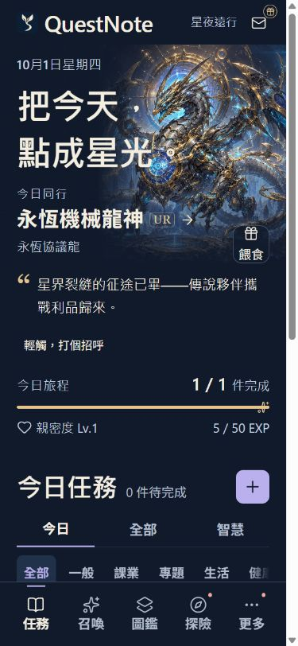
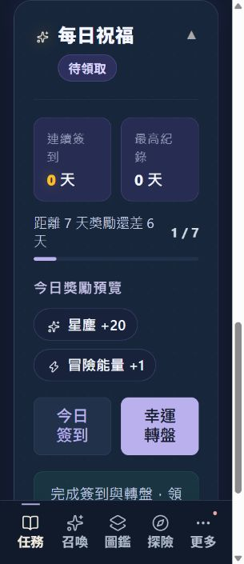
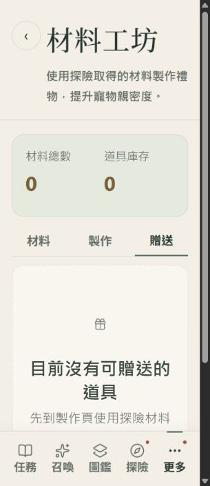

# 字體放大後的視覺檢查與修正

2026-10-01；本機 V3.4.36；分支 `codex/font-size-settings`。來源留在本機，未 push、合併或發布正式版。

## 結果與範圍

確認並修正了旅程圖示偏移、新增按鈕符號放大、稀有度拆行、每日祝福標題直排、召喚文字被固定高度裁切、探險能量與地區名稱擠壓、成就稱號操作擠壓，以及工坊空白提示文字誤放入圖示欄位。

大字模式收起裝飾英文、重複說明與空陪伴的重複引導；長任務說明改為可展開閱讀，原文和換行完整保留。派遣摘要先顯示同行數、目標、能量與時間，完整隊伍和收穫可展開。重要名稱、獎勵、價格、進度、消耗、狀態沒有因為字體放大而刪除。

測試使用隔離的 `http://127.0.0.1:8879/` IndexedDB，沒有寫入使用者的 8877 存檔，沒有提交意見回報或修改遠端內容。下列截圖均為本次實際瀏覽器畫面。

## 逐步檢查

| 步驟 | 畫面與操作 | 健康狀態及修正 | 截圖 |
| --- | --- | --- | --- |
| 1 | 任務首頁、今日旅程、長任務新增／完成／說明展開 | 已修正。星形固定 16px 並垂直置中，0/50/100% 都留在軌道內；加號使用固定 24px SVG。長說明可用 Enter 展開，原文三段和換行完整保留。 | [首頁](font-size-audit/24-home-extra-large-390.jpg)、[完整說明](font-size-audit/28-task-description-expanded-320.jpg) |
| 2 | 每日祝福、幸運轉盤視窗 | 已修正。標題獲得完整主欄寬度，待領取狀態另列；移除簽到數值前重複的標籤。轉盤圖案與獎勵清單仍可讀。此次未執行隨機轉盤。 | [祝福](font-size-audit/11-daily-after-320.jpg)、[轉盤](font-size-audit/29-wheel-extra-large-320.jpg) |
| 3 | 召喚首頁、卡池資訊 | 已修正。取消固定場景高度，收起重複的裝飾文案，保留卡池夥伴名稱；祝福摘要允許換行。沒有改動卡池、機率、價格或演出邏輯。 | [召喚](font-size-audit/12-gacha-after-320.jpg) |
| 4 | 圖鑑、長寵物名稱、詳情與餵食視窗 | 已修正稀有度拆行，UR 等徽章保持完整；名稱正常換行，對話與撫摸按鈕在大字模式分列。詳情與空庫存餵食視窗未發現字級造成的重疊。 | [窄首頁](font-size-audit/08-home-after-320.jpg)、[詳情](font-size-audit/25-pet-detail-extra-large-320.jpg)、[餵食](font-size-audit/26-pet-feed-extra-large-320.jpg) |
| 5 | 探險能量、地區卡片、派遣、進行中與到期狀態 | 已修正。能量提示分列，地區卡片按鈕另列，標題不再擠成直排。派遣大字摘要精簡且可展開。完成有效任務取得能量、派遣一隻夥伴、等待到期的本機流程成功。 | [地區／進行中](font-size-audit/10-expedition-after-320.jpg)、[派遣](font-size-audit/17-dispatch-after-320.jpg) |
| 6 | 成就、稱號管理與習慣 | 已修正稱號操作排列；長習慣名稱、說明、完成按鈕未重疊。習慣新增成功。 | [成就](font-size-audit/13-achievements-after-320.jpg)、[長習慣](font-size-audit/14-habits-after-320.jpg) |
| 7 | 工坊材料、製作、贈送與空白狀態 | 已修正。收起與頁首相同的摘要說明；四個空白狀態補上正確的圖示參數，避免提示文字被當作大圖示。製作所需材料和數量仍可讀。 | [材料](font-size-audit/15-workshop-after-320.jpg)、[空白提示](font-size-audit/18-workshop-empty-after-320.jpg) |
| 8 | 更多、設定、手冊、教學、回報及信箱 | 檢查範圍未發現新增的字級破版。選項、標籤與提示可閱讀，長頁面可捲動。回報只檢查表單，未送出。 | [更多](font-size-audit/19-more-extra-large-320.jpg)、[設定](font-size-audit/20-settings-extra-large-320.jpg)、[手冊](font-size-audit/21-handbook-extra-large-320.jpg)、[教學](font-size-audit/22-guide-extra-large-320.jpg)、[回報](font-size-audit/23-feedback-extra-large-320.jpg)、[信箱](font-size-audit/27-mailbox-extra-large-320.jpg) |

## 驗證證據

- `npm test`：195 + 11 = 206 項通過，揭曉流程邏輯斷言通過；最終結果見 [regression.log](font-size-audit/regression.log)。
- `node --check`：`src/ui.js`、`src/twilightPresentation.js`、`src/version.js`、`service-worker.js` 通過；`git diff --check` 通過。
- 新增 [font-size-layout-test.html](../devtools/font-size-layout-test.html)，使用實際樣式與首頁產生函式，不使用 IndexedDB。三風格 × 三字級 × 三容器寬度（對應 320/390/430 手機的內容空間）× 三進度 = 81 組通過。檢查圖示大小、置中、水平邊界、稀有度單行與每日祝福標題可用寬度。結果見 [layout-matrix.json](font-size-audit/layout-matrix.json)。
- 真實 App 的 320px viewport：三風格 × 三字級 × 四主頁 = 36 次檢查，無整頁水平溢出或小於兩個字寬的長標題；root font size 分別為 16/20/24px。見 [page-matrix.json](font-size-audit/page-matrix.json)。
- 真實 App 的 390/430px viewport：特大字體各四主頁共八次檢查，無整頁水平溢出。見 [wide-page-matrix.json](font-size-audit/wide-page-matrix.json)。另有桌面 1280px 畫面觀察。
- 版本和 SW cache 已同步至 V3.4.36 / `questnote-preview-cache-v3436-font-layout`；字體樣式原已納入離線 precache。

## 限制與後續驗收

以上是桌面瀏覽器手機尺寸與元件測試，沒有實體 iPhone。iPhone Safari、主畫面 PWA、iOS 系統文字大小、VoiceOver、真實安全區及系統鍵盤仍需手機驗收；不能由截圖宣稱完整無障礙合規。

字體放大後頁面會變長，使用者須捲動或展開完整說明。沒有嘗試每個寵物、任意長度暱稱、所有內容包和全部隨機演出，也沒有重做正式發布驗收。正式版保持原狀，待使用者檢視通過後才另行發布。
