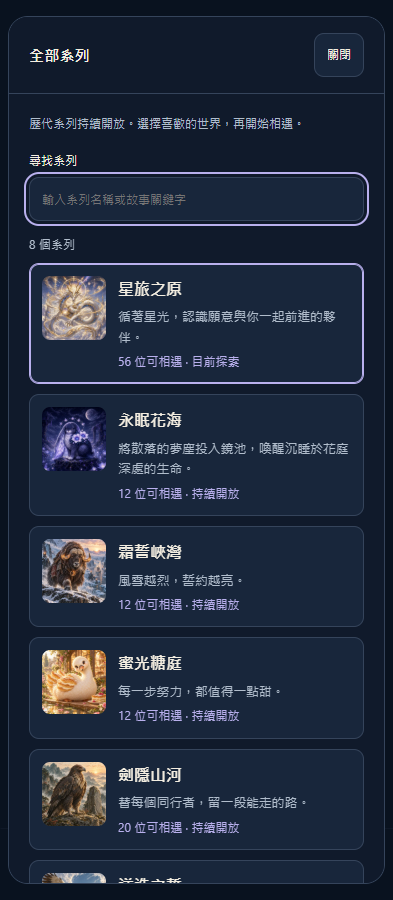

# 卡池生命週期第一階段驗收

日期：2026-10-10。基準為 `origin/main` 的 `d81d3e87a59865d4be8ba36ad0f959518e86f2e1`，工作分支為 `codex/pool-lifecycle-navigation`。本次來源版本為 V3.9.5；尚未 push、組裝正式發布包或部署。

## 完成內容

- 探索頁改為「最新登場」「星旅之原」「全部系列」三個固定入口，避免入口隨新系列持續延長。
- 全部系列目錄保留目前八個 active 系列，可搜尋名稱與故事關鍵字，顯示角色封面、可相遇數與目前選擇。
- 使用者已選系列在重新開啟後保留；新使用者仍從星旅之原開始。
- 選池與抽取期間鎖定入口，完成後恢復操作及鍵盤焦點。
- 沿用既有價格、角色候選、解鎖、保底、收藏與存檔結構。永眠花海未解鎖時顯示 12 位，擴編後為 16 位。
- 最新登場明確指定為黯冠王庭。新池發布時必須同步更新推薦 ID，已補入新卡池 SOP。

## 驗證結果

最終 `npm test` 成功退出：三組共 395 個測試（369＋14＋12）皆通過，並通過原有啟動與揭曉流程檢查。修改的 JavaScript 語法檢查與 `git diff --check` 通過。

隔離 Edge 瀏覽器使用全新 localhost 測試資料庫，通過以下流程：

1. 八個系列完整可選、搜尋與空結果、花海解鎖數及選池持久化；選池不寫入星塵、收藏或保底。
2. 最新與常設快捷入口沿用完整入場流程。
3. 320／393／1280px、三種主題、標準／特大／200% 文字，頁面和目錄均無水平溢出；Escape 返回開啟按鈕。
4. 易讀模式可使用目錄與抽取控制。
5. 離線重新開啟仍可載入目錄並切換已可用系列。
6. 真實抽取期間禁止切池，強制點擊也不改變儲存選擇；揭曉結束後控制恢復。

完整輸出保留於工作樹的 `.dev-backups/test-runs/pool-directory-final-integration/npm-test.log` 和 `.dev-backups/test-runs/pool-directory-browser-5/result.json`，已依工作樹治理登記。瀏覽器驗收是本機來源驗證，未取代正式發布包或真實手機驗收。

## 代表畫面

截圖 SHA-256：`665AF54A34A0952147F1EBD17740AD662B4BCDF62E9045488B23988A580167C1`。

## 下一階段

依改善計畫加入推薦起訖日期及倒數。14 天為推出新系列的目標節奏，推薦結束後一般系列仍持續開放；倒數需明確表示「推薦期」，避免誤導成角色永遠無法取得。尚未實作期限、經濟調整、池子合併或寵物退場。
