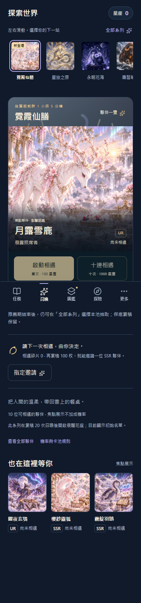
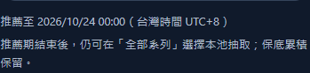

# 卡池生命週期第二階段：推薦期與倒數

本機版本 V3.9.7，2026-10-10 驗證完成。延續階段一提交 `4a237f1`，整合主線 `f5c4db0`；主線信箱資料原樣保留。本次未推送、發布或部署。

## 交付行為

- 推薦中顯示天／小時，最後 24 小時改為小時／分鐘；列出確切台灣截止時間。
- 開始／結束邊界、回到前景與離線重載均重新計算狀態。
- 到期改為「持續開放」，移除推薦標記。下一次正常重繪才調整排序，保留操作中的焦點、搜尋與選池。
- 推薦結束不關閉一般卡池，不變更星塵、收藏、保底或解鎖，不中斷單抽、十連結果。
- 使用者確認正式日期尚未確定，因此來源設定仍為 `recommendation: null`。正式發布前再設定首次上線起點與 14 天推薦期。

## 預覽（全部為測試日期，非正式排程）

隔離瀏覽器伺服器臨時提供 2026-10-10 00:00 至 2026-10-24 00:00（UTC+8）的合成安排；未修改來源設定或正式資料。裝置時區設為紐約，截止時間仍顯示台灣時間。

完整頁面截圖會包含固定底部導覽；下圖為捲動至資訊區的實際可讀畫面。

## 驗證結果

- `npm test`：407 項 Node 測試通過（381 + 14 + 12），失敗 0；既有產品流程與揭示流程檢查通過。
- 推薦期單元測試涵蓋未設定、無效日期、含時區格式、開始／結束瞬間、14 天間距、跨時區與時鐘跳動。
- 專項瀏覽器驗證：倒數刷新、到期保留畫廊搜尋與焦點、離線選池、到期不變更儲存狀態、單抽／十連期間到期後正常完成。
- 原系列目錄回歸：9 個系列免輸入即可選取、花海解鎖限制、抽取中鎖定切池、鍵盤 Escape 回焦、選池持久化。
- 320／393／1280px、三種主題、標準／特大／200% 文字、長輩閱讀模式通過；沒有水平溢出。
- JS 語法及 `git diff --check` 通過。既有 CSS hook 的兩個範圍限定例外維持不變；本次未新增忽略，CSS 檢測無新發現。
- 最終自動化輸出保留於 `.dev-backups/test-runs/pool-recommendation-final/`（受 artifact 管理，未加入 Git）。兩次先前執行失敗屬測試腳本：跨日全頁重繪干擾節點比較，以及減少動態效果模式的十連直接顯示摘要；修正腳本後完成全套重跑。

## 限制與下一步

目前時間依裝置時鐘；離線只能使用已載入的排程。推薦期限只管理曝光，不能作為限時交易或獎勵資格。瀏覽器檢查使用桌面 Edge 模擬尺寸，未宣稱實機驗證。

發布前尚須設定正式起訖、重新驗證並走既有正式組包流程。下一階段先試算 14 天星塵取得量、指定 SSR／UR 成本及跨期累積，再決定經濟調整。

## Skill 選用

已依 find-skills 查找測試能力：[Anthropic webapp-testing](https://skills.sh/anthropics/skills/webapp-testing) 可用 `npx skills add anthropics/skills@webapp-testing` 安裝。現有 Playwright 與專案測試足以完成這一切片，因此未重複安裝。
