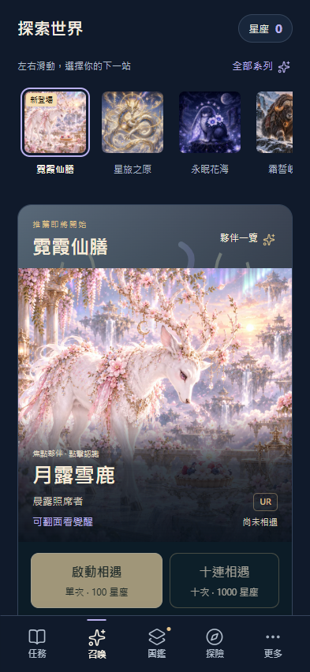
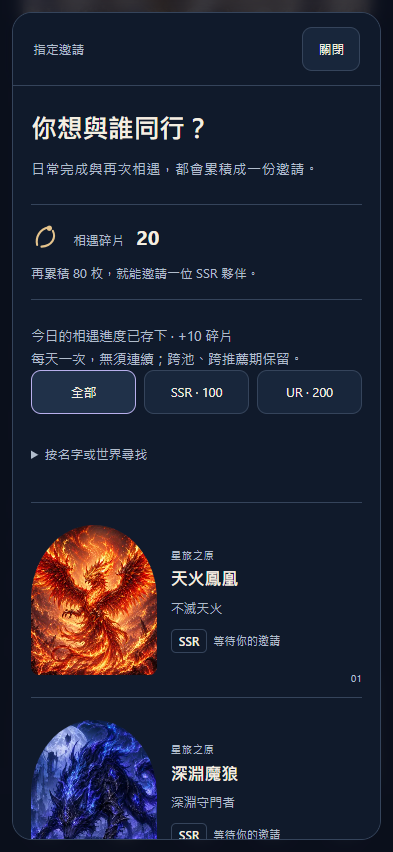
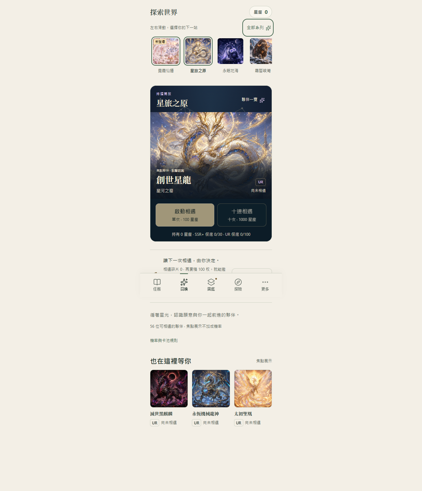
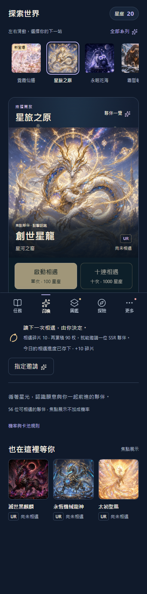

# V3.9.10 卡池生命週期改善

使用者於 2026-10-10 明確要求完成剩餘改善、審視美術後推上正式版。本次為既有卡池的探索、推薦與指定取得流程改善，不新增角色或替換已核准卡圖。

## 完成內容

- 固定高度封面列與全部系列畫廊，點圖選池；搜尋收合為輔助，保留已選系列。
- 首次推薦安排 2026-10-10 06:00 至 2026-10-24 06:00（台灣時間）；日期前顯示即將開始，到期後仍可抽取、保底保留。推薦不是寵物退場。
- 每個本地日首次完成非教學任務或有效習慣，共用相遇碎片 +10；無需連續參與。SSR 100／UR 200，跨池跨期保留。
- 完成紀錄、每日收據、相遇餘額與必要舊收藏轉換在同一 IndexedDB 交易中提交。相同日、重試、取消重做和並行不重複發放；回撥日期不重領。
- 完成回饋與指定邀請顯示實際已存下進度，保留現有故事鎖定規則。
- 整合正式 V3.9.8 的 31 張覺醒翻面預覽與 V3.9.9 的移動終點線修正，原系列、卡圖、信箱、覺醒與收藏保留。
- 建立 [14 天營運與發布規則](../../docs/card-pool-lifecycle-operations.md)，包括內容準備、推薦退場、品質門檻及三週期觀察。

## 來源驗證

完整 npm test：421 項 Node tests（395 + 14 + 12）通過，另有產品流程與召喚流程斷言通過。新增 11 項每日相遇檢查含多時區午夜／DST、任務習慣去重、教學排除、溢位與錯誤收據、舊收藏轉換、邀請扣款、備份、並行與整筆回滾。

原生瀏覽器使用全新 loopback／隔離 IndexedDB，已驗證每日發放、跨日、日期回撥、備份與離線；選池、三主題、大字級、320／393／1280px、保底與抽卡不受推薦到期影響。第一輪整合覺醒測試因兩個夥伴預覽入口的定位歧義停止；美術與資訊層級審視也確認該入口重複，因此移除下方重複入口，保留上方「夥伴一覽」，再驗證。

## 美術審視

目的：讓玩家先看到喜歡的夥伴，快速選池，清楚理解隨機抽取與指定邀請的成本與進度。

採用既有角色插畫、文字與主題做實際手機／桌面審視，不複製任何參考網站。以國際優秀數位設計作品的資訊層級、互動完整性與細節為內部標準，不宣稱獲獎或得到主辦方認證。

第一輪實際畫面發現：費用／保底文字偏小、夥伴預覽入口重複、合併的覺醒提示應與角色文案同組。已把關鍵數字升至 0.75rem，刪除重複入口，將覺醒提示放進角色名稱區；維持大字／長輩模式的獨立排版。沒有增加炫技動畫或新裝飾。

最終美術判定：可發布。實際驗證了角色焦點、按鈕與費用可讀性、三主題、大字模式、鍵盤操作與減少動態效果。放大費用後的手機首屏按鈕邊緣曾超出底部導覽 1px，已調整間距並重跑全部畫面流程通過。

本次沒有新增 detector 忽略；整合雙方既有的檔案限定例外，CSS 檢測沒有新發現。

## 限制

推薦與每日日期以裝置時間為準；不把離線 PWA 宣稱為防改時鐘或防整份存檔回滾的伺服器帳本。新備份保留收據，舊備份無法重建不存在的歷史。後續回滾需支援每日收據欄位，否則採前向修正，不能回退玩家收藏和錢包。

已驗證瀏覽器手機尺寸，實體 iPhone／VoiceOver／安裝 PWA 的裝置專屬驗收不能由桌面模擬替代。未新增遙測或部署後端；三週期實際行為觀察是後續營運工作，尚無觀測結果。

## 正式發布結果

- 來源：`8403a3062f6af25548ca7f461157eee335ec5e9a`；[PR #102](https://github.com/leotsouo/questnote-pwa/pull/102) 已合併，主線提交 `27de96aa6408b8a23d9c46494ab4d9fe629cc180`，PR 與整合後 CI 均通過。
- 正式部署：`972ebe8cfc0548e973e865f302b584240d0a9b9e`；[Pages 作業](https://github.com/leotsouo/questnote-pwa/actions/runs/37991853136) 於 2026-10-10 05:12（台灣時間）完成。
- 正式 artifact：`4b81cf66353c89177b5e9ba17eeaf2ab72795a20036763471166ef61d7c10671`。
- Manifest SHA256：`757762a177e490f78b7eae99b428e6fa636112e43d72ac416ad8470bb0095bc5`；[固定包與路徑](artifacts.json)。
- 部署樹 836 個檔案逐一與產物一致；HTTPS 讀回 835 個檔案（不讀取 `.nojekyll`），全部大小及 SHA256 一致。
- 正式站：[QuestNote](https://leotsouo.github.io/questnote-pwa/)。首期推薦尚未開始時顯示即將開始，06:00 生效；一般系列仍可抽取。

## 最終驗證與失敗處理

- 完整來源測試 421 項、整合後賽跑／發布安全 24 項、卡池與圖片檢查通過；發布流程煙霧測試通過，合成產物保留於受保護的 release archive，不當作玩家內容發布。
- [18 項原生產物驗收](artifact-browser.json) 全數通過；[V3.9.9 → V3.9.10 更新](update-offline.json) 保留收藏、故事、每日收據與備份；舊快取清除，31 張覺醒卡面線上／離線正常。
- [每日相遇](daily-browser.json)、[視覺選池](directory-browser.json)、[推薦倒數](recommendation-browser.json)、[覺醒預覽](awakening-browser.json) 原生瀏覽器驗收通過。
- 首次 HTTPS 批次讀回因網路 `ECONNRESET` 中止；該次診斷保持 hold。驗證工具改為四路並行及最多四次暫時性錯誤重試；404 與雜湊錯誤仍失敗。五個針對性模擬情境與語法檢查通過，沒有關閉 TLS 驗證。[重新讀回](live-verification.json) 835 個檔案全數一致，該輪無需重試。
- [正式 HTTPS 瀏覽器驗收](hosted-browser.json)：全新隔離 Chromium，載入正確 artifact、實際完成任務 +10、取消重做不重領、選池入口可用、離線保留收據，page errors 為 0。沒有操作使用者原有瀏覽器資料，也沒有向後端送出測試內容。
- 設計 hook 的 `side-tab` 對應角色引言 blockquote；`border-accent-on-rounded` 對應稀有度提示。均保留既有檔案限定例外，不擴成全域忽略。真正可讀性與首屏按鈕問題已修正，沒有未處理的本輪設計阻擋項。

本輪改善已完成並正式發布。後續是實體 iPhone／VoiceOver 驗收，以及第 14／28／42 天的真實使用回饋；不宣稱已完成尚未發生的營運觀察。下一池依營運規則準備，總池合併與共享保底維持獨立決策。