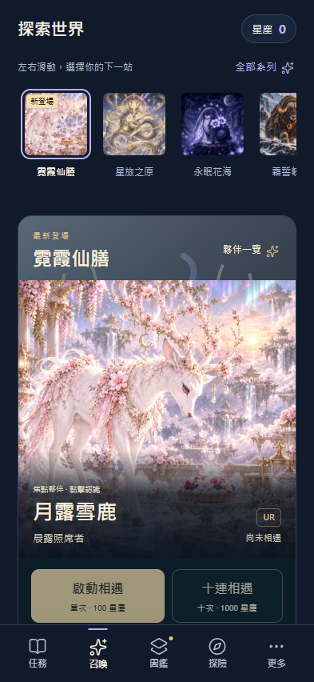
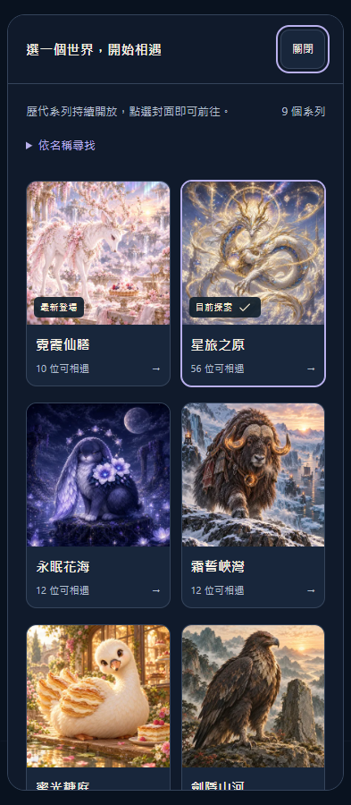

# 召喚頁：看圖選世界

## 設計判斷

使用者需要先被角色與世界吸引，再直接選池相遇。第一版目錄以搜尋欄和長條文字列為主，插畫只作小縮圖，讓收藏遊戲的探索流程接近資料查詢。

本次改為固定高度的橫向封面列，滑動或直接點選即可切換；九個 active 系列全部可達。新登場的霓霞仙膳置前，星旅之原其次，歷代系列隨後。「全部系列」以大圖畫廊並排呈現，搜尋收合且不自動聚焦，因此一般選池不需要鍵盤。

召喚主畫面以既有角色原畫作為視覺主體，角色名字疊在圖片下緣，抽取按鈕緊接插畫。小螢幕及大字級將文字移至圖下，避免遮住角色。沒有更換角色美術或加入新的世界觀分類。

## 實作範圍

- 延續第一階段工作樹，整合主線 `fa5a13e` 的霓霞仙膳內容。來源版本 V3.9.6，未部署。
- 封面列自動將目前選池保持在可見範圍，選擇持久化及入場流程沿用現有服務。
- 畫廊採手機兩欄、桌面三欄；保留搜尋空結果、Escape 關閉與焦點返回。
- 選池、抽取期間鎖定入口。顯示角色數與封面遵守原有擴編解鎖；各池價格、候選與保底規則沿用主線。
- 更新推薦 ID 維護 SOP。倒數仍留在下一階段，不混入本次視覺修訂。

## 驗證

隔離 Edge 瀏覽器驗收通過。使用 localhost、新建測試資料庫，不操作玩家存檔。

- 九個系列的畫廊及封面列均完整可選，預設搜尋收合、不聚焦輸入框；不打字即可完成選池。
- 搜尋、空結果、花海初始 12 位候選、選池持久化；選池不改寫星塵、保底、解鎖或收藏。
- 選取末端封面後，封面仍在橫向可見範圍；最新系列在 393 × 852 畫面中可直接看見抽取按鈕。
- Tab／Shift+Tab 焦點保留在畫廊，Escape 關閉後回到入口。
- 320／393／1280px、三主題及標準／特大／200% 文字皆無頁面或對話框水平溢出。
- 易讀模式的角色說明置於圖下，召喚控制與所有系列可用。
- 離線重新開啟及切池；抽取中禁止切池，強制點擊不改存檔，揭曉後恢復。

最終 `npm test` 成功退出：373＋14＋12，共 399 個測試通過，並通過既有產品流程與揭曉流程檢查。修改的 JavaScript 語法檢查及 `git diff --check` 通過，無失敗項目。輸出保留在工作樹 `.dev-backups/test-runs/visual-pools-final/`，已由 producer wrapper 登記。

手機召喚截圖 SHA-256：`FB3497EC4ABF518674250BCC7975C97351B015251514F55AD523C40BBC32AAEA`。

畫廊截圖 SHA-256：`C30991AF2640654F2D3E2DEDD29333FFC25288A754034CD31BE398F6854CC19E`。

## 實際畫面

### 召喚頁

### 全部系列

## 來源與技能

- 使用已安裝的 taste：以實際畫面、主線資料、既有角色原畫及主題色票決定內容層級。
- 使用已安裝的 mobile-native：點按回饋、原生橫向捲動、捲動邊界、至少 16px 搜尋文字及避免預設開啟鍵盤。真實手機的觸控、瀏海安全區仍需裝置驗收。
- find-skills 已查核 Anthropic 官方 [frontend-design](https://skills.sh/anthropics/skills/frontend-design)，約 96.8 萬次安裝，來源 [anthropics/skills](https://github.com/anthropics/skills) 約 18 萬 stars；安裝指令 `npx skills add anthropics/skills@frontend-design`。本次未新增安裝。
