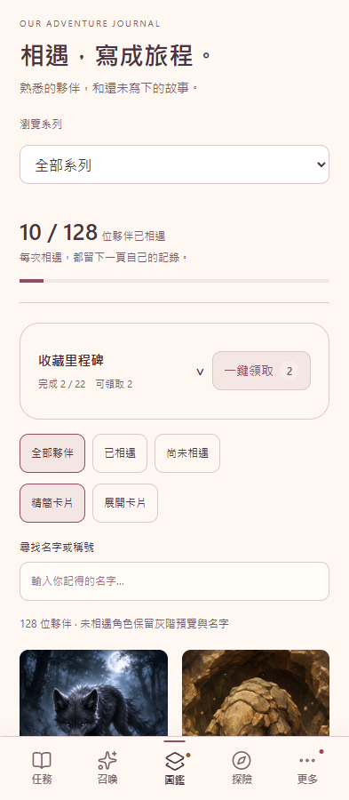
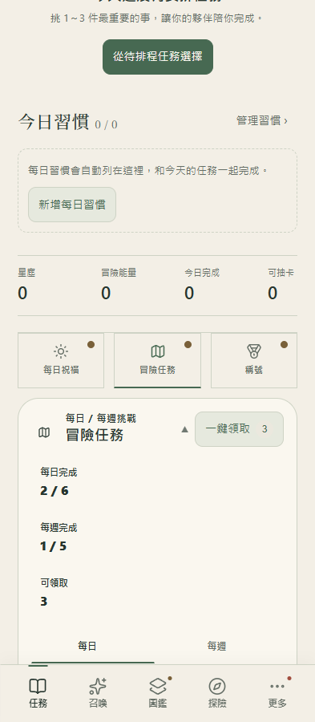
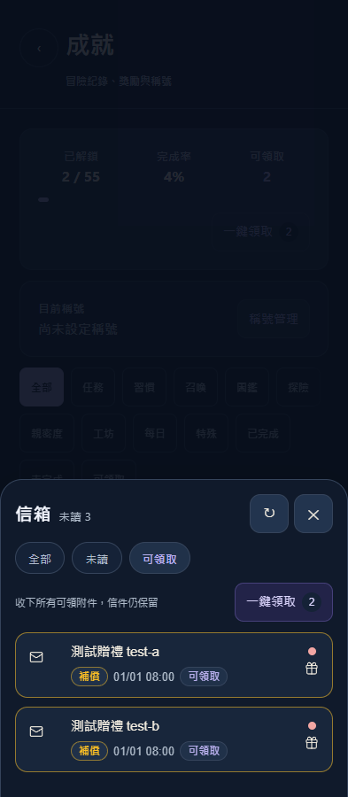

# 一鍵領取設計與驗收

最初來源基準：`origin/main` 的 `0d3fbeb`；發布前已整合主線的 V3.5.22 召喚更新。功能分支：`codex/claim-all`，目標版本 V3.5.23。以下測試與畫面已在整合後重跑；正式發布另記錄於發布收據。

## 操作與版面

每日祝福、冒險任務、成就、信箱附件、收藏里程碑與所有地區探索里程碑，使用一致的「一鍵領取＋數量」按鈕。按鈕融入現有標題或工具列，只在有獎勵時顯示；收合里程碑也能領取。窄螢幕與放大字體可自然換行。

- 每日祝福一次收下尚未領取的簽到與隨機轉盤獎勵，保留原有單獨簽到與轉盤演出入口。
- 冒險任務包含當下所有已完成的每日及每週任務，與目前選取的分頁無關。
- 成就、收藏與探索里程碑領取當下已達成的獎勵，保留單項領取與閱讀內容。
- 新版圖鑑的收藏里程碑重新接回收藏進度下方，預設收合。其獎勵以完整圖鑑為準，系列篩選不縮小領取範圍。
- 信箱包含所有可領附件，與篩選無關；過期、格式有誤及版本不相容的附件不領取。批次收附件保留信件及未讀狀態。
- 探險旅程與同行約定同時最多一筆，原本已能直接按一次領取；任務／習慣完成與卡池解鎖獎勵原本自動發放。

領取期間防止重複操作。各筆依序重新驗證並領取，顯示一次加總結果；部分失敗會指出未領數量，成功紀錄保留，重試只會領取剩餘獎勵。每日祝福及冒險任務的資源與領取紀錄在同一筆 IndexedDB transaction 提交。

## 驗證

- `npm ci`、`npm test`：整合後 318 個 Node 測試與 35 項揭示流程檢查全部通過。
- 修改 JavaScript 的 `node --check` 與 `git diff --check`。
- 新增 `devtools/reward-claim.test.mjs`：依序提交、獎勵加總、部分失敗與空集合。
- `devtools/reward-claim-browser-test.mjs`：只連 loopback，使用拋棄式瀏覽器存檔與合成附件，禁止對外請求及 service worker。
- 108 組版面：六個區域 × 320／393／1280px × 星夜／花園／暮光 × 標準／特大字體。
- 六個區域實際按鈕領取、每日／每週跨分頁、信箱跨篩選、重複領取無發獎、未讀保留。收藏里程碑的單項領取與篩選也驗證不影響卡片篩選。
- 重複簽到／轉盤／任務只成功一次；批次鎖生效。注入無效獎勵的 transaction 中止時，資源與領取紀錄皆不寫入。
- 詳細結果：[瀏覽器驗證 JSON](reward-claim/results.json)、[測試紀錄](claim-all-npm-test.log)、[瀏覽器紀錄](reward-claim-browser.log)。

## 畫面

[互動式畫面檢視](reward-claim-preview.html) 可切換區域與主題。畫面皆來自隔離存檔。

