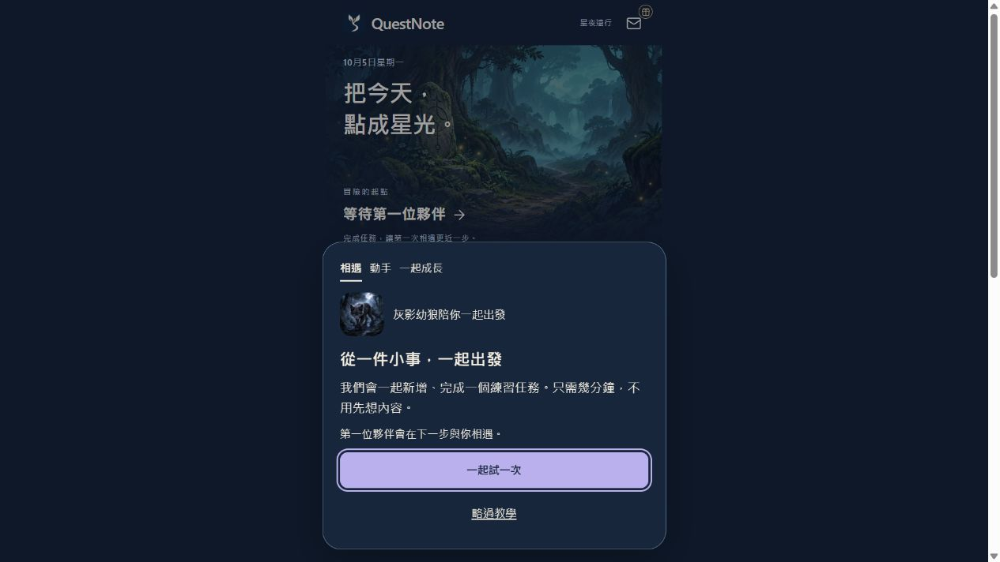
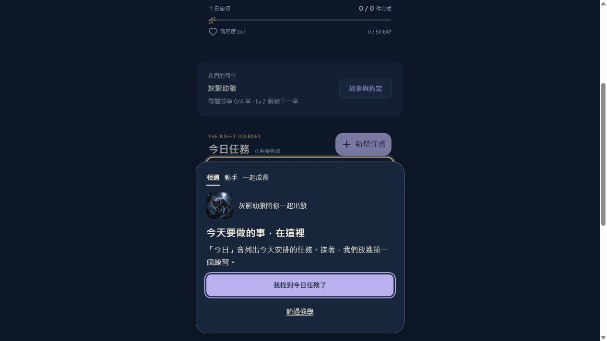
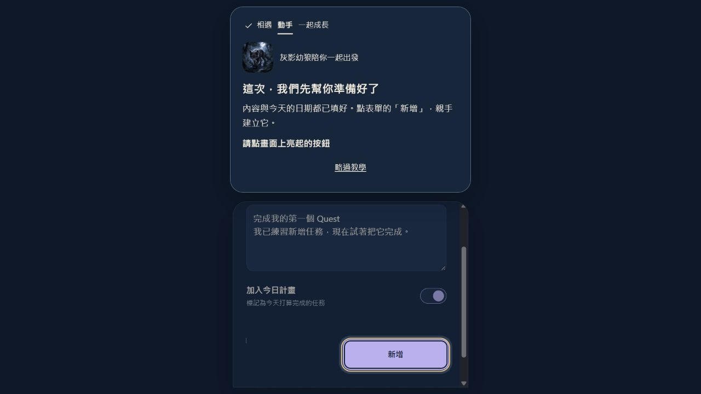
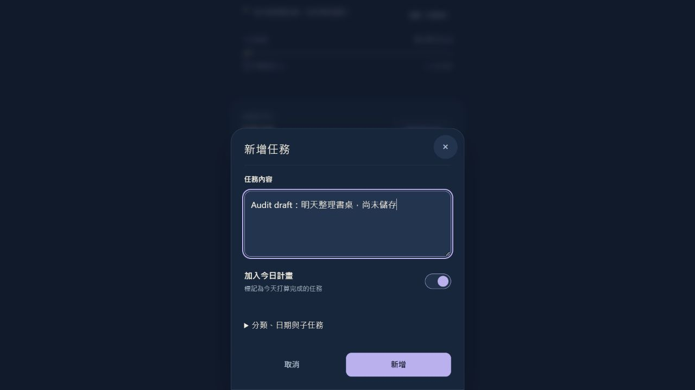
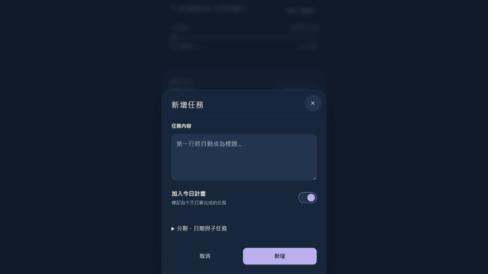
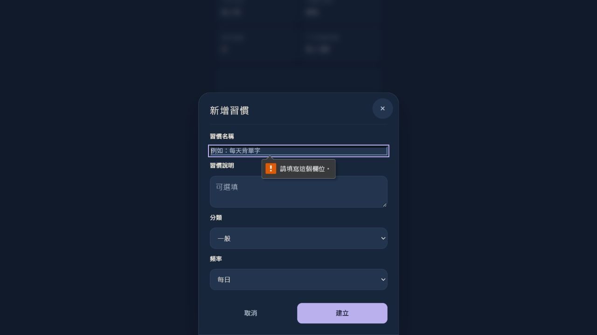
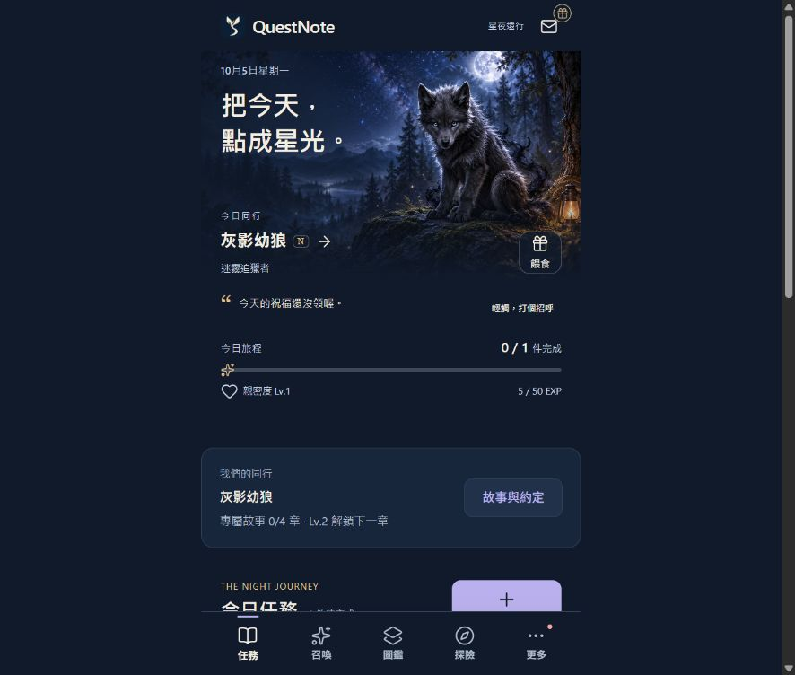
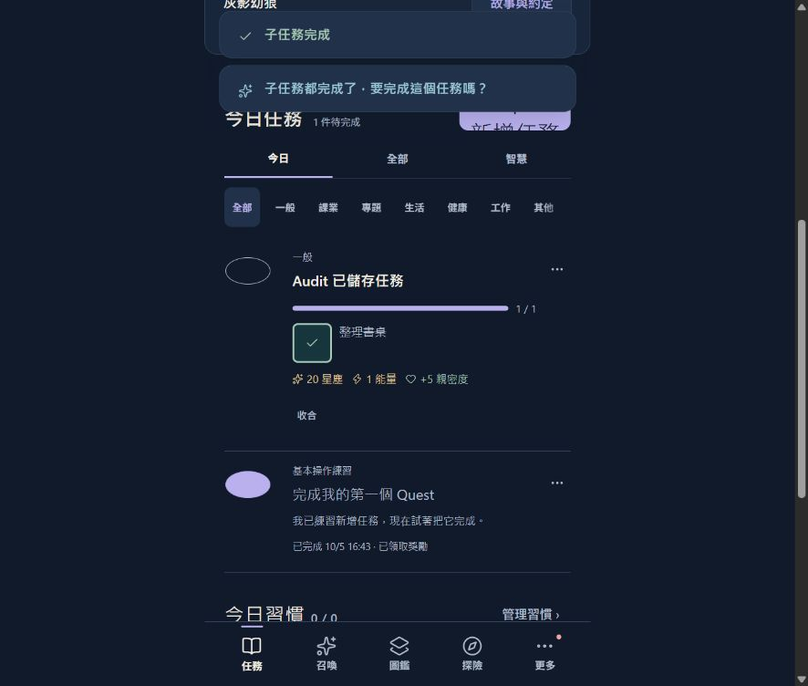
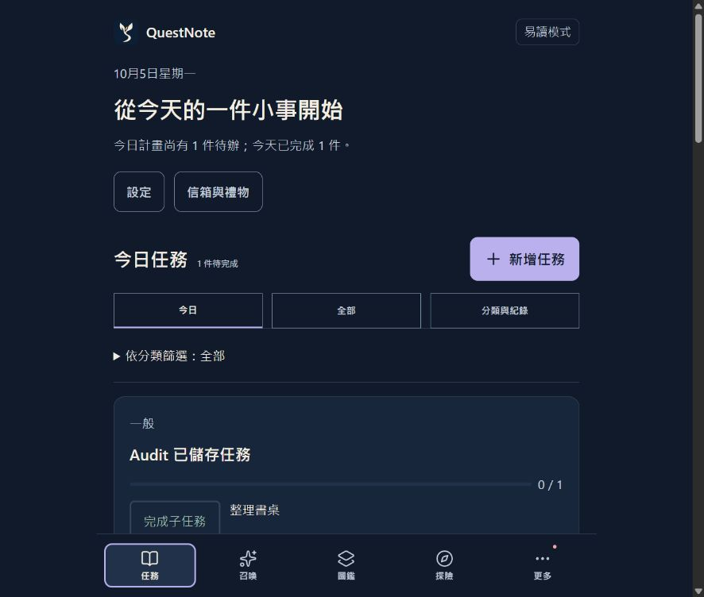
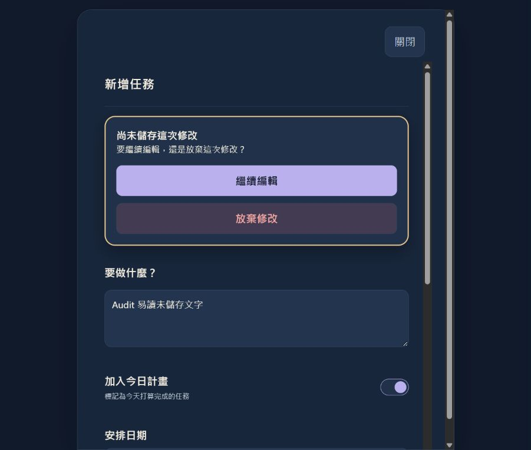

# Scenario-based Product Flow Audit

日期：2026-10-05。基準 source：`dcca53bcd598a446e4f1618fa63b4aec76861ba6`；產品程式與上一輪 `1de87e4` 相同。範圍為本機 V3.8.0 的代表性使用旅程，不是重新設計全產品，也不是正式站發布驗收。

結論：核心「新增 → 完成 → 成長」有清楚引導，回訪與易讀模式多數流程應 KEEP。發現 7 個有來源／實測支持的改善項目。按本次指定的「資料錯誤列 P0」定義，兩個受控故障／重送案例列條件式 P0；並非宣稱它們已在正式使用者裝置發生。1 個 P1、4 個 P2；不為湊數列 P3、MERGE、REMOVE 或 REDESIGN。

證據方法：Codex In-app Browser 操作真實 UI、11 張當次截圖、當次原始碼追蹤、161 個既有聚焦 Node 測試通過、兩個可重跑的 source-extraction reproduction harness。瀏覽器只使用 `devtools/onboarding-browser-server.mjs` 隔離 origin，DB 為 `QuestNoteTest-Onboarding-44313763-07a8-428c-8b3a-311d4d6a7fa4`；沒有操作原使用者存檔、送出正式 feedback 或啟用雲端推播。

標記：`[S]` Screen、`[C]` Component、`[F]` Function、`[STATE]` State、`[API]` API/Persistence、`[NAV]` Navigation、`[ERR]` Error、`[UX]` 使用者需要判斷的地方。流程為 source-backed 摘要，非逐行 call graph。

CODE = 程式／當次測試；INTERACTION = 本次真實 UI 操作；DESIGN = 本次可見呈現與語意；ASSUMPTION = 尚未驗證的使用者行為。High 不代表 production 發生率高；它表示對所述現象／條件的證據強。ASSUMPTION + Low 一律 NEEDS VALIDATION，不直接提案修改。

## 1. Scenario A — First-time

目標：不靠外部說明新增並完成一個任務，知道它和夥伴成長的關係。

```text
[S] 初次開啟 App
 -> [F] initApp() / prepareGuidedOnboarding()
 -> [API] 檢查隔離 IndexedDB stores
 -> [STATE] 新存檔 / active / WELCOME
 -> [C]「一起試一次」＋「略過教學」
 -> [UX] 練習或略過
 -> [F] advanceGuidedOnboarding()
 -> [C] 夥伴介紹、今日任務定位、亮起的新增按鈕
 -> [NAV] 真實任務表單
 -> [F] openTaskForm() / tutorialDraft()
 -> [STATE] 預填內容與今日安排
 -> [UX] 按「新增」
 -> [F] createTask() / commitTutorialTask()
 -> [API] 任務 + 教學 checkpoint 同交易
 -> [NAV] showGuidedHome()
 -> [C] 任務「完成」
 -> [F] claimTutorialReward()
 -> [API] 任務 / receipt / wallet / companion / guide 同交易
 -> [C] 星塵、能量、親密度收穫說明
 -> [STATE] completed
 -> [UX] 新增自己任務 / 成長教學 / 回今日
 [ERR] checkpoint 儲存失敗 -> 引導 run() error branch / 重試或略過
```

當次互動：從歡迎一路完成練習任務，得到 +20 星塵、+1 能量、+5 親密度；最後可回今日，不被要求再去召喚或先理解所有養成系統。截圖 01、04。**KEEP / INTERACTION + CODE / High**。

第一步清楚、可略過、內容預填、進階欄位摺疊，降低開始負擔。來源：`guidedOnboardingController.js:33`、`guidedOnboardingService.js:59`、`ui.js:3184`。沒有發現必須重設新手旅程的證據。

Quest／星塵等詞是否人人理解、十個短 checkpoint 是否過多，是 **ASSUMPTION / Low → NEEDS VALIDATION**。這次操作者能完成不等於真實新人理解率已被測量。

## 2. Scenario B — Returning

目標：直接新增或完成日常任務，不反覆跑教學。

```text
[S] 回訪今日首頁
 -> [F] initApp() / refreshState()
 -> [API] 讀已保存任務、偏好與教學狀態
 -> [STATE] completed / existing / skipped -> 核心教學不再阻擋
 -> [C] 新增任務 / 任務完成控制 / 中文底部導航
 -> [UX] 決定下一件事
 +-- 新增 -> [F] openTaskForm() -> 内容 / 今日預設 / 選填進階欄位
 |          -> [F] createTask() -> [API] 儲存
 `-- 完成 -> [F] toggleTaskComplete()
            -> [STATE] 當次控制 disabled
            -> [API] 完成與領獎服務
            -> [F] onRefresh() -> renderAfterRefresh()
            -> [C] 同頁結果 / 已完成記錄
            [ERR] 寫入失敗 -> 刷新狀態 +「未能儲存，請再試」
 -> [NAV] 繼續原頁，或 switchView() 到所需功能
```

當次互動：儲存「Audit 已儲存任務」，reload 後任務仍存在，沒有再次出現核心新手 coach。截圖 08。**KEEP / INTERACTION + CODE / High**。

新任務只需內容；分類日期子任務按需展開。完成是同頁操作，不多加確認。來源：`ui.js:893`、`:3184`、`:3364`、`:3427`；導航中文標籤 `index.html:953`。**KEEP**。

「更多 → 習慣／工坊」兩步是否太慢，沒有頻率或完成時間證據；不建議立即改核心導航。**ASSUMPTION / Low → NEEDS VALIDATION**。

## 3. Scenario C — Interrupted

目標：分清楚已提交資料、未保存草稿、持久化 checkpoint 與短暫演出。

```text
[S] 新手教學 / 任務 / 召喚 / 工坊
 -> [UX] 關閉、reload、離頁、回前景，或停止操作
 +-- 教學
 |    [F] recoverGuidedOnboarding() / recoverGuidedState()
 |    [API] 讀 persisted checkpoint
 |    [STATE] 回原步驟 -> [C] 原說明 -> [NAV] 繼續
 +-- 已保存任務
 |    [F] getAllTasks() -> [API] IndexedDB -> [STATE] 保留 -> [S] 任務列表
 +-- 尚未保存的表單
 |    [STATE] DOM draft -> 關閉 / document reload -> 不具跨重啟恢復
 |    [C] 一般模式 Close -> [F] dismissModal() -> closeModal()
 |    [NAV] 重開 -> [STATE] 未保存文字消失                 I04
 +-- 已提交召喚
 |    [F] executeDraw() -> [API] dbMutateRecords() commit
 |    [STATE] 扣款與收藏已保存 -> [C] 演出可被中斷
 |    [NAV] 回收藏確認；是否容易找回剛抽到誰待驗證
 `-- 製作
      [F] craftItem() -> [API] spendMaterials() 已提交
      -> [API] saveInventory() -> [ERR] 寫入失敗
      -> [STATE] 已扣料 / 無道具（受控重現）                  I02
      -> [C] 製作失敗 -> [UX] 不知道是否可放心重試

回前景且跨日 -> [F] visibilitychange callback
 -> [STATE] today != lastKnownDate -> [F] refreshState(full)
```

實測教學 HOME_INTRO reload 前後為相同位置，截圖 02/03；已存任務也保留。**KEEP / INTERACTION + CODE / High**。一般模式 Close 後重開未存任務變空白，截圖 05/06；易讀模式同樣 Close 會先提示保留／放棄，截圖 11。I04 是模式不一致與誤退出保護缺口，不把「明確選擇放棄」本身當 bug。

工坊 I02 是第二段寫入拒絕的 **CODE / High 受控故障重現**，不是 native quota、OS kill 或 production 發生率的實測。App 被手機 OS 回收、長時間背景後的鍵盤／焦點／頁面恢復沒有實機證據，列 NEEDS VALIDATION。沒有把 reload 等同於所有 App 關閉情境。

## 4. Scenario D — Error

目標：發生什麼、為什麼、能做什麼、如何恢復，都要讓使用者能判斷。

```text
[S] 新增習慣
 -> [C] required 名稱 -> [UX] 空白按建立
 -> [ERR]「請填寫這個欄位」+ 焦點回名稱             KEEP
 -> [UX] 補填 -> [F] openHabitForm() submit callback
 -> [API] createHabit() pending
 +-- 再送一次 -> [API] 第二個 createHabit()
 |    -> [STATE] 兩個 ID / 兩筆相同習慣             I01
 `-- storage reject -> [ERR] Promise 逃出 callback，沒有 inline catch I01

[S] 開啟 App
 -> [F] bootApplication()
 +-- 發布控制／快取驗證失敗 -> [F] renderBootstrapRecovery() KEEP
 `-- [F] initApp() 失敗 -> hideLoader()
      -> [ERR] 訊息寫到已移除節點                 I03
      -> [UX] 沒有該錯誤的可見恢復說明

[S] 意見回報
 -> [F] validateFeedback() -> [C] 預覽
 -> [STATE] 固定 report ID / pending draft
 -> [API] sendFeedback() / POST
 +-- 成功 -> [C] receipt
 `-- network / timeout / HTTP / empty response
      -> [ERR] 原因 + 下一步 -> [UX] 同份重試      KEEP

[S] 設定提醒 -> [API] 本機 dirty 已保存 -> 同步 API
 -> [ERR] timeout / fetch / JSON error.message 原生文字  I05
 -> [C] 已存本機、待同步 / 重新同步
 -> [UX] 仍需推斷錯誤原因與重試時機
```

當次空白習慣表單實測可清楚定位名稱，截圖 07。**KEEP / INTERACTION / High**。

| 失敗情況 | 本輪證據 | 發生什麼／為什麼 | 能做什麼／如何恢復 | 結論 |
| --- | --- | --- | --- | --- |
| 空白習慣名稱 | INTERACTION High，07 | required popup 指向名稱 | 補填原表單 | KEEP |
| feedback invalid input | CODE High + 當次 tests | 中文缺欄位提示 | 原表單補填 | KEEP |
| feedback network/timeout/429/409/空或錯誤收件回應 | CODE High + 當次 tests | 中文分類訊息 | 保留 report、同 ID 重試／按提示修改 | KEEP |
| 同份 feedback 重送 | CODE High + 當次 tests | 相同 ID/hash 回同收件結果 | 可安全重試，不新建回報 | KEEP |
| 習慣重複 submit、儲存 throw | CODE High + source harness | duplicate 或 exception 無 UI 分支 | 缺當次 saving/catch | I01 |
| initApp outer failure | CODE High + synthetic DOM harness | 錯誤寫在 detached loader | 不會顯示該 recovery message | I03 |
| bootstrap incompatible worker/瀏覽器能力不足 | CODE High + tests | 明示版本／能力原因 | reload、關閉其他頁、用瀏覽器／官網 | KEEP |
| habits load failure | CODE High + tests | 不與空列表混淆 | error panel + 重新整理 CTA | KEEP |
| catalog load failure | CODE High | 有部分功能載入失敗 toast、部分入口 guard | 未逐項實測所有 catalog failure | NEEDS VALIDATION，未另新增 issue |
| reminders network/timeout/invalid JSON | CODE High | 待同步狀態有中文，但 hint 可能原生英文 | 有重新同步與前景自動重試 | I05：改原因與下一步，不重做同步 |
| backup commit 前／後 error | CODE High | 統一說「資料未完整寫入」 | 不容易分辨重匯入或只需刷新 | I07 |

沒有把测试通过解释成所有 API/device 故障都已驗證；API 失敗主要是 mock/core tests，本次沒有發送正式 API 請求。

## 5. Scenario E — Change Mind

```text
[S] 任務表單
 -> [C] Close / Cancel / Escape / backdrop
 -> [F] dismissModal()
 +-- [STATE] saving -> 阻擋關閉                          KEEP
 +-- [STATE] senior + dirty -> [UX] 繼續編輯 / 放棄         KEEP
 |    +-- 繼續 -> [C] 同一表單與原文字
 |    `-- 放棄 -> [F] closeModal() -> [NAV] 原頁 / focus
 `-- 一般模式 dirty -> [F] closeModal()
      -> [NAV] 重開 -> [STATE] 只載原存檔，未存修改不在     I04

[S] 任務 / 習慣
 -> [C] 改回未完成 -> [F] toggleTaskComplete() / uncompleteHabitToday()
 -> [API] 更新完成標記 -> [STATE] 適用領獎記錄保留，不退資源
 -> [UX]「取消完成」不等同撤销所有已發獎勵
 -> [C] 刪除任務有確認；封存習慣說明保留紀錄             KEEP

[S] 匯入備份
 -> [C] Preview -> [UX] 確認覆蓋
 -> [F] createAutoBackupBeforeImport()
 -> [UX] 確认檔案已保存 -> [C] 最後確認
 +-- Cancel -> [NAV] 回預覽，原 DB 未替換                KEEP
 `-- restore -> [F] restoreBackup() -> [API] replaceAllStores() TX
      -> [F] 刷新 / theme / achievement
      -> [ERR] 任一步 error 都说「資料未完整寫入」          I07
```

易讀模式「繼續編輯」實測保留原文字；選「放棄修改」回原頁並恢復入口焦點。**KEEP / INTERACTION + CODE / High**。不為未修改表單加確認；I04 提案只對 dirty 生效。

備份兩次確認用途不同：先告知覆蓋，再觸發自動下載，最後由使用者確認檔案保存後允許替換。**KEEP / CODE / High**，不是單純重複問同一件事。來源 `ui.js:8872`、`:8887`、`:8910`。取消行為保留預覽；`replaceAllStores()` 單交易應保留。沒有為減步數移除保護。

## 6. Scenario F — Low Digital Familiarity

```text
[S] 更多 -> [NAV] 設定
 -> [C]「易讀模式」文字、說明、switch
 -> [UX] 選擇開啟
 -> [F] setReadingMode() / applyReadingModeToDocument()
 -> [API] 同一份 userPreferences
 -> [STATE] senior，原任務/夥伴/資源共用
 -> [NAV]「返回任務首頁」
 -> [S] 易讀首頁
 -> [C]「新增任務」「編輯任務」「更多操作」等文字控制
 -> [F] composeSeniorTaskForm()
 -> [C]「要做什麼？」「今天／明天」「新增任務」
 -> [API] 同原 taskService
 -> [C] 持續可讀的操作結果（可手動收起）             KEEP
 [ERR] 偏好保存失敗 -> 回復 switch / 說明未保存

[C] 已完成的子任務仍叫「完成子任務」
 -> [UX] 想確認或再次完成
 -> [F] toggleSubtaskComplete()
 -> [STATE] 實際取消完成                           I06
```

當次成功開啟易讀模式，原任務仍存在，文字操作與返回首頁入口可見；截圖 10/11。**KEEP / INTERACTION + DESIGN + CODE / High**。核心操作不要求 swipe、long press 或 hidden menu 才能完成。

I06 在一般模式實測：按一次後 0/1 → 1/1，按鈕 accessible name 仍「完成子任務」、`aria-pressed` 缺；再按同名按鈕 1/1 → 0/1。易讀模式會把這個 label 當可見文字。**INTERACTION + CODE / High**，不是只評論 icon 外觀。截圖 09 與當次 observation log。

是否能自行找到「更多 → 設定 → 易讀模式」、是否要讓新人先選模式，仍 **ASSUMPTION / Low → NEEDS VALIDATION**。沒有測到真人尋路失敗，不提案新增首次必答流程。沒有宣稱完整螢幕閱讀器或 WCAG compliance。

## 7. Cross-scenario Problems

| ID | 問題與觸發條件 | Scenario | 等級 / 決策 | Evidence / Confidence | 不改會怎樣 / 受影響指標 |
| --- | --- | --- | --- | --- | --- |
| I01 | 第一次習慣儲存仍 pending 時第二次 submit，可建立第二筆；write throw 缺 UI catch | B/C/D | 條件式 P0 / IMPROVE | CODE High，source callback + service、延遲 in-memory persistence 重現 | 非預期 duplicate data、重輸／清理、儲存結果不明；Error prevention、Recovery、Task efficiency |
| I02 | craft 材料 debit 成功後 inventory write 拒絕，無同筆交易／補償 | C/D | 條件式 P0 / IMPROVE | CODE High，實際 craftItem orchestration + stub 邊界故障重現 | 材料扣除但無道具、重試再扣；Data correctness、Recovery、User confidence |
| I03 | initApp outer catch 先移除 loader 再寫錯誤 | A/C/D | P1 / IMPROVE | CODE High，實際語句 + synthetic DOM 脫離重現 | 看不到該錯誤或恢復操作；Completion、Recovery、User confidence |
| I04 | 一般模式 dirty task Close/Cancel/Escape 沒有與易讀模式相同保護 | B/C/E | P2 / IMPROVE | INTERACTION + CODE High，05/06 vs 11 | 誤退出後重輸未存修改；Task efficiency、Error prevention、Consistency |
| I05 | reminder API network/timeout/JSON failure 直接展示 error.message | D/F | P2 / IMPROVE | CODE High，來源 error route；頻率未測 | 已有待同步狀態，但需要自行翻譯原因；Learnability、Recovery、User confidence |
| I06 | 子任務 completed toggle 的 label 不含目標與取消語意／pressed | D/E/F | P2 / IMPROVE | INTERACTION + CODE High，09、0/1→1/1→0/1 | 聽／讀「完成」卻取消、多子任務同名；Accessibility、Error prevention、Consistency |
| I07 | restore 與其後 refresh/theme/achievement 共用「資料未完整寫入」catch | C/D/E | P2 / IMPROVE | CODE High，try/catch 範圍與單交易 replacement | 無法區分 commit 未完成與已恢復但畫面失敗；Recovery、User confidence |

P0 標記依本輪指定定義：控制條件下已重現資料錯誤，值得優先處理。不表示 production 普遍出現、不表示全 App 不可用。故障 occurrence rate 不明，不給虛構的完成率／轉換率提升數字。

未使用 SIMPLIFY/MERGE/REMOVE/REDESIGN，是因為這輪證據主要支持可靠性與狀態說明；正常路徑已夠直接，沒有理由重做主要旅程。

## 8. KEEP

| 保留流程 | 為什麼合理 | Evidence |
| --- | --- | --- |
| 真實新增／完成的漸進教學，預填內容，可略過 | 第一步明确，不要求先理解所有遊戲系統 | INTERACTION + CODE High，01/04 |
| 教學 checkpoint 與完成後不強制重跑 | 中斷能續接、回訪不被拖慢 | INTERACTION + CODE High，02/03/08 |
| 任務簡潔表單，選填進階內容 | 只輸入必要內容即可完成 | INTERACTION + CODE High，05 |
| 主導航中文文字與同頁完成 | 核心操作不用手勢、少路由跳轉 | INTERACTION + CODE High |
| 任務保存 guard / disabled / 失敗保留表單 | 重送控制與儲存回饋合理；可給習慣沿用 | CODE High，ui.js:3364/:3427 |
| 空白輸入 required 定位 | 說明缺什麼、焦點到修正處 | INTERACTION High，07 |
| habits load failure 與 empty state 分開 | 不把讀取失敗錯當「還沒建立」 | CODE High + tests |
| feedback 草稿、預覽、sending disabled、固定 ID 重試、receipt | 不意外送出，network failure 可續接且去重 | CODE High + 當次 frontend/backend tests |
| 抽卡 busy、原子交易、提交後才演出 | 中斷動畫不再次扣款／抽卡 | CODE High + 當次 transaction tests |
| 工坊頁內 crafting/using lock、選道具與收件者 | 不因 UI 可按就推定重點一定多扣；贈禮對象清楚 | CODE High + tests；不同於 I02 多段寫入故障 |
| 簽到／quest／信箱／里程碑適用交易與領取身份 | 防重領的既有機制有目的 | CODE High + tests |
| 易讀模式共用資料、文字控制、持續結果、dirty exit guard | 保持同一心智模型、避免漏讀或誤關 | INTERACTION + CODE High，10/11 |
| 刪除確認、習慣封存保留紀錄 | 提供有意義的後果說明 | CODE High |
| 備份預覽、自動下載、最後確認、單交易替換 | 確認不同風險，不應為減步驟刪除 | CODE High + backup tests |
| reminder 本機 dirty、同步狀態、重新同步、前景重試 | 已有恢復路徑，只需 I05 補清楚原因 | CODE High + tests |
| bootstrap 安全驗證／recover CTA | 無法驗證版本時不混開 DB；有可理解恢復說明 | CODE High + tests |

部分取消習慣紀錄保留規則依既有星塵／receipt 條件，不宣稱每一種 bond-only log 都保留；未重現的重領風險不硬列 issue。

## 9. P0

**I01：習慣重送 duplicate data；I02：製作第二段 failure 後資源不一致。** 都是故障／重送條件下的可重跑 CODE reproduction，不是 INTERACTION 或正式裝置證據。先核對這兩條保護邊界，其他服務不能直接套用同一結論。

## 10. P1

**I03：初始化失敗訊息不在 DOM，缺少該錯誤的可見恢復入口。** 正常啟動沒有問題；修的是失敗分支。沒有證據將所有 init failure 都說成資料毀損。

## 11. P2

**I04 dirty exit 模式一致性、I05 提醒錯誤原因、I06 子任務行為／狀態名稱、I07 備份恢復階段訊息。** 都能指明具體後果與指標，不是純美觀。I04 只處理已修改表單；I05 不移除現有同步狀態。

## 12. P3

**無必要項目。** 本次不列色彩、圓角、裝飾或「看起來更漂亮」的建議。

## 13. NEEDS VALIDATION

下列使用者行為判斷均 **ASSUMPTION / Low**，不直接改產品：

| 待驗證判斷 | 先怎麼驗證 | 目前不直接做什麼 |
| --- | --- | --- |
| Quest／星塵／冒險能量是否阻礙理解 | 請未用過的人做完練習後說明 App 用途與下一步 | 不全站改名 |
| 分步教學是否過長 | 新人無提示完成、觀察退出點與所需時間 | 不只因有 10 checkpoints 就刪步驟 |
| 更多內入口是否拖慢常用功能 | 回訪者指定日常任務、記錄路徑與時間 | 不直接改底部導航 |
| 低熟悉度者是否找不到易讀模式或依賴 icon | 從初次頁請其建立／編輯／完成真實任務，不先指入口 | 不強制首次選模式、不全站換 icon |
| 需要跨 App 關閉持久草稿 | 長內容編輯、背景、OS 回收、再開的實機研究 | I04 先限於表單 exit，不引入新 draft model |
| 抽卡演出中斷後能否找回新角色 | commit 後中斷、回訪請找剛抽到角色 | 不立刻加抽卡歷史或恢復演出系統 |
| native storage/device 故障發生率與用戶影響 | 隔離 DB 的 quota/abort/reopen 實機驗證 | 不宣稱 source stub 等於 OS/process kill 實測 |
| 所有 catalog 缺資料狀態是否有足夠恢復提示 | 隔離 server 逐項 404/timeout/invalid bundle；檢查其餘畫面 | 不先合併所有 error/empty states |

額外證據界線：background 沒有卸載時 DOM 可能保留；手機 OS 可回收，不能僅以桌面 reload 推定裝置 behavior。輔助科技只核對 DOM/accessible name，未做真人螢幕閱讀器操作。

## 14. Proposed Improvements

| ID | 改什麼 | 少了什麼 / 為什麼 | Complexity | Mental model |
| --- | --- | --- | --- | --- |
| I01 | 習慣 submit 同步 saving guard、disabled/loading、try/catch/finally、保留輸入 | 去掉重送與無反馈的 failure；沿用任务表單現有模式 | 少量局部 state/error 分支 | 不變：按建立只建立一次 |
| I02 | craft 的 wallet/inventory/workshopStats 以現有 dbMutateRecords 同交易保存 | 消除只扣材料的部分 commit | 增加 transaction reducer 與一致性驗證；不增加 schema/screen | 不變：花材料取得道具 |
| I03 | 初始化 error host 保持可見；說明載入未完成／可辨原因＋重試 | 不再把訊息寫到 detached node，不必自己猜 | 少量錯誤展示與重試分支；避免重复綁事件 | 不變：載入成功或可重試 |
| I04 | 所有模式追踪 task dirty；dirty exit 才沿用繼續／放棄 | 減少誤退出後重輸，不增加空白表單確認 | 統一既有 dirty tracking / exit guard | 不變：儲存才提交 |
| I05 | timeout/network/invalid response 中文分類；說明本機已存／待同步／下一步 | 減少自行翻譯和猜測重試時機 | 輕量 error mapping | 不變：本機保存、雲端同步 |
| I06 | 子任務 label 含目標、完成／取消完成、aria-pressed | 不再在「完成」操作下意外取消 | render 層狀態映射 | 不變：同一項可切換完成 |
| I07 | 將 restore commit 與其後畫面刷新分開報告 | 不把已恢復誤報資料未完整寫入 | 一个已提交階段標記與錯誤分支 | 不變：覆蓋恢復後刷新 |

I04 此輪不擴充習慣／所有 modal 全站新草稿機制；習慣 form dirty exit 是否同時沿用可在獨立小範圍審查，不由一個 task issue 推導全站變更。I02 也不直接擴到未重現的送禮／任務發獎流程。

## 15. Before / After ASCII

以下 AFTER 都是提案，未實作、未驗證提案成效。

### I01 — 習慣提交

```text
BEFORE
[C] 建立 -> [F] createHabit() -> [API] pending
[C] 再建立 -> [F] createHabit() -> [API] 第二筆
 -> [STATE] duplicate
或 [API] reject -> [ERR] callback 無 catch -> [UX] 結果不明

AFTER
[C] 建立 -> [STATE] saving=true -> [C] disabled / 儲存中
 -> [F] createHabit() -> [API] 保存
 +-- 成功 -> [NAV] 關閉 / 刷新
 `-- 失敗 -> [ERR] 未保存 / 可辨原因
      -> [STATE] 保留輸入、解除 saving -> [UX] 修正或重試
```

### I02 — 製作一致性

```text
BEFORE
[C] 製作 -> [F] spendMaterials() -> [API] wallet commit
 -> [F] saveInventory() -> [ERR] reject
 -> [STATE] 已扣料 / 未取道具 -> [UX] 重試可能再扣

AFTER
[C] 製作 -> [F] craftItem() -> [API] 單一 transaction
 [wallet debit + inventory credit + stats]
 +-- commit -> [STATE] 三者一致 -> [C] 成功
 `-- abort -> [STATE] 原資源保留 -> [ERR] 未完成 -> [UX] 重試
```

### I03 — 初始化恢復

```text
BEFORE
[API] init failure -> [F] hideLoader()
 -> [C] loader detached -> [ERR] 在 detached node 寫文字
 -> [UX] 看不到該說明 / 沒有該 retry

AFTER
[API] init failure -> [C] 可見 error host
 -> [ERR] 載入未完成 / 可辨原因 -> [STATE] 不自行重置存檔
 -> [UX] 重新載入 / 依能力限制提示處理
 -> [F] retry -> [NAV] 重試 App
```

### I04 — 一般模式離開表單

```text
BEFORE
[C] 一般表單 -> [STATE] 未儲存輸入 -> [UX] Close/Escape
 -> [F] closeModal() -> [NAV] 重開 -> [STATE] 原輸入不在

AFTER
[C] 任務表單 -> [UX] Close/Escape -> [F] dismissModal()
 +-- 未修改 -> [NAV] 立即返回
 `-- dirty -> [C] 繼續編輯 / 放棄修改
      +-- 繼續 -> [STATE] 原表單保留
      `-- 放棄 -> [NAV] 返回 [API] 原已存任務不變
```

### I05 — 提醒同步錯誤

```text
BEFORE
[API] 本機保存 -> [API] 同步失敗 -> [ERR] error.message
 -> [C] 待同步 -> [UX] 自己理解原因 -> [C] 重新同步

AFTER
[API] 本機保存 -> [API] 同步失敗 -> [F] error 分類
 -> [ERR] 已保存本機，提醒尚未同步；連線失敗 / 逾時 / 回應無效
 -> [UX] 恢復網路或稍後重試 -> [C] 原重新同步
```

### I06 — 子任務狀態

```text
BEFORE
[STATE] completed=true -> [C]「完成子任務」
 -> [UX] 認為要完成 -> [F] toggleSubtaskComplete()
 -> [STATE] completed=false

AFTER
[STATE] completed=true
 -> [C]「取消完成：整理書桌」/ aria-pressed=true
 -> [UX] 理解這次會取消 -> [F] toggleSubtaskComplete()
 -> [STATE] false -> [C]「完成：整理書桌」/ aria-pressed=false
```

### I07 — 備份恢復與畫面更新

```text
BEFORE
[F] restoreBackup() -> [F] refresh/theme/achievement
 -> [ERR] 任一步失敗：「資料未完整寫入」
 -> [UX] 不知道要重匯還是刷新

AFTER
[F] restoreBackup()
 +-- 未 commit -> [ERR] 恢復未完成 / 可辨原因 -> [UX] 修正或重試
 `-- commit -> [STATE] restored=true -> [F] 刷新
      +-- 成功 -> [C] 恢復完成
      `-- 失敗 -> [ERR] 資料已恢復，畫面更新未完成
           -> [UX] 重新整理 [NAV] 重開已恢復資料
```

不把未辨識的 storage corruption 一律說成安全；訊息需依 transaction 結果確定 commit／abort。

## 16. Affected Functions

來源位置均已當次核對。連結為 code 宣告／相關行為起點。

| ID | function / callback | 來源 | 若將來核准修改，必要驗證 |
| --- | --- | --- | --- |
| I01 | openHabitForm submit callback / createHabit | [ui.js:7857](../../src/ui.js#L7857)、[habitService.js:88](../../src/habitService.js#L88) | pending 重送只一筆、throw 顯示錯誤、保留輸入、finally 解鎖、原 validation |
| I02 | craftItem / spendMaterials / saveInventory / saveWorkshopStats / dbMutateRecords | [workshopService.js:347](../../src/workshopService.js#L347)、[db.js:172](../../src/db.js#L172) | 中途 abort 不扣料、成功三者一致、缺料／重按／多頁／旧存檔 |
| I03 | initApp / hideLoader | [app.js:512](../../src/app.js#L512)、[app.js:728](../../src/app.js#L728) | 可見原因與 retry、初始化 listener 不重複、存檔保留 |
| I04 | openTaskForm / dismissModal / closeModal / composeSeniorTaskForm | [ui.js:1557](../../src/ui.js#L1557)、[ui.js:3184](../../src/ui.js#L3184)、[seniorModeController.js:231](../../src/seniorModeController.js#L231) | 空白／未改立即退出、dirty 各離開途徑、保存中阻擋、focus、備份 cancel 不受影響 |
| I05 | api / syncReminders / initReminders / renderReminderSettings | [reminderService.js:31](../../src/reminderService.js#L31)、[reminderController.js:49](../../src/reminderController.js#L49) | timeout、network、invalid/empty JSON、401 等既有分類、本機 dirty/retry 保留 |
| I06 | renderTaskCard / toggleSubtaskComplete / decorateSeniorControls | [ui.js:3138](../../src/ui.js#L3138)、[seniorModeController.js:184](../../src/seniorModeController.js#L184) | 一般／易讀的已完成與未完成、不同子任務名稱、aria-pressed、鍵盤操作 |
| I07 | executeRestoreBackup / restoreBackup / replaceAllStores | [ui.js:8929](../../src/ui.js#L8929)、[backupService.js:615](../../src/backupService.js#L615)、[db.js:279](../../src/db.js#L279) | commit 前 reject、commit 後刷新 reject，正確訊息，不重複執行恢復 |

## 17. Change Scope

| SMALL | MEDIUM | LARGE |
| --- | --- | --- |
| I01 表單 pending/error interaction | I02 製作交易一致性（同資料模型） | 無提案／無實作 |
| I03 啟動失敗 feedback/retry | I04 統一 dirty exit 的 component flow | 不改主要 journey / IA / navigation |
| I05 同步 error feedback |  | 不新增 draft/history data model |
| I06 控制 label/state |  | 不增刪產品功能 |
| I07 恢復階段 feedback |  |  |

**本輪停止在 Audit。沒有實作任何 SMALL、MEDIUM 或 LARGE 產品變更。** 建議審查順序 I01/I02 → I03 → I04/I06 → I05/I07；真人理解與裝置情境先驗證再決定。

### 當次操作步驟與截圖證據

1. 初次歡迎 — 健康：入口與略過清楚。
2. 教學進到今日定位 — 健康：下一步明確。
3. 中途 reload — 健康：同一 checkpoint 續接。
4. 預填真實新增表單 — 健康：內容預備、進階選填。随后真實按新增、完成並看 +20/+1/+5 結果。
5. 一般模式輸入未保存 task — 草稿正常存在於表單。
6. Close 再開 — I04：表單空白；無離開確認。
7. 空白習慣按建立 — 健康：required popup 與焦點定位。
8. 保存 task + 子任務，再 reload — 健康：任務保留、不重跑主教學。
9. 子任務 0/1→1/1 — I06：仍同名「完成子任務」、無 pressed；再按變 0/1。截圖為完成後 toast 仍可見的真實結果，不作為穩態布局判斷。
10. 文字入口開啟易讀模式、回首頁 — 健康：同資料、明確控制。
11. 易讀 dirty Close — 健康：繼續／放棄；繼續後原文字仍在，明確放棄才返回。

截圖都以當次工具原始 JPEG 保存，保存後讀回檢視；不使用上一輪截图。預設 viewport 由 App 管理，未宣稱固定手機尺寸或一致 breakpoint 比較。操作遇到的 AX/DOM role 差異與 selector timeout 经新 DOM 修正，不當成產品 failure。

### 驗證與可重跑證據

- [learning-tests.log](learning-tests.log)：32/32，guided/page-tour/senior/onboarding。
- [error-tests.log](error-tests.log)：44/44，feedback/reminders/cache-recovery；追加 startup reproduction。
- [recovery-tests.log](recovery-tests.log)：85/85，task/habit-view/gift/gacha/bond/awakening/backup/reward；追加受控重送與故障重現。包含一個 harness fixture 缺 Map 的初次失敗與修正，不是產品回歸。
- [recovery-repro.mjs](recovery-repro.mjs)：source callback + service／craft orchestration 的 synthetic boundary reproduction。
- [startup-repro.mjs](startup-repro.mjs)：source 語句與 synthetic DOM，驗證 detached loader。
- [interaction-notes.json](interaction-notes.json)：隔離 origin、安全界線、UI observation 與未測項。
- [audit-validation.log](audit-validation.log)：文件連結／函式引用／截图與 staged whitespace 驗證。

上述 Node/source harness 可重跑；瀏覽器互動為當次人工 agent trace 與截图，不宣稱自動化完整端對端覆蓋。沒有重跑完整 npm test，因为沒有 runtime 變更；本輪聚焦驗證對應 Scenario 的現有核心行為。
