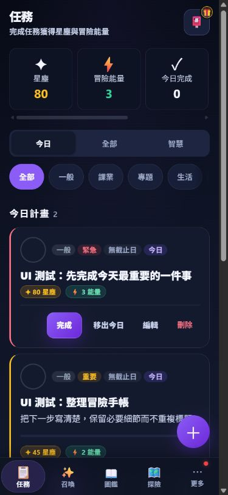
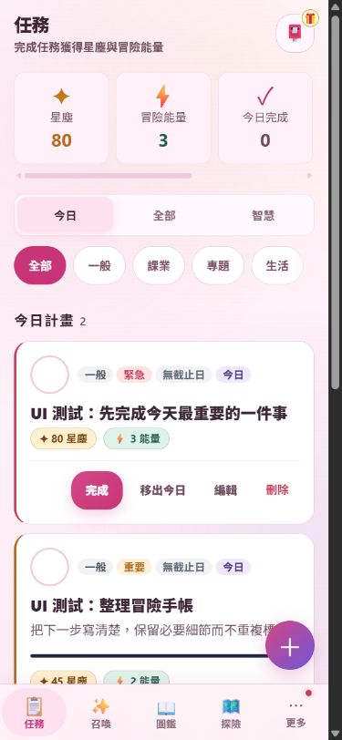
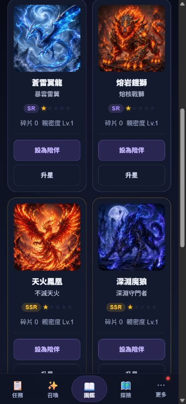
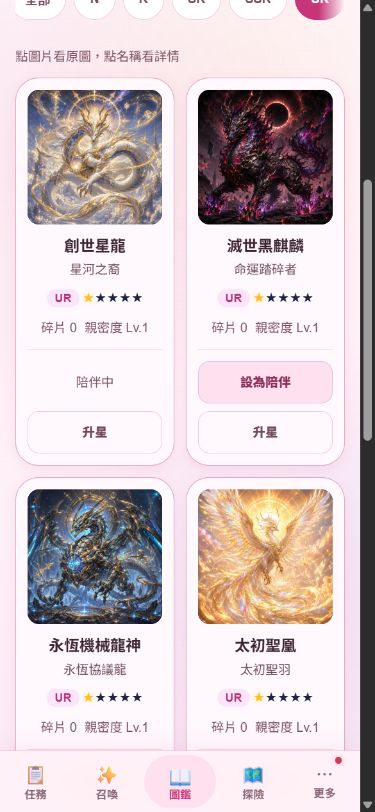
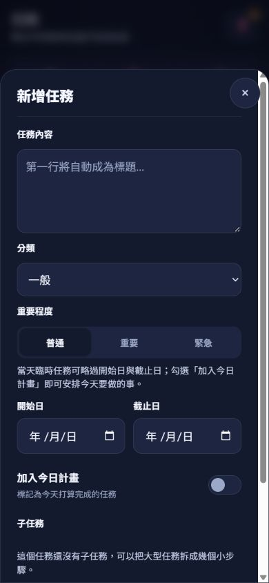
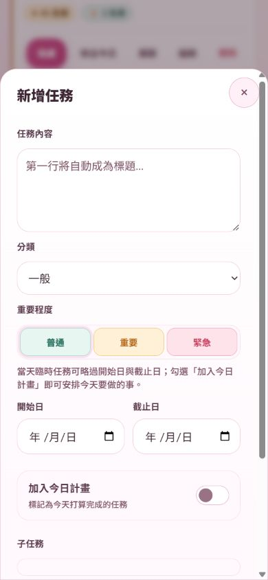

# QuestNote UI polish — VP-01 / VP-02 / VP-04 / VP-05

Implementation date: 2026-09-23 (Asia/Taipei). Local implementation only; no merge, push or deployment. VP-03 is excluded.

## Base and workstream separation

- Branch: `codex/ui-visual-polish`.
- Worktree: `C:/Users/User/OneDrive/questnote-pwa/.worktrees/ui-visual-polish`.
- Base: `95a4f5d70233195050f1f0fce2eee3d9945c2b32`, the committed tip of `codex/card-pool-pipeline` when this work began. Its M1/M2A/M3A/M4/M5 product changes are already present; the UI branch does not start from older `main`.
- The root checkout has concurrent, uncommitted glacier/card-pool work. None of that dirty content was copied, merged or overwritten. The root branch remained at the same committed base during final inspection.
- Neither requested engineering document exists in the checked-out base, the card-pool branch tree, or local `git log --all` history for those paths. Prior audit also found neither in OneDrive. There is no evidence to claim they are merely unmerged files. Unknown external branches were not fetched. Work uses AGENTS guidance, `docs/roadmap-progress.md`, the committed architecture/contracts and actual product code. Their absence does not block these local presentation changes.
- Product direction: 靜謐星夜・冒險手帳 for task surfaces; 幻獸典藏・精緻卡冊 for collection display. Sweet uses the same markup, actions and state semantics.

## VP-01 — Theme / state fixes

- Sweet UR cards use a light token surface with readable main text. Actual name contrast on the solid base: **13.18:1**.
- Default task priority borders again use the semantic 3px left border. Badges remain, so priority is not color-only.
- Task preview starts after the first line used for the title; single-line tasks no longer duplicate their title.
- Task text, date, select and subtask inputs share token surfaces, borders, radius, focus outline and 44px minimum controls. Dates remain native inputs, with theme-appropriate color scheme.
- Collection empty states span the entire two-column grid.
- `[hidden]` once again hides the backup success panel until the existing restore flow shows it. Backup persistence/validation is unchanged.

## VP-02 — Home / tasks

- Ordering changes from resources → companion/empty companion → adventure hub → task list to resources → task tabs/filters → task list → secondary summaries → companion/hub.
- Task surfaces are quieter; title, readable secondary content and completion are clearer than metadata and secondary actions.
- Completion touch controls are at least 44px. Completed text remains readable instead of dimming the entire card.
- The horizontal resources row has a visible scroll cue. Existing filters, tabs, companion, hub and rewards remain available.
- At **390×844**, the first urgent title ends at y=482.8 (default) / 484.2 (sweet); the primary completion control ends at y=576.7 / 581.2, above the navigation at y=780. These results hold with and without a companion.
- Before audit, the new-user task content only began around y=681 after large secondary sections. This is a hierarchy comparison, not a pixel-perfect benchmark with identical fixture data.

## VP-04 — Collection / cards

- Pet images grow from the audited approximately 80px to **140px** in the 390px fixture grid, retaining the original aspect ratio and artwork.
- Consolidate the image/detail hint above the grid; group fragments and bond level; remove repeated collection totals and empty nickname copy.
- Keep role image and detail actions distinct. Companion/upgrade actions occupy consistent rows; current-companion and max-star states preserve alignment.
- Keep series/rarity filters, locked previews, rarity, stars, progression and existing event delegation. No Pet, Pool or Series contract changes.
- Detail hero gets more image space. Collection remains two columns within the existing phone-oriented app container.

## VP-05 — Modal / overlay

- Existing generic, viewer, mailbox and dispatch shells get consistent heading/action sizing, 44px close controls and safe-area-aware height constraints.
- Generic modal body owns content scrolling, keeping the close button available. Dispatch uses one scroll area instead of a nested pet-list scroller; selection preserves scroll position and focus, with `aria-pressed` identifying the selected pet.
- Small focus helper handles initial focus, live Tab boundaries and focus return. Initial focus waits for visible shell state, including reduced-motion rendering.
- Escape acts only on the top dialog. A viewer above pet details closes first and returns to the image button; the second Escape closes details and returns to the card.
- Pet detail explicitly records its image trigger as the return target, rather than relying on a transient active element while the modal appears.
- Closing generic confirmations invokes their existing cancel control, preserving cancel callbacks. Existing result resolver logic remains unchanged. Independent summon/reveal controllers remain outside this helper's Tab ownership.
- Summon result-specific layout selectors are excluded from generic modal spacing/scroll polish. No VP-03 implementation.

## Changed files

- `index.html`: load scoped polish stylesheet, move existing task blocks, one collection hint.
- `src/ui-polish.css` (new): scoped token-based polish. **`src/styles.css` is unchanged.**
- `src/ui.js`: limited task/collection markup and dialog lifecycle integration; dispatch focus/scroll retention.
- `src/dialogFocus.js` (new): focus/keyboard utility with no persistence or game-state ownership.
- `src/version.js`, `service-worker.js`: V3.4.7 UI preview namespace, build time and precache entries for the two new product files.
- `devtools/ui-polish-server.mjs`, `devtools/ui-polish-test.html`, `devtools/ui-polish-test.js` (new): synthetic-origin browser checks.
- `reports/ui-polish/`: this report, browser/Node evidence and screenshots.

No framework, schema, catalog, gacha transaction, pool contract or pipeline changes.

## Validation and evidence

- Reviewed actual diffs after each VP; independent read-only review of collection and modal integration. Found and corrected CSS selector issues, transient initial focus, and dispatch scroll reset before acceptance.
- Full `npm test`: **113 tests + 34 existing logic assertions passed**. See `node-tests.txt`. Includes release/precache validation, content contracts and summon performance/logic.
- JavaScript syntax checks and `git diff --check` pass.
- Browser: dedicated ephemeral localhost origin, fresh synthetic IndexedDB, no personal backup or production site. Test server refuses service workers and initialization over unknown existing databases. SW 403 warning on this origin is intentional; this visual harness does not claim offline installation coverage.
- VP-01: **10 checks passed**, both themes (`vp01-browser.txt`). Empty state was measured before seeding collection.
- VP-02: **41 checks passed**, both themes (`vp02-browser.txt`). Includes edit/cancel, tab switching, subtask expand/collapse, no-companion state, complete/undo/recomplete and prevention of repeated dust/energy/bond rewards. Earlier fresh-fixture run confirmed +80 dust/+3 energy; saved rerun correctly confirms already-claimed rewards produce +0.
- VP-04: **18 checks passed**, both themes (`vp04-browser.txt`). Actual detail/image controls and companion switch/restore; all four owned-card rows align at their action bottom.
- VP-05: **54 checks passed**, both themes (`vp05-browser.txt`). Includes nested viewer, delete confirmation cancellation, mailbox, dispatch selection without starting an expedition, scroll retention at 246.67px and unchanged wallet/expedition records.
- App **Reduce Motion enabled: 54 checks passed again**, both themes (`vp05-reduced-motion-browser.txt`), including initial focus and return to the exact image trigger. The near-zero-transition issues found during this extra run were fixed before acceptance.
- Native keyboard checks separately verified heading entry, Tab to close, Shift+Tab to final action, Tab wrap and Escape return in default/sweet at 390×844. Scrolled content leaves the close control visible.
- Screenshots use the real app and synthetic fixtures, not generated mockups.
- Desktop checks at 1365×900 (sweet) and 1280×720 (default) preserve the existing 430px app container without horizontal page overflow. Desktop framing remains deliberately unchanged.

### Explicit limits

- The browser harness explicitly skips repeat-ten confirmation/resolver interaction and the custom backup-download cancel callback. Those private paths were reviewed in source; no synthetic draw was performed to reach them. Existing Node summon tests pass. Recheck those paths during Card Pool integration.
- Safe-area CSS is preserved/improved, but real iOS notch, software keyboard, standalone PWA, screen reader and OS-level reduced-motion emulation are not claimed as tested.
- Very long nicknames, maximum-star owned rows and every empty/filtered/catalog combination are not an exhaustive matrix. Existing escaped values and wrapping remain intact.

## Integration risk with card-pool-pipeline

- **High, deliberate overlap:** `src/version.js` and the SW cache/precache section. Both workstreams use V3.4.7 under different preview cache names. Integration must choose one release version/cache and take the union of required assets; never select either file wholesale.
- **Moderate, shared file:** `src/ui.js`. UI edits touch imports, generic dialogs, task cards, collection/detail and dispatch. Concurrent card-pool changes touch imports and gacha routing. Imports may conflict even where functional hunks do not. Preserve both imports and recheck generic confirmation/reveal interactions.
- **Low textual overlap, visual dependency:** the other workstream edits `src/styles.css`; this workstream adds `src/ui-polish.css` after it. Scoped rules avoid summon pages and result layouts, but integration should still smoke-test new pool overlays and result confirmations.
- No automatic merge, rebase onto dirty content, deployment, card-pool publication, or catalog edits were performed.

## Remaining visual debt

- VP-03 summon polish is intentionally deferred until Card Pool coordination permits it.
- More/settings/habits/workshop and other feature-specific forms retain their existing visual language; this is not a full product/CSS rewrite.
- Collection header still contains milestones and filters; further discovery/sorting changes require a separate UX decision.
- Legacy emoji navigation, inactive-star styling, large-screen framing and token alias cleanup remain future work.
- Real-device/PWA/keyboard accessibility matrix and the two skipped integration paths remain follow-up validation.

## Screenshots

## Reproduce

Run `node devtools/ui-polish-server.mjs` from this worktree. Open its printed URL in a new tab, initialize once, select a VP and run both themes. The frame is 390×844. Use a new ephemeral port when restarting the server. Do not use the harness on an origin with real data. It never deletes a database to reset tests.
