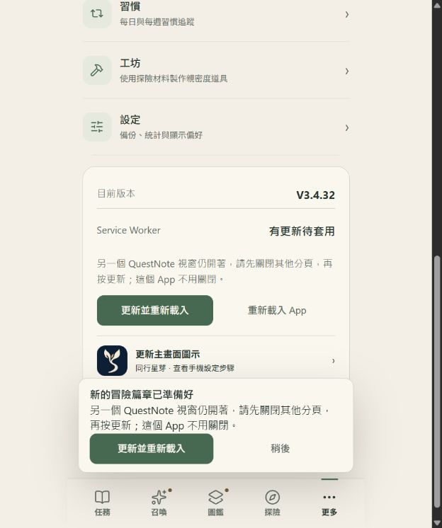

# V3.4.35 工坊正式發布

使用者明確要求發布。[PR #19](https://github.com/leotsouo/questnote-pwa/pull/19) 經 CI 通過後合併，來源 `a66ecfea432a39fa99b3089f596530051cb95a7f`。整合最新收藏拖曳功能後升為 V3.4.35，避免與另一主線版本重號。

- Artifact：`7849ec9d9cc02e994f74ae68b3782ea5e8cd6c63a771067cb94b7c25725f1384`。
- Manifest SHA-256：`5dbecc343374f7e4ee72eb36aa34c399288e96dba25cd23972e8dce5c7ca981d`。
- Pages 提交：`77d30b869ca69cdf5a9b56b127ab13d5e2e6056b`。
- [Pages run 36773772651](https://github.com/leotsouo/questnote-pwa/actions/runs/36773772651) 成功。
- Scope `/questnote-pwa/`、QuestNoteDB 及正式 cache namespace 維持。

來源含 96 位角色作者資料。獨立發布工作區使用正式站 84 位角色／3 卡池的四個目錄作為 baseline，並指定相同正式 bundle 候選；main 作者快照未更動。artifact sourceFiles 雜湊如實記錄輸入差異。新增圖片仍是靜態資源，但本次未切換到 Honeylight 卡池。正式 catalog 雜湊維持 `3dfd5055f9c2d2d288ab7e235d4c85202899f0ecba49a1b2473d505ba3e9ff32`，信箱 bytes 亦維持。

本機 npm test 203 主套件案例、11 主題案例及召喚斷言通過；修改 JS 語法、diff 空白、production／preview 嚴格 artifact verifier 通過。407 個 Git blob（含 manifest）全部與 artifact 位元組一致，Windows 行尾轉換已修正。

實際組裝檔的 12 項原生瀏覽器測試全通過，包括首次啟動、舊版更新、profile 隔離、快取失效、離線開啟及工坊教學恢復，詳見 release-artifact-browser.json。15 個正式 HTTPS 檔案全部符合雜湊，詳見 production-live-hashes.json；包括版本、工坊、喜好、配方、SW、bootstrap、profile、原卡池及信箱。

正式瀏覽器現有 V3.4.32 狀態偵測並驗證 waiting 更新；套用時因另一個正式 App 視窗仍開著而被保護機制擋住。未繞過、未關閉不可見視窗、未清除 storage、未寫入正式測試資料。因此確認發布 bytes 成功，未宣稱這個既有視窗已完成升級。關閉其他正式 App 視窗／分頁後，在更多按「更新並重新載入」即可。

未更新 hosted preview 或部署後端；保留既有未追蹤字體測試報告。實機字級與輔助技術仍需裝置驗收。
