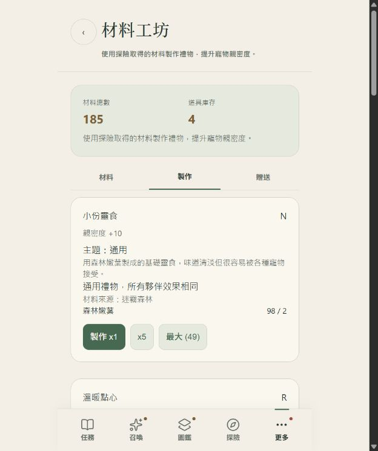
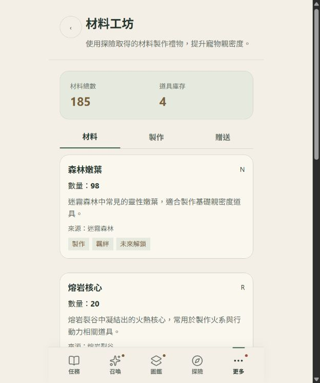
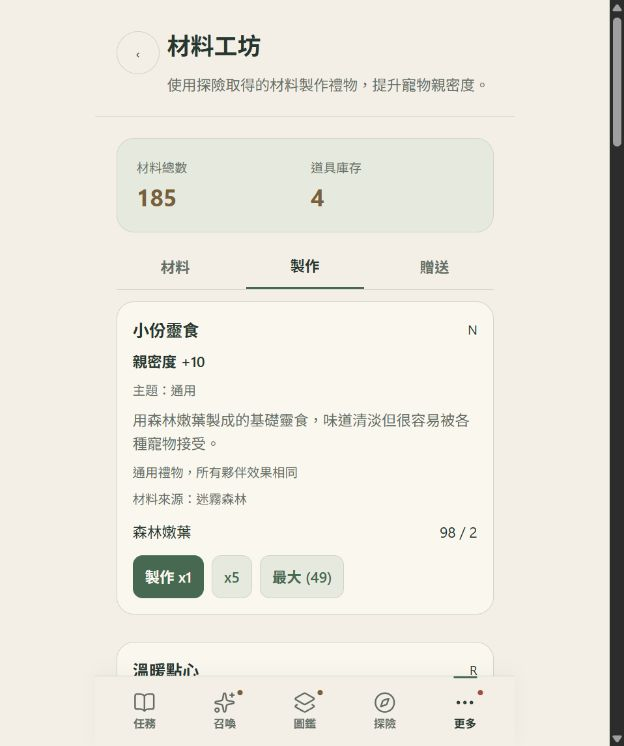
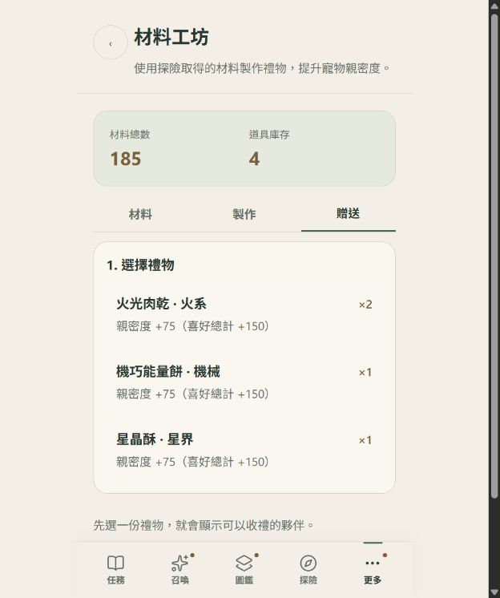

# 工坊字體與閱讀層級 · V3.4.34

範圍：材料、製作、贈送。以本機隔離資料檢視，未部署。這是針對字體與資訊層級的改善，不代表獎項認證或完整無障礙認證。

修改前的實測：頁面說明與分頁 12px，效果及描述 13.12px，主題與喜好人數 15px；按鈕使用 Arial，標題使用襯線字，卡片使用系統無襯線字。相同資訊角色沒有一致規則，重複的效果說明也增加閱讀負擔。

共用規則：24px 頁面標題與統計數字、17px 卡片及步驟標題、15px 內文／效果／操作、13px 來源及狀態；以 rem 定義，所有角色使用同一系統字型組。內文行距 1.6、標題 1.35–1.45。按鈕及展開入口至少 44px，數字使用 tabular-nums。保留三主題配色，工坊規則優先於主題字級覆寫。

1. 材料頁：正常。名稱、數量、描述與來源可依序掃讀；改善小字來源與標籤。
   
2. 製作頁：正常。效果使用主要內文層級；主題、來源與喜好人數使用補充層級。移除重複加成及統計卡說明，材料數字對齊。
   
3. 贈送頁：正常。禮物、推薦與確認使用同一組標題規則，庫存改與名稱並列，效果獨立一行；實際贈送規則維持。
   

驗證：npm test 通過；修改的 JS 語法與 git diff --check 通過。隔離瀏覽器驗收包含三主題在 320／393px 的字級、字型與換行檢查，及既有贈送流程。詳見 browser-results.json。截圖直接取自當次實際頁面，已逐張檢視。

限制：未做真實 iPhone、系統動態字級或螢幕閱讀器完整驗收；字級與視覺層級檢查不能代替完整可及性測試。原生瀏覽器離線限制延續先前驗收報告。
